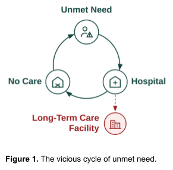
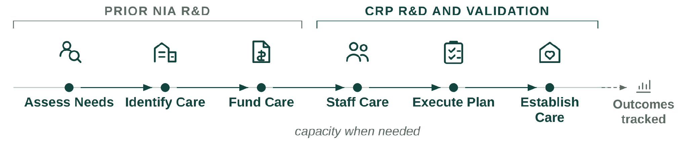
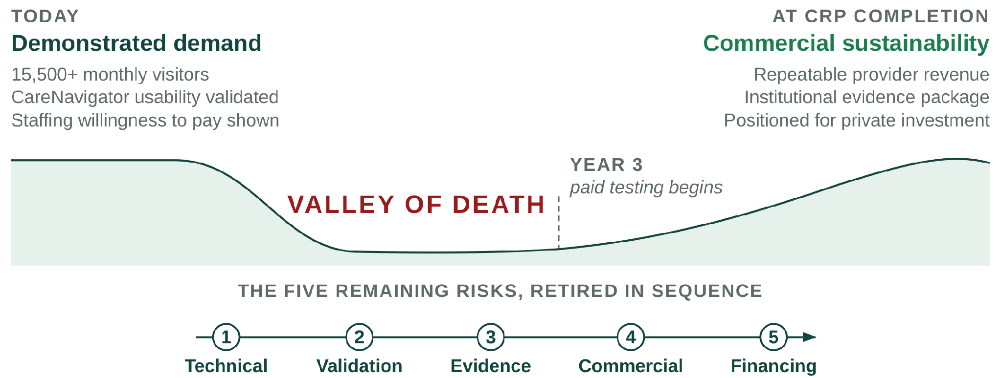
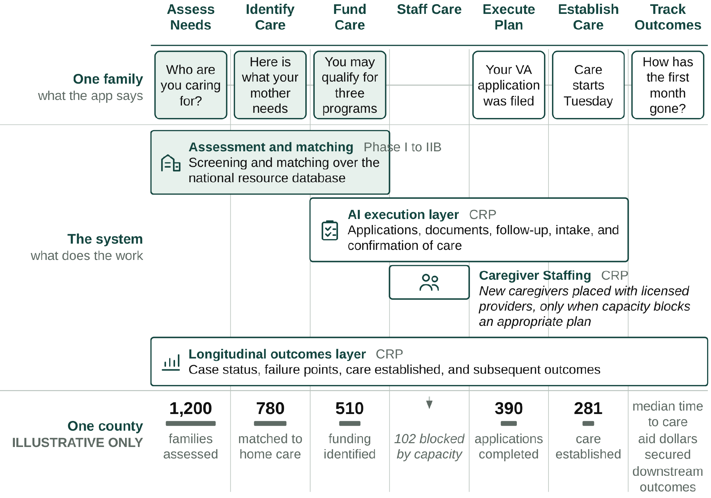
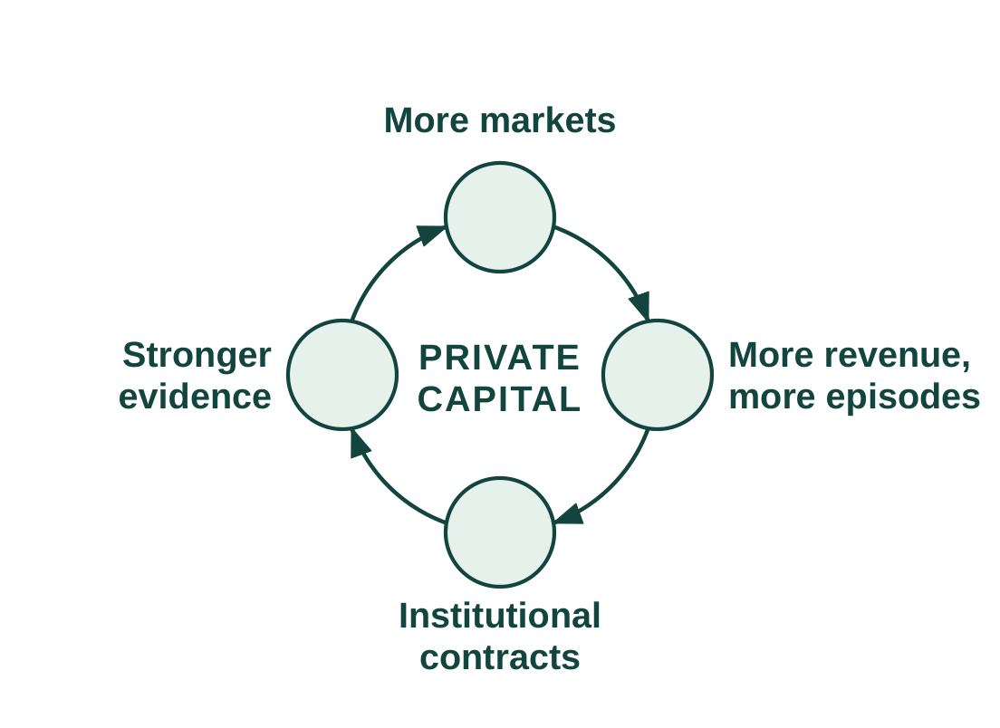
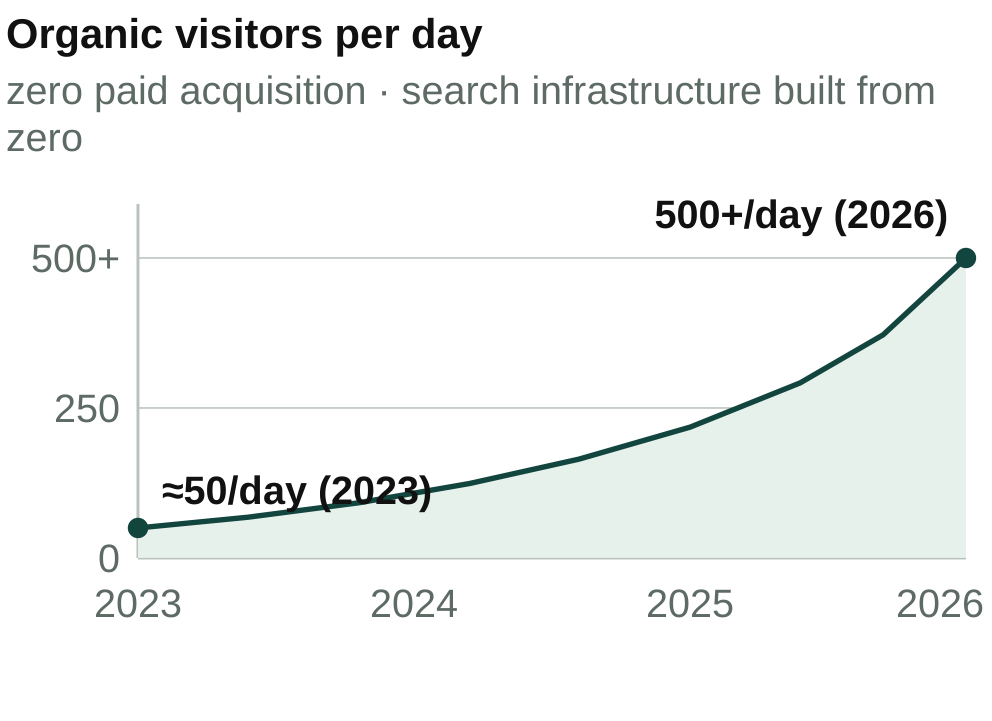

# 3. Commercialization Plan

> **Source of record.** Transcribed from *3. Commercialization Plan*, Google Drive living-documents folder
> (`1VutumddG9xH-UO3UBklUKsLvMnw0drwn`, modified 2026-08-30 10:10 UTC), via the PDF export of that file.
> **This is a mirror, not the master.** Edit the Drive document; re-run the transcription here afterwards.
> See `README.md` for method and known limitations.
>
> Document state at transcription: 13 pages · Figures 1–6 · Tables 1–9 · References 1–14.

---

## 1. Statement of Need

**The product and its impact.** The gap between older Americans who need help and the care available to them is growing. An aging population is increasing demand while families continue to face a fragmented system for finding providers, securing financial assistance, and establishing care. When care is not established, the consequences can compound into a vicious cycle of unmet need, hospitalization, failed care establishment, and premature institutionalization (Figure 1). Among community-dwelling Medicaid HCBS users, unmet service needs have been associated with substantially greater emergency-department use (52% vs. 34%) and hospital or rehabilitation stays (36% vs. 24%).1 Olera developed CareNavigator through NIA Phase I–IIB (Impact Scores 20 and 25) to intervene earlier in this cycle by helping families identify appropriate care, find aid to pay for it, and connect with providers who can deliver it. Its central outcome is simple and measurable: does a *recognized need* reach established care?

**Figure 1.** The vicious cycle of unmet need.

The remaining opportunity is to carry navigation through the full pathway from recognized need to established care (Figure 2). Prior work substantially developed the upstream navigation needed to assess needs, identify care, and fund care. The CRP will develop and validate the ability to staff and execute and track the care plan and outcomes, using a validated **Caregiver Staffing** product to expand the local workforce available to home-care providers, including when insufficient provider capacity would otherwise prevent care establishment, and **Task-based AI Agent Execution** to execute care-plan administrative tasks that cause families to get lost to follow up, together with an **Analytic Outcomes Data** layer needed to confirm that care was established and measure what follows from that pathway.

**Figure 2.** Care establishment requires a coordinated pathway from assessing need through confirming care.

**Olera's Valley of Death (Figure 3).** CareNavigator is deployed nationally, draws 15,500+ visitors per month through organic search at near-zero acquisition cost, and has demonstrated usability and technology acceptance in peer-reviewed studies.2,3 Caregiver Staffing has also been tested in prior pilots, where providers hired workers sourced through Olera and demonstrated willingness to pay for the service.4 Family demand, CareNavigator usability, and basic provider demand for Caregiver Staffing are therefore substantially de-risked. Five remaining risks must now be retired in sequence:

1. **Technical risk.** Can CareNavigator execute and track care establishment?
2. **Real-world validation risk.** Does the complete pathway work in practice?
3. **Evidence risk.** Does establishing care produce outcomes and economic value institutional buyers care about?
4. **Commercial risk.** Can the value created support durable revenue?
5. **Financing risk.** Is Olera investable when CRP ends?

**Figure 3.** CRP bridges the five remaining risks between demonstrated demand and commercial sustainability.

**Why government funding is the right instrument at this stage.** Crossing this gap requires later-stage R&D and evidence generation before CareNavigator's largest commercial pathway can be demonstrated. Private investors must underwrite the risk of completing and deploying the system before its institutional value has been established, while institutional buyers need real-world evidence before they can confidently value and purchase the product. Non-dilutive CRP funding can break this cycle by financing the work needed to retire these risks.

The alternative is not simply to raise prices or sell the same product differently. Charging families would create the greatest barrier for households already struggling to afford eldercare. Charging providers for referrals would introduce steering incentives and limit participation by some federally reimbursed providers. Caregiver Staffing can generate nearer-term provider revenue without those tradeoffs, but staffing alone addresses only the workforce barrier; it does not help families navigate, fund, and execute the rest of the care-establishment pathway.

Our investor advisors agree that longitudinal outcomes demonstrating CareNavigator's value to institutional buyers, together with a repeatable provider-revenue model, would materially improve Olera's investability.

**How CRP funding advances Olera to full commercialization.** Three sequential aims remove these remaining barriers. Aim 1 develops and independently verifies the execution and outcomes technology required to carry families from a care and funding plan through to established care. Aim 2 validates the complete system in a smaller real-world deployment, measuring whether families identify, fund, and establish appropriate care; where cases fail; and whether Caregiver Staffing can relieve workforce constraints when they prevent care establishment. Aim 3 scales deployment and builds the institutional-buyer evidence case. Caregiver Staffing is evaluated in parallel as a repeatable provider-revenue pathway.

---

## 2. Value of the CRP Project, Expected Outcomes, and Impact

**The product to be commercialized.** CareNavigator is Olera's family-facing eldercare navigation platform. It combines a national, expert-curated resource database with AI-supported execution workflows and longitudinal outcomes tracking to help families move from recognized need to established care. Families use CareNavigator at no cost. The platform assesses needs, identifies appropriate care and financial aid, helps execute the administrative and follow-up work required to obtain them, confirms whether care was established, and records where the pathway succeeds or fails (Figure 4).

Caregiver Staffing is a complementary provider-facing product and capacity mechanism. When an otherwise appropriate care plan cannot be delivered because a provider lacks workers, Olera recruits new caregivers into the workforce and connects them with licensed providers, which retain responsibility for interviewing, hiring, training, credentialing, supervision, and care delivery.

**Figure 4.** What a family sees, what the system does, and what accumulates across a county. Shaded elements exist today.

**Foundation from prior SBIR R&D.** Olera's NIA Phase I and Phase IIB awards (Impact Scores 20 and 25) established the foundation for this commercialization effort: a nationally deployed first-generation CareNavigator; an expert-curated database containing more than 72,000 eldercare provider and aid-program records; peer-reviewed evidence of usability and technology acceptance; and extensive customer discovery defining the needs of families and providers. In an early staffing pilot, Olera received approximately 900 student applications, accepted 100 candidates, and placed 25 with local providers, with participating students and providers returning in a subsequent semester. These results support the CRP's next step: integrate, execute, measure, and commercialize the complete pathway.

**Weaknesses in current approaches.** Families do not lack individual resources; they lack a system accountable for carrying them across the full pathway to established care. Table 1 organizes current approaches around the same care-establishment pathway used throughout this application.

| Pathway step | Where families still fall off | Olera's CRP approach |
|---|---|---|
| Assess Needs | Assessment may end as information or referral rather than an executable case | Persistent case begins with structured needs assessment |
| Identify Care | Fragmented inventories and handoffs leave families to reconcile options | Curated national resource infrastructure identifies services and providers |
| Fund Care | Eligibility information does not ensure applications, documentation, or approval | Aid identification is linked to execution and case tracking |
| Staff Care | Providers may have an opening but lack workers to serve the family | Caregiver Staffing adds a workforce channel when capacity blocks care |
| Execute Plan | Administrative tasks cross organizations; risk of "lost to follow up" | AI-supported workflows execute applications, documents, follow-up, and intake |
| Establish Care | Referral or eligibility is treated as success even when service never starts | Closed-loop confirmation records whether appropriate care actually begins |
| Track Outcomes | No longitudinal record connects need, pathway failure, and subsequent outcomes | Case-level outcomes infrastructure supports institutional evidence generation |

**Table 1.** Current approaches address portions of the pathway; the CRP integrates them into a closed-loop system oriented to confirmed care.

**Commercial applications and innovation.** The commercial opportunity is not another directory, referral marketplace, or staffing channel in isolation. It is an integrated infrastructure that carries a family across the care-establishment pathway and creates evidence about what happened at every step. AI-supported execution moves the product from recommending what a family should do toward completing and tracking the work required to establish care, and every executed case produces a structured longitudinal record of the pathway.

At scale, this longitudinal record could become a distinctive commercial and scientific asset: a county-level empirical map of where eldercare pathways succeed, where they fail, and what resolves those failures. The CRP tests and builds the infrastructure required to create this asset; it does not assume its value in advance (Figure 4, lower register).

**Expected outcomes.** Successful completion of the CRP will leave Olera with: (1) a verified CareNavigator capable of executing and tracking the pathway from care plan to established care; (2) real-world evidence on care establishment, failure points, operating cost, and longitudinal outcomes; (3) a repeatable Caregiver Staffing model that can both generate provider revenue and relieve workforce constraints to enable care establishment; and (4) an institutional-buyer evidence package and operating model positioned for subsequent contracting and private investment.

**Commercial and non-commercial impact.** Olera's commercial and public-health objectives reinforce one another: growth means more families can receive support before unmet needs progress to higher-cost crises.

| Impact potential | Measured by | National priority served |
|---|---|---|
| **Societal.** Families establish appropriate care; available aid is converted into support; caregiving capacity is added where supply is short | Aid dollars secured; care established; time to care; staffed caregiver hours added | 2022 National Strategy to Support Family Caregivers |
| **Educational.** Future health professionals gain supervised, real-world geriatric care experience while contributing to the direct-care workforce | Students recruited and placed; documented patient-care hours; retention | National direct-care workforce need |
| **Scientific and public health.** New visibility into where the care-establishment pathway fails and how patterns differ across communities | Case-level pathway records; failure points; county-level capacity and outcomes | Healthy aging, integrated care, long-term care access, implementation research |

**Table 2.** Commercial growth produces measurable societal, educational, and scientific value.

---

## 3. Company

**Origins and objectives.** Olera, Inc. grew from a multidisciplinary effort at Texas A&M University to solve a problem families repeatedly described: eldercare was difficult to navigate, difficult to afford, and difficult to convert from information into actual support. PI Tokunbo (TJ) Falohun began working with Logan DuBose, MD, MBA, now Olera's Chief Research Officer and co-investigator, through the Texas A&M chapter of Sling Health in 2019. Their initial work focused on dementia caregiving; continued discovery revealed a broader need across eldercare and led to Olera's formation in 2020.

Olera's corporate objective is to make establishing eldercare navigable and broadly accessible for American families while building the commercial infrastructure that can sustain that access. **The commercialization strategy has evolved as evidence accumulated; the mission has not.** Core CareNavigator access remains free to families, recommendations remain neutral, and commercialization is concentrated where Olera creates incremental value for providers and institutional buyers.

| Olera, Inc. | At a glance |
|---|---|
| Founded & structure | 2020 · independent U.S. small business concern · C-corporation · founder-led Board |
| Commercial stage | Pre-scale commercial company · nationally deployed CareNavigator · early Caregiver Staffing validation · no significant annual sales |
| Leadership | TJ Falohun, PhD, CEO/PI · Logan DuBose, MD, MBA, Chief Research Officer/co-investigator |
| Team | Founder-led product and engineering · full-time engineer (~2 years) · two full-time family/provider call-center personnel (>3 years) · part-time marketing (~1.5 years) · two part-time research assistants (~5 and ~1.5 years) |
| Federal R&D | ≈$5.7M NIA SBIR, 2021–2027 · Phase I/II Fast-Track + Phase IIB (1R44AG074116) |
| Commercialization development | NSF I-Corps customer discovery (200+ interviews) · Blackstone Techstars · Texas A&M |
| Senior advisors | Marcia Ory, PhD (>6 years advising Olera) · David Qu, MBA · Qiping Fan, MD, MS/Clemson University |
| Finance, compliance, regulatory | Founder-led finance and federal administration supported by ADC accounting/CPA and specialized legal/compliance counsel · HIPAA-aligned data practices · federal research, IRB, and data stewardship experience · referral-compliance review |

**Table 3.** Olera at a glance.

**Core competencies and operating continuity.** Olera's capabilities now extend beyond the founders and reflect several years of accumulated operating experience. The company combines software and applied AI engineering, an expert-curated eldercare data infrastructure, human-centered aging research, digital distribution, family/provider operations, and commercialization research. Four peer-reviewed studies established usability and technology acceptance, and direct family/provider operations continue to expose the team to the practical barriers between a recommendation and established care.

**Olera's progression from R&D to commercial scale.** Early discovery defined the problem; Phase I/II built and evaluated the first-generation platform and national resource infrastructure; Phase IIB supported national deployment and deeper provider/workforce learning; and the CRP is designed to complete execution and outcomes capabilities, establish repeatable Caregiver Staffing economics, and build the evidence required for institutional commercialization. Successful CRP completion therefore changes the appropriate source of capital: subsequent scale is intended to be financed by commercial revenue and private investment rather than continued dependence on federal R&D support.

**Vision, sustainability, and management evolution.** Today, the founders retain overlapping responsibility for strategy, product, engineering, research, finance, and administration, supported by established engineering, operations, marketing, and research personnel. DuBose leads research and internal finance/federal administration with professional accounting support from ADC; Falohun leads company, product, and technical strategy. This structure has allowed Olera to remain capital-efficient while building and operating a national platform.

The lean internal team is complemented by senior expertise accumulated over years rather than assembled for a single application. Marcia Ory, PhD, has advised Olera for more than six years and brings decades of aging, caregiving, implementation, dissemination, and sustainability expertise, including 20 years at NIA. Qiping Fan, MD, MS, and Clemson University provide longstanding capabilities in epidemiology, mixed-methods evaluation, health-services research, and independent study execution. David Qu, MBA, brings approximately 30 years of healthcare-technology commercialization and executive experience, including scaling and exiting digital-health companies, together with relationships across healthcare and senior-care investment networks.

As CRP milestones demonstrate repeatable provider sales, operating demand, and institutional engagement, Olera will internalize dedicated commercial, customer-success, operations, data/compliance, and finance capabilities when their workload and strategic importance justify full-time leadership.

**SBIR/STTR commercialization history.** Olera's SBIR history is one continuous arc: a single NIA project carried from concept to a validated national platform across a Phase I/II Fast-Track and a Phase IIB continuation (1R44AG074116). Table 4 answers the required history questions directly.

| Required question | Answer |
|---|---|
| Company name changes in the past five years | None. The company has operated as Olera, Inc. throughout. |
| Subsidiary or spin-off status | Independent. No parent company. |
| Share of company revenue derived from SBIR/STTR funding, each of the past five years | FY2021 100% · FY2022 100% · FY2023 100% · FY2024 ~100% · FY2025 ~100% (one-off pilot fees, <1%) |
| Total SBIR/STTR Phase II awards from any federal agency | Two, on one project: the NIA Fast-Track Phase II and its Phase IIB continuation (1R44AG074116). No other agency awards. |
| Total revenues generated to date from commercialization of SBIR/STTR projects funded in the past five years | Limited and by design: multiple one-off paid pilots, no recurring revenue. Olera held monetization until the platform could support it without charging families or gating referrals. Provider willingness to pay also depends on concentrating families and providers in the same local markets, which research funding was not scoped to do. |

**Table 4.** SBIR/STTR commercialization history.

---

## 4. Market, Customer, and Competition

**Market segments and potential customers.** Olera commercializes through two buyer classes created by the same care-establishment pathway. The near-term beachhead is care-delivery providers that lose revenue when caregiver vacancies prevent them from accepting or staffing new cases. The emerging institutional market is healthcare organizations that bear financial risk when unmet needs contribute to avoidable utilization, failed care transitions, or earlier institutional care.

Caregiver Staffing addresses an unusually persistent provider problem. The United States employed approximately 4.68 million home health and personal care aides in 2025, with roughly 760,500 openings projected each year from 2025 to 2035; home-care benchmarking separately reported 75% median professional-caregiver turnover in 2024.5,6 The problem directly constrains growth: 63.3% of surveyed home-care providers reported turning down cases because of staffing shortages in 2023.7 Caregiver Staffing therefore addresses provider workforce demand regardless of where the underlying client originates, existing clients, externally generated referrals, growth, turnover replacement, or a capacity constraint observed through CareNavigator. Non-medical home care is Olera's initial provider beachhead.

The institutional market is larger but evidence-gated. Prospective customers include Medicare Advantage plans, accountable care organizations (ACOs), health systems, Medicaid managed-care and managed long-term-services-and-supports organizations, and other entities exposed to the downstream cost of unmet need. In 2026, 35.2 million people are enrolled in Medicare Advantage and 14.3 million Medicare beneficiaries receive care coordinated through accountable-care arrangements.8,9 CMS's active GUIDE Model further validates the purchasing logic: Medicare is already testing and paying for dementia care navigation, community-resource connection, and caregiver support, with the explicit aim of delaying nursing-home placement.10

**Market opportunity and path to meaningful scale.** Caregiver Staffing enters an existing, recurring recruitment market in which providers already spend to fill vacancies; the CRP determines Olera's repeatable pricing, conversion, retention, and unit economics. CareNavigator enters a larger institutional market only as evidence matures; the CRP determines whether established care and longitudinal outcomes create sufficient economic value for institutional contracting. Olera's geographic unit of commercialization is a local market, defined as one U.S. county or county equivalent, within which family demand, provider supply, workforce capacity, care-establishment outcomes, acquisition costs, and revenue performance are all measured. With more than 3,100 such geographic units nationally, Olera can expand by replicating a validated local-market model without requiring dominant national market share.

**Significant advantages and competitive position.** The remaining relevant competitive question is not whether alternatives exist, but why Olera can create differentiated value as those alternatives evolve.

1. **End-to-end execution.** CareNavigator integrates assessment, care identification, funding, AI-agent execution, staffing when needed, and longitudinal outcomes rather than optimizing a single step.
2. **New workforce supply and demand intelligence.** Caregiver Staffing creates an easier pathway into direct care rather than merely redistributing workers already circulating among providers. CareNavigator reveals where family demand and provider capacity constraints collide locally.
3. **Distribution and local data.** Organic family demand, a national provider and benefits infrastructure, and county-level care-establishment and outcomes data compound as the platform is used.
4. **AI interoperability.** Olera can expose domain data and execution capabilities to search and general-purpose AI interfaces, allowing them to become entry points to CareNavigator rather than substitutes for its execution layer.

Caregiver Staffing's initial workforce wedge is deliberately narrow. Olera initially targets health-profession applicants and students for whom paid caregiving can also provide meaningful patient-care experience. The opportunity is nationally distributed and continuously replenished: in the most recent cycles, U.S. MD programs reported 54,699 applicants and NursingCAS reported 75,078 applicants across 282 participating nursing schools.11,12 These two pipelines are not the full addressable workforce.

**This wedge is differentiated from conventional job boards.** Traditional recruiting channels primarily compete for workers already searching for caregiver jobs. Recent recruitment benchmarking found Indeed generated 68% of applications to participating home-care agencies in Q1 2026, illustrating how concentrated conventional caregiver acquisition remains.13 Olera instead builds relationships with universities and applicant communities to introduce caregiving as a paid entry pathway into healthcare, while the licensed provider remains the employer responsible for interviewing, hiring, training, credentialing, supervision, and employment standards.

**Current and emerging competition.** For Caregiver Staffing, Olera competes across categories rather than against a single end-to-end incumbent. Provider staffing alternatives include large job boards like Indeed, staffing agencies, caregiver-specific recruiting platforms, and emerging student-caregiver models such as CareYaya. For CareNavigator, alternatives include government and nonprofit resource directories, patient navigators, social workers and care managers, eldercare referral platforms like A Place for Mom or Caring.com, and increasingly general-purpose AI and search where families ask eldercare-related questions. Olera's response is to compete where domain-specific infrastructure matters most: verified local provider and benefits data, execution of real administrative workflows, workforce-capacity creation, confirmation of care establishment, and longitudinal outcome records.

**Market and customer acceptance hurdles.** The CRP is structured to measure the remaining commercial uncertainties rather than assume adoption.

| Commercial hurdle | How the CRP retires it |
|---|---|
| Will providers pay? | Measure willingness to pay, conversion, retention, and unit economics for Caregiver Staffing across markets. |
| Can new workforce supply replicate? | Measure applicant acquisition, provider hiring, placement, retention, and market-to-market reproducibility. |
| Will institutions value the evidence? | Generate longitudinal care-establishment and outcomes data, economic analyses, and contracting-ready evidence for institutional buyers. |
| Can AI execution be trusted? | Independently verify workflows, characterize error behavior, ground actions in curated data, and maintain auditable records. |
| Can the model scale geographically? | Deploy across multiple counties and measure where performance, cost, workforce capacity, and care-establishment rates vary. |

**Table 5.** Principal market-acceptance uncertainties and the CRP activity designed to retire each.

**Strategic alliances, partnerships, and route to market.** Olera enters the CRP with relationships on both sides of its beachhead: university relationships that support workforce recruitment and working relationships with local and franchise-affiliated eldercare providers that can serve as early customers and implementation sites. No FDA approval is required for the products proposed here, and Olera does not depend on a licensing agreement to commercialize them.

. Provider sales begin where Olera can demonstrate an immediate staffing constraint and measurable hiring value; institutional development begins with organizations whose populations and economics align with the outcomes the CRP is designed to measure. The detailed acquisition channels, sales process, production infrastructure, and post-CRP scaling plan are presented in the Production and Marketing Plan (Section 7).

---

## 5. Intellectual Property Protection

**Protection strategy.** Olera will protect each component of its commercial advantage with the form of intellectual-property protection best suited to that asset. The principal proprietary assets generated and extended through the CRP include CareNavigator's non-public workflow orchestration and execution logic; the structure, normalization, quality-control methods, and derived variables that organize Olera's provider and financial-aid data; the longitudinal care-establishment and outcomes architecture and resulting proprietary datasets; and the methods that connect local workforce capacity to care execution. Olera will maintain these as trade secrets through role-based technical access, confidentiality obligations, and employee, contractor, and partner agreements governing intellectual-property ownership and permitted data use. Original source code, interfaces, documentation, and content are protected by copyright, while Olera and product branding will be protected through trademark rights and registration where commercially appropriate. For CRP-generated inventions with sufficient novelty and commercial value, Olera will evaluate patent protection with IP counsel before public disclosure.

**Temporal barriers to replication.** Individual interface features can be reproduced; the integrated commercial asset is substantially harder to recreate. A new entrant would need to rebuild Olera's family distribution, national provider and benefits infrastructure, execution workflows, provider and workforce relationships, and the longitudinal evidence showing where care is established, where it fails, and what follows. These barriers compound during the CRP: every deployment both advances commercialization and adds execution history, local-market intelligence, care-establishment records, and longitudinal outcomes that a new entrant cannot obtain retrospectively.

---

## 6. Finance Plan

**Capital required.** Olera is requesting approximately $4 million in CRP funding over three years to finance the later-stage R&D, real-world validation, and commercialization work required to cross the Valley of Death described in Section 1. The award is designed to move Olera from pre-scale commercialization to an investable commercial inflection point, not to assume that revenue from the limited CRP markets immediately replaces the full federal operating budget.

**From CRP capital to commercial sustainability.** Olera's financing strategy combines capital sources that enter at different stages. During the CRP, federal capital finances the R&D and evidence generation that private investors are not yet positioned to underwrite. Caregiver Staffing is validated free in Year 2 and begins paid testing in Year 3, producing approximately $120,000 in recognized revenue and a ~$240,000 annualized exit run rate under the conservative base case (Section 8). This growing revenue base contributes operating cash but does not eliminate the near-term financing requirement; independent third-party capital bridges the remaining operating need and finances faster market and institutional expansion until recurring commercial revenue can assume a greater share of growth.

**Fundraising Plan.** Olera will begin financing its next stage before CRP funding ends. The aims are deliberately sequenced so that sufficient technical, real-world, and early commercial evidence should be available by approximately the end of Year 2 to begin structured investor cultivation, while Year 3 strengthens the financing case and supports a formal raise. The objective is to enter post-CRP commercialization with financing secured or actively closing rather than encounter a new funding gap.

**Investor engagement and financing readiness.** Commercialization advisor David Qu will advise Olera quarterly throughout the CRP, helping management define investment-readiness milestones, pressure-test the financing strategy and materials, and prepare for institutional fundraising. As milestones mature, he will support introductions and continued engagement with relevant senior-care and healthcare investors in his network, including Ziegler, Equitage Ventures, 7Wire Ventures, and Alumni Ventures, among others. His Letter of Support describes this role and commitment to helping Olera prepare for and pursue independent third-party financing as CRP milestones are achieved.

**Post-CRP financing requirement.** Olera expects independent third-party capital to finance the transition from CRP validation to commercial scale. The current five-year model estimates approximately $1.4 million in operating requirements in post-CRP Year 4 against ~$600,000 in projected commercial revenue, leaving an approximately $800,000 operating gap; by Year 5, approximately $1.85 million in operating requirements against ~$1.5 million in projected revenue narrows that gap to approximately $350,000. Olera therefore anticipates a post-CRP financing round of approximately $3–5 million, subject to refinement as CRP unit economics are measured. Detailed revenue assumptions and commercial economics are presented in Section 8.

**Use of post-CRP capital.** The raise is intentionally larger than the modeled operating deficit because its purpose is not merely to extend runway. Expanding Caregiver Staffing into additional county markets generates successful hires, provider revenue, and greater workforce capacity. Expanding CareNavigator generates more care-establishment episodes and a larger longitudinal evidence base from which institutional contracts can mature. Private capital therefore serves as the bridge from a CRP-validated model to progressively revenue-financed commercial scale (Figure 5).

**Financing continuity.** If financing takes longer than expected, management can moderate expansion while commercial revenue extends runway.

**Figure 5.** Post-CRP growth flywheel.

---

## 7. Production and Marketing Plan

**Production model.** Olera produces and operates its software in-house, but the commercially meaningful unit of production is a functioning local market: the county in which families can enter CareNavigator, providers can participate, workers can enter local provider labor pools through Caregiver Staffing, and completed care pathways can be measured.

**Digital product and AI infrastructure.** CareNavigator and Caregiver Staffing are developed by Olera's internal engineering team, including the founders and full-time engineering personnel. Because the products are software, there is no manufacturing, inventory, or physical-distribution dependency.

**Data and workforce infrastructure.** Olera's provider and benefits information is indexed, normalized, reviewed, and surfaced geographically so that local CareNavigator infrastructure can exist before every provider has actively joined the network. Caregiver Staffing operates through the same platform: providers can seek workers for staffing needs arising anywhere in their business, while CareNavigator provides an additional signal when local workforce capacity is preventing a family from establishing care.

**Market selection and activation.** Olera will not enter counties indiscriminately. CRP markets are selected to support both rigorous testing and practical commercialization, using signals such as existing family demand, provider density and workforce need, recruitable workforce supply and nearby university or community-college infrastructure, existing local relationships, and the feasibility of concentrating enough participation to measure care-establishment and commercial outcomes. The CRP applies this process across approximately eight markets and measures the operating requirements and cost of activation so that subsequent expansion can use evidence rather than intuition.

**Customer and participant acquisition.** A functioning Olera market requires concentrated participation from families, providers, and caregivers; commercialization additionally requires conversion of providers and, as evidence matures, institutional buyers. Olera enters the CRP with established channels for each audience and will use the award to measure their cost, yield, and reproducibility across markets (Table 6).

| Audience | Established acquisition base | CRP market-concentration channels | Conversion/activation |
|---|---|---|---|
| Families | Organic search through provider pages, benefits resources, and guides; social communities | Geo-targeted search and social ads; community, faith, and aging-service organizations; clinics | Free CareNavigator account → assessment → active care-establishment pathway |
| Providers | National provider index; organic discovery; inbound profile claiming | Claim-your-profile email and calls; family inquiries; associations, conferences, franchise relationships | Listed → claimed → active → Staffing demonstrated → paid conversion |
| Caregiver workforce | University relationships and prior applicant pipeline | Career centers and job boards; student organizations; advisors and faculty; career fairs | Applicant → screening → provider interview/hire → staffed care |
| Institutional buyers | Advisor and industry relationships; emerging CRP evidence | Direct business development; advisor introductions; targeted outreach to MA plans, MCOs, ACOs, health systems | Evidence review → scoped pilot/annual contract → broader deployment |

**Table 6.** Distinct but coordinated acquisition channels concentrate the participants and customers each local market requires.

**Sales and contracting.** Olera uses two distinct commercial motions. Provider sales are near-term and can become increasingly self-service: free listing and network participation lead to demonstrated staffing value, a subscription or other CRP-tested offer, online acceptance of terms, and electronic invoicing and billing.

**Institutional development is evidence-gated rather than transactional.** Olera will identify Medicare Advantage plans, Medicaid managed-care and managed-LTSS organizations, ACOs, health systems, and other prospective buyers with meaningful member concentration in markets where CRP data can demonstrate care-establishment and economic value.

**Figure 6.** Organic traffic growth, 2023–2026.

**Distribution and route to market.** Olera's distribution advantage is already visible in organic demand: traffic has grown from approximately 50 visitors per day in 2023 to more than 500 per day in 2026 without paid acquisition (Figure 6). Olera also intends to make CareNavigator's domain data and execution capabilities interoperable with search and general-purpose AI interfaces, allowing those systems to become additional entry points rather than requiring Olera to own every point of discovery.

**Scaling the production and commercial system.** The CRP does not fund construction of a commercialization apparatus from scratch; it measures, systematizes, and makes repeatable operating processes Olera already uses.**Marketing and sales strategy**

---

## 8. Revenue Stream

**Two revenue engines, sequenced by evidence.** CareNavigator remains free to families and basic family-provider connections remain free to providers. The near-term engine is Caregiver Staffing: providers pay when Olera helps them successfully hire workers, whether the staffing need arises from turnover, existing clients, externally generated referrals, growth, or a capacity constraint identified through CareNavigator. The emerging engine is institutional CareNavigator contracting.

**Caregiver Staffing: revenue follows successful hires.** The Staffing model is intentionally simple: successful hires, times realized revenue per successful hire, times active county markets. CRP Year 1 is an engineering year and generates no Staffing revenue. In Year 2, Olera deploys Staffing free to providers so the project can establish applicant acquisition, provider hiring, placement, retention, and market-to-market reproducibility before price is introduced. Paid testing begins in Year 3. The working base-case price is $250 per successful hire, with $150 and $350 as sensitivity bounds. This is an Aim 3 pricing hypothesis, not an asserted market price. It is economically plausible relative to the burden providers already bear (Table 7).

| Model input | Base projection | Range or benchmark | Basis |
|---|---|---|---|
| Successful hires per county per month | 10 | Expected mature range 10 to 30 | Conservative Olera and CRP hypothesis |
| Price per successful hire | $250 | $150 to $350 sensitivity | Aim 3 pricing hypothesis |
| Home-care turnover | | About 75% | Published benchmark6 |
| Recruiting and training burden | | Up to about $2,700 per replacement | Published benchmark14 |
| First institutional revenue | Post-CRP Year 4 | | Planning assumption |
| Institutional relationships | About 3 by Year 5 | | Planning assumption |
| Annual value per relationship | About $250K | Negotiated after evidence | Planning hypothesis, not a benchmark |

**Table 7.** The projection separates published benchmarks from Olera assumptions and CRP hypotheses.

For the financial projection, Olera holds every paid market at only 10 successful hires per month. At $250 per hire, that equals $30,000 annualized Staffing revenue per county. Olera expects mature markets may support approximately 10 to 30 successful hires per month, but the model does not require that maturation. Across eight CRP markets, the conservative case produces a $240,000 annualized Staffing run rate.

The five-year model is an early commercialization case, not the scale ceiling. At the same conservative assumptions, 100 active counties produce approximately 12,000 successful hires and $3.0 million in annual Staffing revenue; 250 counties, 30,000 hires and $7.5 million; and 500 counties, 60,000 hires and $15 million. At 500 counties, 60,000 successful provider hires are equivalent in scale to approximately 8% of the roughly 760,500 annual U.S. home health and personal care aide openings projected by BLS.5

**Institutional CareNavigator: contracts follow outcomes evidence.** The institutional engine is modeled separately and more conservatively. Olera assumes no institutional revenue during the CRP. Years 1 to 3 instead test the intermediate outcome on which the institutional value proposition depends: whether recognized needs reach established care, why pathways fail when they do not, and what happens longitudinally afterward. This matters economically because unmet home- and community-based service needs have been associated with substantially greater acute-care utilization (Section 1).8 The CRP does not assume that CareNavigator prevents these downstream events; it generates the evidence needed to determine whether that value proposition is real.

There is already precedent for organizations responsible for health outcomes to pay for care-management and coordination infrastructure: CMS's GUIDE Model uses per-patient-per-month dementia care-management payments for coordination and caregiver support, and in 2026 the Medicare Shared Savings Program includes 511 ACOs serving 12.6 million Traditional Medicare beneficiaries.9,10 These sources establish the buyer class and purchasing logic; they do not establish Olera's future price. Accordingly, the five-year model treats institutional revenue as evidence-gated contracts rather than multiplying an unvalidated PMPM across a hypothetical health plan.

| | CRP Y1 | CRP Y2 | CRP Y3 | Post-CRP Y4 | Post-CRP Y5–Y10 potential |
|---|---|---|---|---|---|
| Commercial stage | Build | Validate free | Monetize | Expand | Scale to national replication |
| Staffing markets | 0 | ~8 free | ~8 paid | ~15 | ~25 to 500 counties |
| Staffing revenue | $0 | $0 | ~$120K* | ~$450K | ~$0.75M–$15.0M/yr |
| Institutional relationships | 0 | 0 | 0 | ~1 | ~3 to 10+ |
| Institutional revenue | $0 | $0 | $0 | ~$250K | ~$0.75M–$2.5M+/yr |
| Total commercial revenue | $0 | $0 | ~$120K | ~$600K | ~$1.5M–$17.5M+/yr |

**Table 8.** Illustrative base case through post-CRP Year 4, with the final column widening Year 5 into a Year 5 to Year 10 range. *Six paid-month equivalents in Year 3.

**How the projection should be read.** These are bottom-up scenarios derived from the number of successful caregiver hires Olera can produce in each county and the number of evidence-gated institutional contracts the company can secure. The principal assumptions, Staffing throughput, price, repeat purchasing, contribution margin, and institutional contracting value, are the same variables the CRP and subsequent buyer negotiations are designed to replace with measured commercial data.

Commercial hiring, workforce expansion, and family care establishment are tracked as related but distinct outcomes. Staffing revenue is earned on successful provider hires; workforce impact is measured through unique entrants, retention, and provider capacity; and CareNavigator-linked family impact is measured by whether cases encountering a documented workforce barrier subsequently establish care. Downstream utilization remains a longitudinal hypothesis until supported by evidence.

**Staffing and capital as revenue grows.** During the CRP, engineering, research, and market-validation personnel remain central. As paid Staffing expands, Olera adds centralized market operations, worker acquisition, provider success, and sales capacity rather than recreating a full team in every county. Engineering grows more slowly because the platform, portals, and workflows are designed for self-service and automation.

---

## 9. Project Management Plan

**Team and governance.** The PI, TJ Falohun, has led the project as PD/PI since Phase I and retains final go/no-go authority at major decision points. Co-investigator Logan DuBose, MD, MBA, the company's Chief Research Officer and a practicing primary-care clinician, oversees clinical relevance, research operations, commercialization coordination, and the milestone calendar. Clemson University leads the academic human-subjects effort with co-investigator Qiping Fan, DrPH, MS, supported by biostatistical expertise for study design and analysis. Independent statistical review and external CPA validation of the commercial unit-economics model provide additional checks.

**How research and commercialization stay synchronized.** Day-to-day execution is managed through named workstream owners, maintained task boards, regular operating meetings, and milestone dashboards tied to the Research Strategy and Commercialization Plan. A milestone that misses its predefined threshold triggers the corresponding alternative strategy rather than automatic continuation.

**Commercialization timeline and gates.** The detailed experimental timeline and thresholds are provided in the Research Strategy; the management timeline below shows how those activities produce successive commercialization decisions.

| Period | Commercialization milestone | Decision or financing gate |
|---|---|---|
| Year 1 (CRP) Build | Technical and measurement infrastructure operational; Staffing workflow ready for real-world deployment. | Confirm readiness for real-world market validation. |
| Year 2 (CRP) Validate free | Quantify acquisition costs, hires per county per month, provider demand, geographic replicability, and care-establishment performance. | Determine which configurations advance to paid testing; begin investor cultivation. |
| Year 3 (CRP) Monetize | About $120K recognized Staffing revenue and about $240K annualized exit run rate; county economics characterized. | Select markets for post-CRP replication; conduct the third-party financing process before CRP runway ends. |
| Year 4 (post-CRP) Expand | About $600K combined commercial revenue, with Staffing expansion and initial institutional revenue. | Set expansion pace based on measured county economics, institutional traction, and available capital. |
| Year 5 (post-CRP) Scale | About $1.5M combined commercial revenue, approximately 25 Staffing counties and three institutional relationships. | Scale according to measured economics and capital efficiency. |

**Table 9.** Five-year commercialization management timeline. Revenue values are planning projections rather than CRP success criteria.

---

## References

1. Agency for Healthcare Research and Quality. Evidence Map on Home- and Community-Based Services and Person-Centered Care for Older Adults. Technical Brief No. 49; 2024.
2. Fan Q, Hoang MN, DuBose L, et al. The Olera.care Digital Caregiving Assistance Platform for Dementia Caregivers: Preliminary Evaluation Study. JMIR Aging. 2024;7:e55132.
3. Hoang MN, Kim L, Fisher L, et al. Exploring Informal Caregivers' Perception of the Olera Digital Caregiving Assistance Platform for Dementia Care. JMIR Form Res. 2026;10:e92967.
4. Olera, Inc. Caregiver Staffing pilot placements and provider fees, 2024 to 2025. Data on file.
5. U.S. Bureau of Labor Statistics. Home Health and Personal Care Aides. Occupational Outlook Handbook; 2025 to 2035 projections.
6. Activated Insights. 2025 Benchmarking Report for Home-Based Care; 2025. Median caregiver turnover 75.0% in 2024.
7. Activated Insights. 2024 Benchmarking Report for Home-Based Care; 2024. 63.3% of providers turned down cases in 2023.
8. KFF. Medicare Advantage in 2026: Enrollment Update and Key Trends; 2026.
9. Centers for Medicare and Medicaid Services. 2026 Medicare ACO Initiatives Participation Highlights; 2026.
10. Centers for Medicare and Medicaid Services. Guiding an Improved Dementia Experience (GUIDE) Model; 2024.
11. Association of American Medical Colleges. U.S. Medical Schools Enroll Record Number of Students in 2025; 2025.
12. American Association of Colleges of Nursing. NursingCAS Application Cycle Closes with Most Applicants to Date; 2026.
13. Augusta and Home Care Association of America. National Caregiver Recruitment Benchmark Report, Q1 2026; 2026.
14. Activated Insights. Caregiver Retention for Home-Based Care; recruiting and training cost up to approximately $2,700 per replacement.
