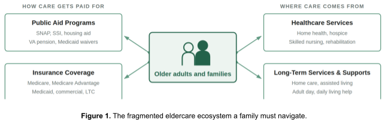
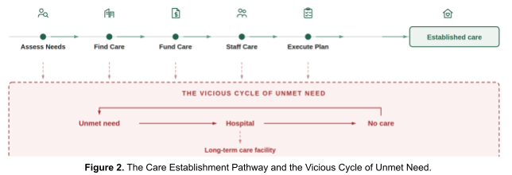
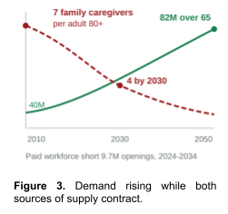
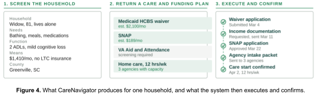
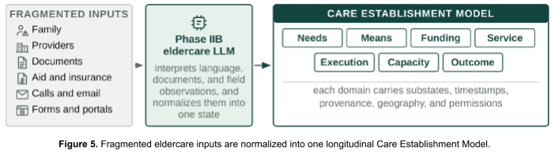
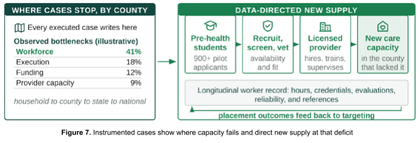
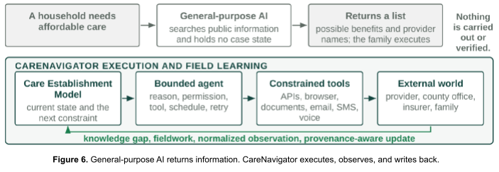
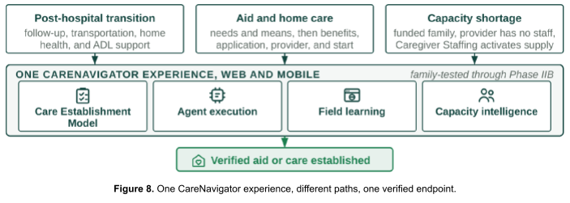
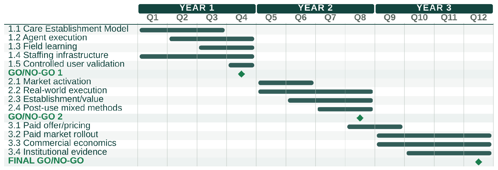

# 2. Research Plan

> **Source of record.** Transcribed from *2. Research Plan [Most Updated 8.30.26].docx*, Google Drive
> living-documents folder (`1RQiB4T29YluP6nVI0NtjM4HbC-0OYjfo`, modified 2026-08-30 18:42 UTC), via the
> PDF export of that file. **This is a mirror, not the master.** Edit the Drive document; re-run the
> transcription here afterwards. See `README.md` for method and known limitations.
>
> Document state at transcription: 11 pages · Figures 1–9 · tables numbered **1, 2, 1, 2, 3, 6** (duplicated;
> see README) · **no bibliography section in the file** although Significance carries superscripts 1–10.

---

## SIGNIFICANCE

**The unmet need.** If we are fortunate, each of us will grow old, and reach the point where we, or someone we love, needs help with bathing, dressing, meals, medications, and moving safely through the home. Most families meet that moment at its worst, after a fall or a hospitalization, and are expected to become experts in eldercare overnight (Figure 1).

**Figure 1.** The fragmented eldercare ecosystem a family must navigate.

The eldercare system in America is fragmented and complex. A family must **find** the right care across the four systems in Figure 1. They must **fund** it: full-time home care costs $80,080 a year,1 Medicare does not cover custodial home care, and Medicaid does so only in some states, once they have spent down their assets to poverty levels. Public aid programs to help pay for care are difficult to apply for, and an estimated $58 billion goes unclaimed each year.2 A provider must be able to **staff** it: 63.3 percent of home-care providers reported declining cases in 2023 because they lacked staff.3 And someone must **execute** the applications, referrals, and intake that stand between a plan and a start date. Many families fall through the cracks and into a vicious cycle of unmet need (Figure 2).

**Figure 2.** The Care Establishment Pathway and the Vicious Cycle of Unmet Need.

Nearly a third of older adults with difficulty in daily activities go without bathing, meals, or medications in a given month,4 and unmet needs of this kind independently predict emergency department use, readmission, nursing home placement, and mortality.5,6,7 Worse yet, unmet daily activity needs are rising because both sources of caregiving support are contracting (Figure 3). The population over 65 reaches 82 million by 2050,8 *family caregivers* per adult over 80 fall from more than seven to four,9 and the *paid caregivers* workforce that would have to absorb the difference faces 9.7 million direct-care job vaccancies between 2024 and 2034.10

**Figure 3.** Demand rising while both sources of supply contract.

**The product and the north star.** Olera exists to increase the effective capacity of America's aging-care system by turning recognized needs into established care. Through NIH SBIR Phases I–IIB, we developed CareNavigator, an AI system that assesses a household's needs and means and builds a personalized plan for the care, funding, and providers available to meet them (Figure 4). *But we've found that a plan is not enough.* Families still have to execute the applications, referrals, and intake required to start care, and even a family that successfully navigates those steps may reach a provider without the caregivers to serve them. This CRP addresses both remaining failure points. We will add task-based AI agents that execute and follow up on the administrative steps between a plan and a confirmed care start, and further develop Caregiver Staffing, a product designed to bring new workers into the local caregiving workforce.

**Figure 4.** What CareNavigator produces for one household, and what the system then executes and confirms.

Together, these capabilities are designed to complete the care-establishment pathway and ensure capacity exists to deliver it. That is Olera's north star. Our objective with CareNavigator and Caregiver Staffing is to turn more recognized needs into established care before they become unmet needs that feed the vicious cycle.

**Market segments and customers.** Families use CareNavigator for free, and providers participate in the navigation network for free, so payment does not gate the care-establishment pathway (Table 1). Olera instead monetizes two additional sources of value through two paying customer classes: providers and risk-bearing institutions, including insurance payers and accountable care organizations (ACOs).

| Segment | Olera value | Relationship | Why it is marketable |
|---|---|---|---|
| Families | CareNavigator: navigation through the care-establishment pathway | Free user | Free access keeps payment from gating care establishment. |
| Care providers | CareNavigator participation and family connections | Free participant | Free participation preserves provider access without a paid referral gate. |
| Care providers | Caregiver Staffing: recruit and place new caregivers | Paid customer | Staffing is a major provider need; providers already pay to solve it, and capacity is required to establish care. |
| Insurance payers and ACOs ("risk-bearers") | CareNavigator for defined member or patient populations | Paid customer, evidence-gated | They bear downstream costs when care is not established; navigation can create value by establishing care earlier. |

**Table 1.** Olera's market segments, commercial relationships, and sources of value.

*Caregiver Staffing is the near-term commercial beachhead.* Staffing is a major problem for healthcare and long-term services and supports providers, and they already spend substantially to recruit and replace caregivers. It is also synergistic with Olera's north star because care cannot be established without provider capacity to deliver it. Caregiver Staffing therefore turns a problem providers already pay to solve into a marketable product that also strengthens CareNavigator's care-establishment infrastructure.

*CareNavigator creates a second, evidence-gated market.* Risk-bearing institutions, including Medicare Advantage plans, ACOs, and Medicaid managed-care organizations, bear downstream costs of hospitalizations and institutionalization of older adults. These organizations can pay for CareNavigator to establish care for defined member populations. Medicare's GUIDE model provides early precedent for payment for care navigation and caregiver support. However, the market remains evidence-gated, and therefore our CRP must generate defensible evidence that CareNavigator can increase care establishment and create economic value for these buyers.

**Competitive environment and our advantage.** The competitive environment mirrors the fragmented care-establishment pathway described above. Existing human and technology-enabled alternatives address individual steps or substantial portions of it, but generally operate through separate services and business models (Table 2). That fragmentation matters because responsibility can return to families between services, creating opportunities for care to fall through before it is established, which then feeds the same vicious cycle.

| Competitive category | Representative examples | Assess | Find | Fund | Execute | Establish | New workforce | Open access |
|---|---|:--:|:--:|:--:|:--:|:--:|:--:|:--:|
| Public information and benefits | Eldercare Locator; BenefitsCheckUp | • | ● | ● | • | ○ | ○ | ● |
| General-purpose AI | ChatGPT; Claude; Gemini | ● | ● | ● | • | ○ | ○ | ● |
| Human navigation | Discharge planners; case managers; private care managers | ● | ● | ● | ● | ● / • | ○ | • |
| Digital and hybrid navigation | Wellthy; Homethrive; Cariloop | ● | ● | ● | ● | ● / • | ○ | • |
| Senior-care referral marketplaces | A Place for Mom; Caring.com | • | ● | ○ | • | • | ○ | • |
| Workforce recruitment | Indeed; myCNAjobs; staffing agencies; referrals | ○ | ○ | ○ | ○ | ○ | • | ○ |
| **Olera after the CRP** | CareNavigator with Caregiver Staffing | ● | ● | ● | ● | ● | ● | ● |

**Table 2.** Competitive alternatives across the care-establishment pathway. ● core capability · • partial or variable · ○ not typical.

Olera engineers from first principles to solve for the endpoint that matters–established care. This is why CareNavigator was designed to instrument the full care-establishment pathway so we can measure where, why, and how quickly care establishment succeeds or fails, and target interventions to the failure points. Four architectural advantages follow from this first-principles approach:

1. **Digital scale.** The care establishment pathway can be screened and navigated across populations through the open web and mobile application architecture.
2. **Open to all.** Families can enter without payment or institutional sponsorship, and providers can participate without paying for referrals. This preserves broad, neutral participation while giving the instrumented pathway visibility across the most families and providers.
3. **Qualified demand and capacity.** CareNavigator can connect providers at no referral cost with families whose needs, funding options, and service fit have been characterized. Caregiver Staffing can mobilize new qualified labor pools rather than redistribute existing workers.
4. **Instrumentation and evidence.** CareNavigator follows the case to the meaningful endpoint of established care rather than ending wherever an individual service's function ends. This creates evidence about whether the care establishment pathway worked, where it failed, and how long it took at the county level.

The CRP tests whether these proposed advantages are real, measurable, and commercially meaningful.

**Related development efforts in academia and industry.** Existing evidence spans care coordination, home-based care, digital caregiver support, closed-loop referral, and workforce development, but these efforts have largely developed separately. Care-coordination research has shown the value of structured support, including increased use of home- and community-based services and dementia outpatient care. Home-based interventions such as CAPABLE have reduced disability and supported aging in place, with Medicaid analyses also finding lower monthly spending. Digital caregiver interventions have shown favorable effects on caregiver health, self-efficacy, skills, quality of life, support, and coping, although application-based interventions show variable engagement and effectiveness and many remain prototypes. Our family-engaged research has verified the usability and acceptance of the built platform functions and evolving needs of families to have a one-stop shop of care services that can establish the care needed. Closed-loop referral research identifies integration, continuity, and outcome measurement as unresolved priorities. Caregiving workforce research shows that retention depends on wages, training, job quality, and working conditions, while tuition assistance, career development, recognition, leadership, and career pathways are among the strategies being studied to strengthen the workforce. Together, these literatures and the industry environment discussed previously support the individual components of Olera's approach while exposing the need for an end-to-end solution.

**Hurdles to adoption.** A coherent product still fails if the people required to use it do not adopt it. Families must trust CareNavigator enough to move from receiving information to allowing AI-enabled execution of consequential care-related tasks. Providers must receive qualified families and workers with sufficient value and minimal workflow burden to incorporate CareNavigator and Caregiver Staffing into their operations. Caregiver Staffing must create genuinely new, safe, reliable workforce supply that providers will hire and that workers will remain in long enough to create real capacity. Risk-bearing institutions face the strongest evidence threshold. Their adoption depends on demonstrating that CareNavigator is accepted by their members and that the care establishment it produces creates defensible economic value through utilization reduction. The CRP project is therefore designed to address these specific adoption and commercialization risks.

---

## INNOVATION

**Key Innovation 1: making the care-establishment pathway computable.** Phase IIB modeled the front end of eldercare planning: household needs and means, likely benefits and aid, and appropriate services and providers. The CRP addresses the harder engineering problem that follows. Eldercare unfolds through a finite but highly variable set of entities, documents, communications, decisions, and delays that differ by household, program, provider, and geography, and reliable automation first requires a computational representation of that system.

We propose a longitudinal Care Establishment Model organized around seven eldercare-specific domains, each carrying substates developed in Aim 1 (Figure 5). The Phase IIB eldercare LLM interprets each of these inputs and normalizes them into this common state; the reverse process assembles a household's verified state into the program- or provider-specific information a bounded workflow requires. Applications, documentation requests, provider denials, waiting lists, service starts, and disruptions become timestamped events with geography and provenance rather than disappearing into disconnected inboxes and phone calls.

**Figure 5.** Fragmented eldercare inputs are normalized into one longitudinal Care Establishment Model.

This is the load-bearing advance for the rest of the CRP. Software cannot reliably automate a fragmented pathway unless it can observe what state a case is in, what changed, who owns the next action, and what evidence defines completion. It also makes the pathway measurable: directories describe what should exist and claims describe what was billed, while executed cases reveal what actually happened between recognized need and established care, so Olera can observe where, why, and how quickly care establishment fails at household and geographic levels.

**Key Innovation 2: AI agents that execute and learn from the care-establishment pathway.** The prevailing paradigm is that digital tools inform, recommend, refer, or plan, and families execute. CareNavigator already determines much of what should happen; the CRP adds persistent agents that perform the administrative work required to make it happen, while the family remains the decision-maker (Figure 6).

**Figure 6.** General-purpose AI returns information. CareNavigator executes, observes, and writes back.

Agents combine LLM reasoning with the structured state in Innovation 1, explicit workflow logic, deterministic permission gates, persistent scheduling, and constrained tools: APIs, permissioned browser automation where portals require direct interaction, document handling, email, SMS, fax, scheduling, and eventually AI-assisted voice. A family could authorize the system to prepare an LTSS application, contact multiple home-care agencies with the same verified case payload, schedule transportation, or activate underused nonclinical insurance benefits. Actions requiring attestation, legal authority, or consequential family choice remain human-controlled.

The engineering challenge is persistence across delay, incomplete information, and heterogeneous external systems. Execution follows an event-driven loop: interpret, plan, permission, act, observe, update, wait or return, and verify or escalate. Sending a form or leaving a voicemail is an event, not an outcome. Cases continue until the endpoint is verified, declined by the family, or cannot safely proceed, and unsupported workflows and ambiguity escalate to a human navigator. CareNavigator does not diagnose, prescribe, place clinical orders, or make clinical decisions; authorized health information is used only to extract and execute administrative tasks already defined by the family, provider, or clinician.

The second novelty is that execution itself generates field knowledge. When the model meets an unresolved operational question, the same tools retrieve current information, inspect a portal, contact a representative, or escalate fieldwork to a person, and the LLM normalizes what comes back with source, geography, time, and provenance. A provider may publicly accept a payer yet report by phone that weekend capacity is unavailable until November. That fact improves the current case and every subsequent case in the same market. More executed cases therefore expose more knowledge gaps, produce more direct observations, and improve future routing, which matters in eldercare because operational truth is local, rapidly changing, and largely absent from the public web.

**Key Innovation 3: data-directed creation of new caregiver capacity.** Better information and execution still cannot establish care when no person is available to deliver it. Long-term care capacity ultimately depends on the caregiver workforce, and existing staffing channels predominantly compete for workers already circulating in the same constrained labor market. Olera instead uses the instrumented pathway to identify where workforce is actually preventing care, and targets new supply at those deficits (Figure 7).

CareNavigator can combine funded family demand, provider denials and vacancies, service type, geography, shift requirements, worker availability, placement outcomes, and external workforce indicators into a local capacity view. The first targeted supply pathway is pre-health students: distributed through universities, replenished each year, often seeking documented patient-facing experience, and available for the evenings and weekends providers report are hardest to fill. Our existing pilot generated more than 900 applicants, preliminary evidence that this is a reachable pool rather than a hypothetical source of labor.

**Figure 7.** Instrumented cases show where capacity fails and direct new supply at that deficit

Within the CRP, Olera recruits, screens, and vets candidates and refers them to licensed providers, which retain responsibility for hiring, training, employment, and supervision. A longitudinal worker record accumulates verified hours, experience, credentials, provider evaluations, reliability, and references. The architecture is labor-pool agnostic even though students are the first test: the innovation is a repeatable mechanism for identifying an underused workforce, activating it, standardizing the information employers need, and measuring whether the resulting supply actually increases care capacity.

The same instrumentation has value beyond staffing. Household state aggregates into county, state, and national visibility on unmet needs, funding failures, processing delays, provider deserts, workforce shortages, and time to established care, creating an analytic layer for researchers, risk-bearing institutions, and public agencies. Caregiver Staffing is the first intervention because the workforce shortage is already large and a missing caregiver cannot be solved by better software alone.

**The end product: the Olera CareNavigator.** The three innovations converge behind the existing CareNavigator web and mobile experience, which Phase IIB developed through repeated build-measure-learn cycles with family caregivers. The front end stays intentionally simple while the computational and agentic infrastructure works behind it. A hospital discharge, a family that cannot afford home care, and a provider without staff enter by different routes and run through the same infrastructure to the same place (Figure 8). Across use cases the endpoint remains the one established in Significance: aid or care actually established before unmet need feeds the vicious cycle.

**Figure 8.** One CareNavigator experience, different paths, one verified endpoint.

---

## APPROACH

### Specific Aim 1: Engineer and technically verify the integrated care-establishment infrastructure.

Phase IIB established the front end of CareNavigator: household needs and means, likely benefits and aid, and appropriate services and providers. Aim 1 extends that foundation into the infrastructure required to observe, execute, and learn across the full care-establishment pathway before the system is permitted to act in real-world cases.

**Task 1.1: Build and verify the Care Establishment Model.** We will formalize the longitudinal state architecture introduced in Innovation around seven eldercare-specific domains: needs, means, funding, service, execution, capacity, and outcome. Each domain will contain substates, timestamped events, geography, provenance, evidence, ownership of the next action, and explicit terminal states. The Phase IIB eldercare LLM will normalize natural language, uploaded documents, communications, forms, and provider or program responses into this common representation. The reverse process will assemble verified household state into the requirements expected by a specific program or provider. Representative pathways spanning public aid, insurance benefits, home care, assisted living, home health, transportation, and post-discharge coordination will be encoded and audited for whether the model retains every datum required to determine the next administrative action and verify completion. Unsupported states will be explicitly identified rather than inferred.

**Task 1.2: Build and technically verify bounded agent execution.** The Care Establishment Model will be coupled to persistent agents that combine LLM reasoning with explicit workflow logic, deterministic permission gates, scheduling, and constrained tools. Tools will include APIs where available, permissioned browser automation for portals, document assembly, email, SMS, fax, scheduling, and later AI-assisted voice. Each workflow will follow an event-driven loop of interpret, plan, permission, act, observe, update, wait or return, and verify or escalate. Consequential actions requiring attestation, legal authority, submission, scheduling, or family choice will require the appropriate human approval. The system will not diagnose, prescribe, place clinical orders, or make clinical decisions. Authorized health information may be used only to extract and execute administrative tasks already defined by the family, provider, or clinician. Representative workflows will be compared with prespecified expected actions, required approvals, payloads, and terminal states. Unsupported or ambiguous workflows will remain human-assisted.

**Task 1.3: Build and verify field learning.** Execution will also function as structured field research. When a case encounters missing, stale, or conflicting operational information, the system will retrieve current public information, inspect an available portal, contact the relevant organization through an approved communication channel, or escalate the question to a human navigator. Returned information will be normalized with source, geography, time, and provenance and will enter the production knowledge layer only after the required quality check. We will test whether verified observations are subsequently retrieved and used correctly in comparable cases and whether conflicting observations trigger review rather than silent overwrite.

**Task 1.4: Build and verify Caregiver Staffing infrastructure.** Olera's existing student recruitment and provider-facing placement infrastructure will be extended from applicant intake to verified employment. Candidates will be screened for availability and fit and, where within Olera's workflow, identity, enrollment, and background-check status will be verified before provider handoff. Licensed providers retain responsibility for hiring, training, employment, supervision, and any provider-specific screening. Employer-confirmed hours, experience, populations served, evaluations, reliability, and references will accumulate into a longitudinal worker record. The technical test is whether a new entrant can progress from screened applicant to employer-confirmed placement with verification provenance preserved across the pathway.

**Task 1.5: Validate usability, control, and appropriate trust before real-world execution.** Under Clemson University IRB oversight, we will conduct a mixed-method stakeholder study of: 25 family caregivers, 25 service providers, and 25 student workers who will complete moderated sessions using standardized non-live cases. Participants will think aloud while completing role-specific tasks. We will record task success, time, errors, and assists, administer the System Usability Scale (SUS) and 12-item Trust in Automation Scale (TIAS), and conduct semi-structured interviews focused on workflow comprehension, permission boundaries, trust, and needed refinements. Quantitative results will be summarized with confidence intervals. Interviews will use a shared codebook, independent coding, discrepancy resolution, and an audit trail, and a joint display will translate quantitative and qualitative findings into engineering changes.

**Potential problems, alternatives, and GO/NO-GO 1.** Progression is conditional. A failed technical component narrows the supported automation envelope rather than forcing unsafe generalization: the implicated workflow can be disabled, moved behind additional approval, or handled by a human navigator while it is corrected and reverified. Human protection is overriding. Any unresolved critical privacy, permission, unauthorized-action, or safety failure is a NO-GO for real-world execution. Aim 2 opens only after the integrated system meets prespecified technical criteria, required approvals cannot be bypassed, intended users demonstrate acceptable usability and control, and no critical human-protection issue remains unresolved.

| Measure | Criterion | Source |
|---|---|---|
| Care Establishment Model representation | Prespecified completeness across representative pathways | Schema audit; Task 1.1 |
| Agent workflow execution | ≥90% expected-action agreement; no bypass of required approvals | Technical test set; Task 1.2 |
| Field observations with provenance and QA | 100% of persisted operational updates | Knowledge audit; Task 1.3 |
| Screened workers reaching employer-confirmed placement | ≥50% | Employer confirmation; Task 1.4 |
| System Usability Scale | Mean ≥72 | Moderated sessions; Task 1.5 |
| Trust / permission comprehension | Mean TIAS ≥5 and no critical control failure | Moderated sessions; Task 1.5 |
| Human protection | No unresolved critical event | Continuous review; GATE |

**Table 1.** Aim 1 success criteria, and the source of each measurement. *(Duplicate number — see README.)*

### Specific Aim 2: Test whether the integrated system establishes aid and care and creates value in real markets.

Aim 2 moves only the verified automation envelope from Aim 1 into real-world operation. The primary question is no longer whether CareNavigator can identify an appropriate resource, but whether an eligible family episode reaches verified aid or care establishment within 90 days and why pathways succeed, stall, or fail.

**Task 2.1: Activate validation markets through Olera-controlled channels.** The number and boundaries of county-centered service areas will be finalized from the sample required for the primary analysis and realistic provider and workforce catchments rather than fixed in advance for convenience. Olera will recruit through channels it already controls. Families will enter through the existing self-service portal, organic search and guidance content, and paid digital acquisition channels previously used by Olera. Providers will enter through the existing provider database and profile-claim flow, supplemented by direct outreach using the same provider infrastructure. Workers will enter through the university and pre-health recruitment pathway that produced more than 900 applicants in the pilot. Every participant or organization will be tagged by market, acquisition channel, cohort, funnel stage, activation, and attributable acquisition cost. If one channel underperforms, effort will shift among demonstrated Olera-controlled channels rather than depend on uncommitted external partners.

**Task 2.2: Execute and instrument real-world care-establishment pathways.** CareNavigator will work active cases longitudinally across the verified workflow classes from Aim 1. Caregiver Staffing will activate when a documented workforce barrier prevents a pathway from proceeding or when a participating provider reports an eligible staffing need. The Care Establishment Model will record state transitions, communications, documents, permissions, applications and referrals, responses, delays, denials, escalations, field-learning events, staffing requests, hires, first shifts, service starts, and terminal states. Platform events will be backed by family, provider, program, benefit, service, or employment records where available. Required actions, deviations, external barriers, and human interventions will be retained so that a product failure is distinguishable from a funding restriction, provider refusal, workforce shortage, family choice, or loss to follow-up.

**Task 2.3: Measure verified care establishment and stakeholder value.** The primary operational cohort will target of approximately 400 index family episodes, subject to final power and recruitment justification before activation. One index episode per household will enter the primary analysis. Success requires the family to confirm that the primary aid or care need documented at intake was actually obtained within 90 days, with source verification where available. A referral, application, benefit approval, provider match, scheduled appointment, or job offer alone is not establishment. Secondary outcomes will include time to establishment and reasons for delay or failure. Provider value will be measured through family connections that become accepted care pathways and staff connections that reach a first completed shift. Worker outcomes will include screening, verification, hire, first shift, hours, and retention when observable.

**Task 2.4: Conduct post-use mixed-methods evaluation and pre-commercial learning.** Actual users will be studied after meaningful exposure to the system. Standardized surveys will measure acceptability, appropriateness, feasibility, perceived value, burden, workflow fit, and user experience. A purposive interview sample will span successful, delayed, failed, and unresolved pathways across families, providers, and workers. Provider willingness to pay will be elicited only after sufficient use to form an informed opinion and will be treated as a pricing hypothesis, not commercial proof. Interview transcripts will be analyzed using the framework approach with a shared codebook, independent coding, discrepancy resolution, and an audit trail. A joint display will integrate qualitative mechanisms with platform outcomes, surveys, acquisition cost, and activity-based cost to serve to define the refinements and commercial assumptions carried into Aim 3.

**Analysis, alternatives, and GO/NO-GO 2.** The day-90 establishment proportion will be estimated with a 95% confidence interval, with time-to-event methods for time to aid, care, family connection, and staff connection. Family, provider, and worker outcomes will be analyzed separately and by market where sample permits. Unresolved cases remain unresolved. A critical privacy event, unauthorized consequential action, systematic erroneous execution, or predefined serious safety signal pauses the affected workflow immediately for review, correction, any required IRB action, and re-verification. Paid expansion is a NO-GO unless human-protection criteria remain satisfied, verified care establishment meets the prespecified success criterion, stakeholder value is demonstrated, and acquisition and operating evidence support a credible paid test.

| Measure | Criterion | Source |
|---|---|---|
| Family episodes enrolled | Target ~400 index episodes; final N fixed by power/feasibility analysis | Enrollment records; Task 2.1 |
| Verified care/aid establishment by day 90 | Primary proportion estimated with prespecified precision | Family confirmation + source records; Task 2.3 |
| Provider family/staff connections | Reported with time to accepted pathway / first shift | Platform + provider/worker records |
| Worker retention | Reported at feasible follow-up intervals | Employment/worker records |
| Acceptability / appropriateness / feasibility | Mean ≥4.0/5 | Post-use surveys; Task 2.4 |
| CAC and cost to serve | Measured on all three stakeholder sides | Cost ledger; Tasks 2.1-2.4 |
| Human protection | No unresolved critical event | Continuous review; GATE |

**Table 2.** Aim 2 success criteria, and the source of each measurement. *(Duplicate number — see README.)*

### Specific Aim 3: Test whether demonstrated value supports repeatable paid commercial economics.

Aim 3 introduces payment only after Aim 2 establishes that the integrated system can produce real-world value. The question is whether that value converts into actual purchasing, retention, repeatable market activation, and economics capable of supporting post-award commercialization.

**Task 3.1: Define and preregister the paid commercial offer.** The tested offer will be derived from Olera's prior paid experience, Aim 2 observed provider value and willingness-to-pay data, and structured pricing research. Before the first paid market opens, Olera will prespecify the package or packages, candidate price range, assignment strategy, primary commercial outcome, follow-up horizon, and decision rules. This prevents pricing and success definitions from being changed after conversion is observed.

**Task 3.2: Enter new paid markets and test conversion and replication.** The number of county-centered paid markets will be fixed from the final experimental and revenue architecture in Aim 2. New markets will be activated using the same Olera-controlled family, provider, and worker acquisition playbooks characterized in Aim 2. We will measure priced offers, paid conversion, time to activation, stakeholder throughput, acquisition cost, and deviations from the market-entry playbook. Rollout will be staged so that implementation lessons from early markets can improve the operating playbook before later markets while prespecified primary commercial comparisons remain intact. Execution by staff beyond the original founders will test whether market entry is transferable rather than tacit founder knowledge.

**Task 3.3: Measure and independently validate commercial economics.** Every core economic measure will come from live records. Acquisition cost will include spending on accounts that do not convert. Cost to serve will include technology, communications, screening and verification, support, navigator time, exception handling, and other attributable operating costs. Revenue, retention, cancellations, payment failures, margin, and customer economics will be measured from billing and operating records, with market-level results reported transparently. These measurements will directly replace the revenue, conversion, retention, CAC, and serving-cost assumptions used in the Commercialization Plan.

**Task 3.4: Assemble the institutional-buyer evidence package.** The final evidence package will combine verified care-establishment outcomes, time-to-care, geographic pathway and capacity analytics, and utilization-linked operational data where lawfully available. External actuarial or economic modeling may estimate the avoided utilization or institutionalization associated with established care using published effect sizes and measured CRP establishment rates, but modeled avoided cost will be labeled as modeled rather than causal proof. The package will specify the population, endpoints, data linkage, comparison design, and follow-up required for a subsequent payer or risk-bearing institutional proof-of-concept.

**Potential problems, alternatives, and final commercial GO/NO-GO.** Low conversion will be interpreted against observed value, price, packaging, acquisition, and workflow evidence rather than solved by indiscriminate expansion. Prespecified alternatives will proceed in sequence: correct demonstrated product-value gaps, reduce acquisition or serving cost, repackage or reprice, and retest within the staged rollout. Human-protection boundaries established in Aims 1 and 2 remain unchanged by payment. Commercial scale is a GO only if real purchasing, sustained use, measured economics, and repeatable market activation support it. Otherwise Olera will preserve and publish the evidence and refine, pivot, or stop the unsupported commercial pathway rather than scale a failing model.

| Measure | Criterion | Source |
|---|---|---|
| Paid conversion | Prespecified before rollout; reported by offer/market | Billing + offer records; Tasks 3.1-3.2 |
| Retention | Reported at 3, 6, 9, and 12 months as available | Account-month records; Task 3.3 |
| CAC / cost to serve / margin | Measured from live records | Billing + operating ledger; Task 3.3 |
| Market replication | Playbook performance and deviations reported | Market activation records; Task 3.2 |
| Independent financial validation | Delivered where commitment remains applicable | Task 3.3 |
| Institutional-buyer evidence package | Delivered with causal boundaries explicit | Task 3.4 |

**Table 3.** Aim 3 success criteria, and the source of each measurement.

**Timetable.** The work is deliberately staged so that downstream exposure occurs only after the preceding gate is met. Tasks that can proceed safely in parallel do so, while contingency time is retained for remediation and re-verification.

**Figure 9.** Three-year task-level timetable. GO/NO-GO gates prevent progression to the next level of human or commercial exposure until prespecified criteria are met.

---

## CRP PROGRESS REPORT

**What prior funding established.** Olera enters the CRP after six years of NIA-supported development, not at the start of it. Across NIA SBIR Phase I/II Fast-Track and Phase IIB awards (1R44AG074116), scored at 20 and 25, Olera built and evaluated the CareNavigator platform, and the Phase IIB review assessed its commercial potential as extremely high. Olera then used NIH and NSF I-Corps support and company capital to test commercialization risks the prior awards were not designed to answer. Table 6 records that progression: each stage tested one uncertainty before Olera built the layer that depended on it.

| Risk | Retired by | Evidence |
|---|---|---|
| **Technical foundation** Could fragmented eldercare data be assembled at national scale? | NIA Phase I to IIB | An expert-curated national database of more than 72,000 aid programs and providers across all fifty states, 578 program guides, and a multi-agent eldercare AI entering production. |
| **User acceptance** Would families use and accept the technology? | NIA Phase I to IIB | Four peer-reviewed evaluations with family caregivers: usability 4.57 of 5; acceptance 5.83 of 7 after four weeks (n = 65); multi-agent version 5.73 of 7 (n = 31). |
| **Family demand** Can Olera reach families at meaningful scale? | Company funds | Organic traffic grew from roughly 50 visits a day in 2023 to more than 500 today, from nearly every county, at near-zero acquisition cost. |
| **Provider participation** Will providers engage with Olera? | I-Corps and company funds | More than 300 customer-discovery conversations with owners and operators; more than 700 providers have since claimed an Olera listing at no charge. |
| **Workforce acquisition** Can Olera reach an incremental caregiver labor pool? | Company funds | A student caregiver pilot drew more than 900 applicants and placed more than 20 into provider jobs, establishing a workforce channel Olera can reach directly. |
| **Early willingness to pay** Will providers exchange real money for the value Olera creates? | Company funds | Four providers trialed Caregiver Staffing and three paid, at roughly $50 to $275 per placement and $275 a month across multiple semesters. Delivery was deliberately manual, to learn the workflow before building the infrastructure that automates it. |
| **The risks that remain** Can the integrated system execute the care-establishment pathway, reach established care and create value, and convert that value into repeatable commercial economics? | Not yet retired | Aim 1 verifies closed-loop execution against blinded expert review; Aim 2 measures established care and stakeholder value in two real markets; Aim 3 tests paid conversion, retention, and market economics with real customers paying real prices. |

**Table 6.** Commercialization risks retired to date, the evidence that retired each, and the risks the CRP is designed to remove.

**Why the remaining work is credible.** The evidence in Table 6 is cumulative rather than redundant. Olera has shown that the information can be assembled, that families will use the technology, and that the company can reach families, providers, and workers through channels it controls. The workforce pilot and the first provider payments show that the staffing pathway can move people into provider jobs and that providers will pay for what Olera produces. Delivering that manually exposed the workflow that now has to be engineered. What none of it establishes is whether the integrated CareNavigator and Caregiver Staffing infrastructure can execute the care-establishment pathway reliably, whether that execution reaches established care and creates stakeholder value in real markets, or whether the resulting value converts into repeatable commercial economics. Those three uncertainties are assigned to Aims 1 to 3.

**Team.** The proposed work is led by substantially the same research and operating team that built and evaluated the system. TJ Falohun was PI on both prior NIA awards and delivered against their milestones. Dr. Logan DuBose is Olera's Chief Research Officer, served as Co-Investigator on Phase I to IIB, and will manage integration and operations across grant activities. Dr. Qiping Fan is Co-Investigator and holds every human subjects protocol, with Dr. Marcia Ory of Texas A&M advising, as she has on Phase IIB.

**Third-party investment readiness.** The commercial endpoints in this application have been exposed to outside market scrutiny. Olera holds relationships with Ziegler, a major underwriter serving nonprofit senior living providers, and with Equitage Ventures, an early-stage investor focused on the aging economy, and the proposed aims were additionally reviewed by an outside investor. These relationships are not financing commitments. They inform the evidence package that prospective third-party capital will require, and the commercial endpoints in Tables 4 and 5 are the ones those investors said they would need to see.

**Development status at CRP entry.** Olera is beyond technical feasibility and initial market discovery, and short of scalable commercial proof. The CRP funds the sequence that closes that gap: engineer and verify the technology and infrastructure both products require; test whether care is established and value created in real markets; then determine whether that value converts into repeatable paid economics. Completing it leaves a commercially tested system, measured customer economics, a repeatable market-entry playbook, and the evidence package required for follow-on investment and institutional-buyer testing.
