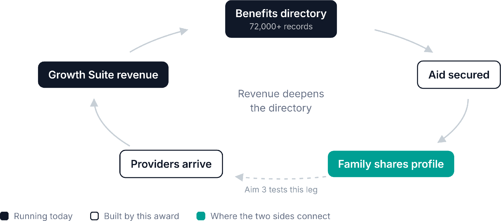
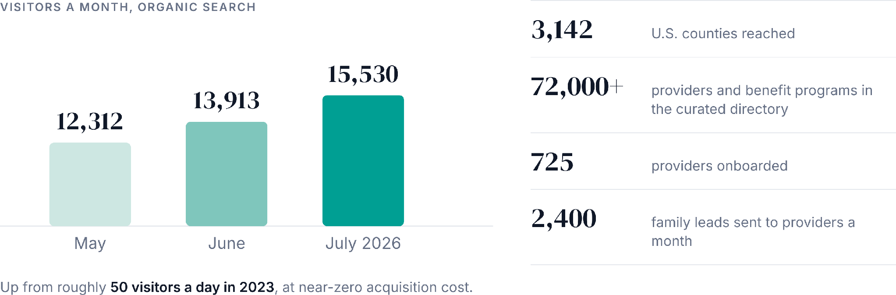
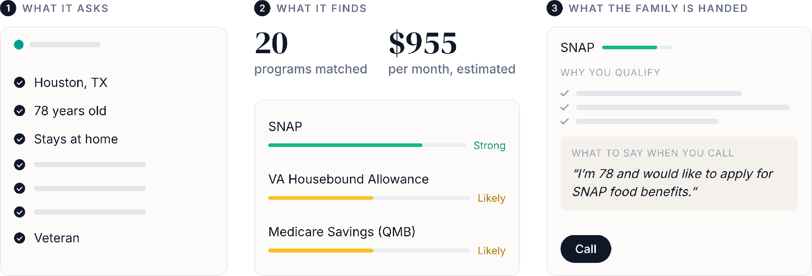
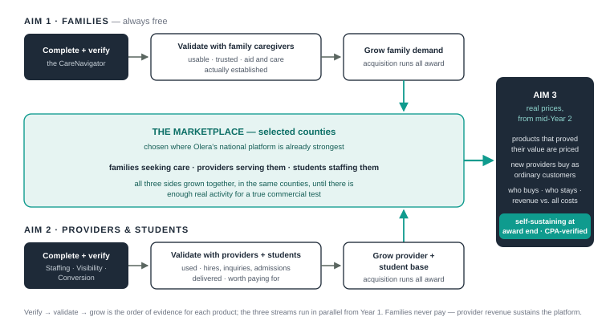
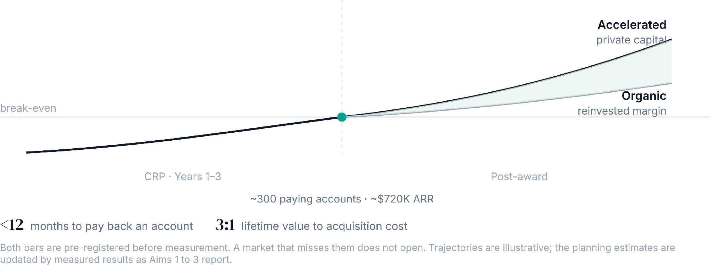

<!--
PROVENANCE: Text export of "2. Research Plan" (Google Drive, Live Grant Documents folder,
file 1dWDYwyS-OPNCmzOHBODh0FR1GyNc9Y4N), snapshot taken 2026-08-17 after TJ Falohun and
Qiping Fan's structural passes (last Drive modification 2026-08-17 14:04 UTC).
The Google Doc remains the surface where humans comment; this file is the working text
for the GitHub revision workflow. Figures are embedded inline from figures/research-strategy/
(see figures/MANIFEST.md). [cite]/[verify] markers are part of the draft, not errors.
-->

# Research Strategy (working snapshot, 2026-08-17)

SIGNIFICANCE

The unmet need. Care needs are growing faster than the country's capacity to provide and finance them. Americans are living longer with more chronic illness: 61 million are 65 or older today, heading toward 88.8 million by 2060. Care costs are rising against limited retirement savings, and family caregiving capacity is shrinking. The caregiving workforce cannot keep pace with the growing demand. The direct-care field must fill 9.7 million workers by 2034,\[cite\] and turnover approaches 80 percent in 2023, so agencies turn away families they cannot staff. The resources that do exist are poorly utilized: an estimated $58 billion in financial assistance goes unclaimed each year because households cannot identify or navigate complex eligibility programs (Figure 1). The result is unmet need, and unmet need in the geriatric population converts into preventable hospitalization, premature institutionalization, and avoidable Medicare and Medicaid spending. Solving the crisis requires both better resource utilization and expanded caregiver capacity, and that pairing is the design of this project.

*Figure 1: Two constraints produce one crisis. Aid that already exists goes unclaimed, and the workforce to deliver care does not exist. CareNavigator addresses both.*

The product and the business model. Olera serves both the families who need care and the providers who deliver it. The platform draws over 15,500 visitors a month, and 725 providers have onboarded. The CareNavigator is a family-facing AI navigation service that reads a household's situation, identifies the aid and services it qualifies for, prepares the applications, and follows each one to a decision. It runs on a curated national database of elder-care aid and services and returns every outcome to that database. The Provider Growth Suite is the paid tools providers use to find caregivers and clients. Keeping core navigation free is both mission and model. Under Olera’s proposed two-sided marketplace model, families in an affordability crisis are not asked to pay, and instead providers pay for optional growth tools to acquire new clients and staff.

The market. On the family side, older adults and the families managing their care must find services, work out how to pay for them, and get them started. Their spending, together with the public programs that help pay for it, supports a $173.6 billion home-care industry and a $76 billion senior-living industry. On the provider side are the operators who deliver that care: home care agencies, assisted living and residential care communities, adult day programs, and franchisees of national brands. Most are small businesses running on thin margins, with few administrative staff and little purchased software, and they compete for the same two scarce inputs, caregivers and clients. Providers are the paying side, and what they buy sits in the $2.4 billion long-term-care software market, the software layer of the two industries above.

Competitive environment and our advantage. Olera's two products face different competitors, and each solves only part of the problem.

  
Family-side navigation: Public tools stop at information. NCOA's BenefitsCheckUp, the Eldercare Locator, and Area Agencies on Aging produce a list of programs to apply to and agencies to call, then leave the family to work through it alone, one application at a time. The high-quality alternative is human: social workers, discharge planners, and case managers deliver real navigation, but that expertise is scarce, expensive, inconsistently available, and impossible to scale nationally. CareNavigator digitizes and scales the specific navigation functions AI agents, structured data, and automation can now support: screen, match, execute, follow up, confirm, and record. No existing digital competitor provides that full longitudinal workflow over a comprehensive elder-care resource database.

Referral marketplaces: Referral marketplaces are paid by the providers they recommend. A Place for Mom and Caring.com, the two largest, concentrate on private-pay placements, sell the family's contact information as a lead, and have been criticized for leaving Medicaid-accepting and non-paying providers out of their recommendations, which excludes the households the unclaimed aid is meant to reach. Olera charges a flat subscription, so its revenue does not change with where a family goes.

Caregiver marketplaces: Care.com and Papa are the two best-funded companies placing a worker directly with the household, and CareYaYa does the same with health-professions students. That leaves supervision thin, puts liability on the family, and puts the work outside licensed care, where public benefits cannot pay for it. Olera's students are employed and supervised by the licensed provider, which keeps the work inside licensed care, where the aid CareNavigator secures can be spent.

Existing alternatives for providers: Each Growth Suite tool has point-solution analogues: staffing agencies and job boards, ad agencies, review platforms, and CRM systems. The Growth Suite does the same work under one vendor, and the referral network adds what none of them sells, families who arrive with aid already secured. The suite was specified by 200+ NIH and NSF I-Corps provider interviews and shaped by Build-Measure-Learn cycles against the barriers providers actually face, on a platform 725 providers have onboarded to. The tool-by-tool competitive table appears in the Commercialization Plan.

Hurdles to adoption. The core technology and family and provider facing MVP offerings are validated through multiple peer reviewed studies and are used by families and providers today. The remaining hurdles are mostly scale and commercial, and the aims are built around these specifically. Benefit rules differ in every state, so each new market carries eligibility work the last one did not need (Aims 1 and 2). Repeatable family and provider acquisition playbooks for new markets (Aims 1 and 2). Enough usage sufficient to accelerate Build-Measure-Learn (Aims 1 and 2). Hardening each offering to measurable commercial value at its commercial-readiness endpoint (Aims 1 and 2). Converting validated free pilots into sustainable paid offerings without early-adopter bias (Aim 3). Preserving neutrality, safety, and regulatory compliance while scaling (Regulatory plan below; detail in the Commercialization Plan).

INNOVATION

Key Innovation 1: A caregiving workforce drawn from student workers training for health careers. The direct-care workforce cannot meet demand: a projected 9.2 million worker shortfall by 2030, turnover near 80 percent, low compensation, weak career ladders, and working conditions that drive attrition.\[cite\] A household approved for a Medicaid waiver still needs a licensed provider with a caregiver free at the time care is needed. Student workers at colleges studying to attend medical, nursing, or other healthcare professional schools are an unusually strong and novel source of new capacity. They need documented patient-care hours for program admissions, so the work itself carries career value. They are intrinsically aligned with care, educated and trainable, and geographically distributed around every community college and public or private university. Their availability fits the shifts providers struggle to fill: evenings, weekends, nights, summers, winter breaks, and many have gap years before professional school they aim to fill with healthcare-related work. Because the hours advance their careers, they deliver high-quality assistance at wages providers can sustain, and intergenerational contact itself benefits both sides. A new cohort arrives every semester, including summer, so the labor source is continuous rather than seasonal. Being students, the safety model must be structural: students are never sent directly to families. They are matched to licensed providers, which interview, hire, train, supervise, and credential them. That keeps families out of household employment, reduces liability, and integrates the new workforce into reimbursable licensed care, the only place the aid CareNavigator secures can be spent. The model is already validated: providers paid for student placements in our Texas A\&M pilot (details in Preliminary Work). The workforce tool also completes the CareNavigator itself: when a family matches to an appropriate provider that lacks staffing capacity, Olera recruits students into that provider's workforce, converting a dead-end match into deliverable care.

Key Innovation 2: Longitudinal AI navigation that does the work and stays with the family. Today's leading alternatives are fragmented single-visit tools and scarce human navigators: directories, benefits websites, discharge planners, clinic social workers, and case managers. None provides a scalable, nationally available workflow that screens eligibility, matches aid and services, executes the required administrative steps, follows stalled tasks, confirms care was established, records the outcome, and learns from it. That workflow is what modern language-model agents make newly possible, and it is what this innovation builds: AI agents grounded in Olera's proprietary elder-care database, automation for forms, documents, and scheduling, structured communication over text, email, and phone, and escalation to a human navigator or local agency when a case needs one. The CareNavigator holds a persistent model of the family and acts on it. It opens with one question, builds its picture at the pace the family can carry, prepares the benefit applications, assembles the documents, drafts the communications, and books the assessments. The family reviews and submits in the same session, and the platform follows each filed application until a decision returns, re-planning as conditions progress, savings draw down, and benefits come up for renewal. Families already take their elder-care questions to AI assistants; through an open interoperability standard the CareNavigator can meet them there and stay with them through care establishment rather than simply answering the question. The eligibility, guidance, and matching components run in production today, and under the CRP we will build the execution loop and the follow-up loop to the milestones at which the integrated product is declared commercially ready. The measure of this innovation is completion: applications filed, assessments attended, and aid received, not merely identified.

Key Innovation 3: A proprietary national resource and outcomes database that learns the real rules from every completed case. A general-purpose AI can fill out a form. It cannot know which of the dozens of scattered federal, state, and local programs a specific household qualifies for, because that knowledge does not exist in usable form on the open web. Across Phase I-IIB, Olera assembled a national directory of 72,000+ providers and benefit programs alongside 700+ paying-for-care guides, curated by experts, versioned, and re-verified against fresh sources in all fifty states. Some resources are never published at all. Those enter the database through structured field work, expert curation, direct outreach to agencies and providers, and the outcomes of applications prepared through the platform. The deeper problem is that published rules are often neither accurate nor current. Because Olera executes applications and follows each case, it learns what programs actually decide, and every completed case becomes a longitudinal record: what the family needed, what it qualified for, where the application stalled, whether local capacity existed, what care was established, and what happened after. At the volume this project funds, those records accumulate into a program-by-program, county-by-county picture of elder-care need, resources, and outcomes that exists nowhere else, with legitimate public-health value for surveillance of unmet need. Commercially, that record is the durable barrier. It cannot be assembled without an execution loop and the family volume to generate it. A competitor who copies the features starts with an empty database, while Olera's is already fed by thousands of families a month and sharpens with every family served.

*Figure 2: One loop, two sides. Consented family demand is the reason a provider signs in. Whether it is also what keeps them paying is the hypothesis Aim 3 tests.*

PRELIMINARY WORK

CareNavigator matured across NIA SBIR Phase I/II Fast-Track (impact score 20) and Phase IIB (impact score 25) awards (1R44AG074116) and runs in production today. Phase I identified the need and built the initial matching infrastructure, validating usability with AD/ADRD caregivers. Phase II scaled the services database and iterated the interface. Phase IIB added the financial-aid programs, connected the database to the planning agents, and evaluated the integrated platform with family caregivers (n=200). The Phase IIB review assessed commercial potential as extremely high, citing the platform's ability to help caregivers access eligible funding.

National reach at no acquisition cost. The platform draws about 15,500 visitors a month through organic search, has grown from roughly 50 a day in 2023 to more than 500 today at near-zero acquisition cost, arriving through benefits screening, care guides, provider pages, and the caregiver community. That national organic baseline is what let us release real products, observe real usage, and make product decisions from user behavior rather than guesses. Validation followed the same pattern: the care-planning tool scored 4.6 of 5 on the Mobile Application Rating Scale among family caregivers (n=31), against the instrument's acceptability threshold of 3.6 and the AI agents scored approximately 5.6 of 7 in structured evaluation of technology acceptance, exceeding the pre-specified benchmark.\[cite\]

*Figure 3: Demand arrives on its own. Organic search alone brings more than 15,000 families a month at near-zero acquisition cost, in nearly every county in the country.*

The family-facing CareNavigator MVP. Benefits eligibility, AI guidance, and provider matching are live nationally, and two-way benefits messaging has become a significant inbound driver of care-seeker profiles that seed providers demand. Prior usage also revealed the gap this award closes: matching alone is not enough. Families fall off during execution, follow-up does not exist, and the database lacks closed-loop outcome data. Aim 1 builds the execution and follow-up loops and hardens the integrated system.

*Figure 4: What the CareNavigator does for one family. Seven questions match one Houston household to twenty programs worth an estimated $955 a month. The platform prepares each application and the family submits it.*

A provider-paid workforce precedent. Franchisees of Comfort Keepers, Visiting Angels, Senior Helpers, and Homewatch CareGivers paid Olera $275 a month for access to caregivers it recruited. That happened in the Texas A\&M MedJobs pilot, which ran eight months across two semesters, drew more than 900 student applicants, and placed about 100 of them. Early paid placements validated willingness to pay; we then built a self-serve MVP staffing tool to remove the manual delivery that capped the pilot's scale. Executives across these nationwide franchised home-care agencies have expressed interest in broader scaling after additional local validation, and the model is replicating with minimal staff effort: a committed provider and a university advisor are prepared for a fall pilot in Indiana, seeded by a single coordinator. This offering enters the CRP ahead of the other provider tools because it already carries direct paid evidence; Aim 2 hardens it through accelerated Build-Measure-Learn.

The Provider Growth Suite. More than 200 NIH and NSF I-Corps provider interviews identified the problems providers pay to solve \[SETTLE: three or four\]: staffing, client acquisition, online reputation, and client conversion. We built and launched each nationwide in July 2026. Until then the tools carried no paywall, because the offerings were still being decided, so there is no pricing history to read and Aim 3 sets the first one. Development continues through submission, and Aim 2 begins from what is live at award, with Task 2.1 establishing that baseline. The platform sent roughly 2,400 family leads a month to providers over the last quarter. Among providers with a claimed account, platform activity runs about fifteen times higher on the day a lead arrives than on days without one, and a fifth of all growth-tool views fall in the twenty-four hours after a lead. Organic reach is national and thin by nature, and pricing a tool needs enough providers in one market to measure against. The CRP resolves this by concentrating family and provider acquisition in selected markets and accelerating Build-Measure-Learn.

Investor-readiness groundwork. Olera has been evaluated by Ziegler, the leading underwriter of financing for nonprofit senior living providers, whose venture funds invest on behalf of the operators Olera serves, and by Equitage Ventures, an early-stage fund dedicated to the aging economy. That diligence set the commercial endpoints this plan measures against, so the milestones in Aims 1 through 3 are written to them. Our advisor David Qu, a Ziegler partner who has founded and exited multiple digital-health companies, advises the company on private-capital positioning and remains involved through the award. The fundraising plan appears in the Commercialization Plan.

What this record means for the CRP. The needs are validated, the MVPs live with real users, organic traction is national, early paid evidence exists, and investor input has shaped the endpoints. The CRP accelerates acquisition and Build-Measure-Learn to harden validated offerings to commercial readiness, then prices them and measures whether the economics carry the business.

APPROACH

Overall design and timetable (Figure A). Olera already has broad family and provider traction nationwide, but breadth alone does not create a healthy marketplace. CareNavigator needs enough families, providers, and workforce in the same local markets for users to receive consistent value and for Olera to generate revenue. The CRP will therefore build that local depth, starting where Olera’s existing family traffic and provider base provide the strongest foundation, then replicate the playbook across other serviceable markets. Aims 1 and 2 will verify, validate, and build adoption of the family and provider products in parallel. Aim 3 will test whether the provider products generate enough revenue to sustain Olera after the award. Across all three aims, the CRP will also generate the commercial evidence investors have asked for to reduce investment risk.

<b>Figure A:</b> Overview of the specific aims and tasks.
<!-- Figure lettering ("Figure A") is finalized against the numbered figures in the consistency sweep. -->

Regulatory plan. CareNavigator is navigational and administrative software: it matches families to benefits, services, and providers and prepares paperwork, and it does not diagnose, treat, or make clinical decisions. It therefore does not meet the FDA’s definition of a medical device, and no FDA premarket authorization, license, or other regulatory approval is required before commercialization. The laws that govern ongoing operations, including privacy, marketing, and referral practices, are addressed in the Commercialization Plan.

Specific Aim 1: Verify, validate, and drive adoption of the CareNavigator for families. Rationale: Financial aid is one of the main reasons families come to Olera. However, families can be lost to follow-up while completing the steps required to apply and again after an application is filed (Preliminary Work). The execution and follow-up loops are designed to close these two points of falloff.

The CareNavigator Platform.

The matching agents (live). Three agents run over Olera's curated, versioned database using retrieval-augmented generation: needs assessment, eligibility matching across twelve program and service categories, and guidance. They read only from that database, never the open web, and cannot assert what the records do not support. Records enter only through the ingestion pipeline, where an eldercare-benefits expert confirms every change before it goes live.

The execution loop (in development). Families currently complete every application step themselves. The loop assembles required documents against a per-program checklist, fills the application from the family's stored profile and flags what is missing, drafts communications for family approval, books assessments, and tracks each case to decision, escalating anything unresolved to a human navigator. Document preparation is the default because it works everywhere; the platform never submits an application and never holds a portal credential, and VA claims are screened and referred because federal law reserves claim preparation to accredited representatives.

The follow-up loop (yet to be developed). Once a family files, no one follows the case. The loop will watch every open case and re-engage the family by text or email when a step stalls, so an application that would otherwise lapse reaches a decision. Every approval, denial, and pending decision the family reports is then captured and returned to the database, and the next family's answer reflects what programs actually decided.

Task 1.1 Verify the CareNavigator against expert review. The developed CareNavigator will be verified by an expert panel of licensed clinical social workers, independent of the engineering team and holding no equity. This is internal product verification, not human-subjects research. For each audited household the panel determines eligibility blinded to the platform's answer, and for a sample of cases it prepares the applications by hand. Both are compared against what the platform produced, category by category for eligibility and field by field for applications. Agreement is reported as percent agreement with a 95 percent confidence interval and as Cohen's kappa, with disagreements fed to the error analysis. Audited households are held out of tuning data.

Metrics for Success for Verification (Task 1.1):

Accuracy: agent-panel agreement of 85 percent or higher, no lower than two panel members reach with each other, reported by category.

Execution Reliability: 100% of prepared workflows have a current state and next step, and 100% of escalations reach a navigator or documented local agency.

Follow-up Reliability: 95% of scheduled follow-ups sent on their due date, with a renewal reminder for every approved benefit, and every miss logged with its reason.

Application accuracy and control: material errors in \<=10% of prepared applications against the expert gold standard, with every adverse event reviewed rather than sampled and confirmed by a second reader; zero applications transmitted without family action; and \>=80% outcome ascertainment at the pre-specified category-specific follow-up window.

Task 1.2: Validate the CareNavigator with family caregivers. This task tests whether the integrated CareNavigator is usable and trusted by family caregivers, whether it helps them reach aid or care, and where it loses them when they cannot. It is human subjects research and runs under IRB approval.

Design, participants, and recruitment. Twenty-five family caregivers of people living with dementia will be enrolled to complete an online mixed-methods study to assess the usability of the integrated CareNavigator product. The study follows the User Experience Evaluation in Intelligent Environments framework and the sample size was informed by prior literature and our preliminary work. Eligible participants will be adults 18 or older who identify as a current unpaid family caregiver of a person living with Alzheimer’s disease or a related dementia, and are involved in arranging or paying for the person’s care, reside in the United States, and can join a video session on a computer or tablet. Participants will be recruited from online aging and caregiving communities and the platform’s caregiver community, and invited to complete an eligibility survey, and eligible and enrolled participants will be invited to participate in a scheduled online interview.

Data collection procedures. Each 60-minute online session will pair a trained moderator with one participant over videoconference (e.g., Zoom). Participants will complete a pre-use demographic and caregiving experience survey, view a standardized demonstration of the CareNavigator, and then work through a protocol of core tasks, including completing the needs assessment, review eligibility matches, prepare one application package, and locate the status of an application. Participants will think aloud while the moderator records task success against pre-defined completion criteria, time on task, errors, and assists. The post-use survey during the session will include the validated System Usability Scale (SUS) that scored 1 to 5 and total score ranged from 0 to 100 and the 12-item trust-in-automation scale (TIAS) scored 1 to 7. After the survey participants will participate in a semi-structured interview on user experience, care application process, and areas for refinement. Short follow-up surveys will be sent by email at 4 weeks and 3 months to track whether participants were able to reach aid or care and identify obstacles requiring additional engineering or human support.

Data management and analysis. The study will run under IRB approval at Clemson University, and informed consent will be obtained from all participants. Identifying information will be used only for data collection follow-up, and stored separately from de-identified data and accessible only to key research personnel. De-identified data will be used for analysis and stored on a password-protected drive. Survey results will be analyzed descriptively with means, percentages, and 95% confidence intervals reported. Group differences in major outcomes (SUS and TIAS scores) by demographic and caregiving characteristics will be reported and treated as exploratory signals for engineering refinement rather than as tested comparisons. Interview transcripts will be analyzed using thematic analysis in a framework approach. Group discussions and preliminary coding will inform a shared codebook for two independent coders, with inter-coder agreement calculated to support analytic validity and an audit trail documenting coding decisions and discrepancy resolution. A joint display of both quantitative and qualitative findings will map themes and be translated into suggestions to engineering refinements.

Metrics for Success for Validation (Task 1.2):

Usability and Trust: mean SUS of 72 or higher against the 68 benchmark, mean trust of 5 or higher on the seven-point TIAS, every engineering refinement resolved.

Task 1.3: Drive family adoption and measure cost to acquire and cost to serve. Organic search brings families nationally at near-zero cost to the Olera platform but a greater volume of families in any one market is needed to rapidly iterate our business model as we work towards long term economic sustainability.

(Task 1.3A) Active family acquisition: This task builds the active channels in twelve markets, ranked in advance on how many families already arrive there, how many providers operate there, how much aid a household can secure under that state's rules, and whether a health-professions campus is nearby to supply student caregivers. The active acquisition channels will be organized as paid media (search and social), partnerships (Area Agencies on Aging, Alzheimer's Association chapters, caregiver creators), and direct outreach (email, phone, events, webinars, PR). Each channel runs under a set budget, a fixed window, and a stated decision rule. Each channel will graduate to sustained spend only when its cost per acquired family lands at or below its ceiling. Channels that miss the thresholds will be closed.

(Task 1.3B) Instrumented cycles and cost models: With families arriving in volume, the product records what each one does, which shows the step where they stop, and each fix is re-measured. Cost to serve counts what it takes to carry one family to aid or care, using time-driven activity-based costing over the compute behind the agents, the messages the loop sends, and navigator time. Cost to acquire counts spend per family by channel and market. Both formulas are set before measurement begins and both read from live records. A family may also opt in to be reached by nearby providers. The profile a provider sees carries the need and not the name. Olera is not paid for the introduction, and the families who opt in are what the referral network in Aim 2 works from.

Metrics for Success and Commercial-Readiness Endpoint:

Funnel: task completion 90 percent or higher with drop-off 10 percent or lower per step, held across two consecutive cycles.

Economics: re-runnable cost-to-serve and cost-to-acquire models from live records, at least two active channels at or below their ceiling, opt-in share reported by market.

  
Aim 1 decision point and deliverable. The family offering enters Aim 3 when it meets its commercial-readiness endpoint. If it does not, it remains in Build-Measure-Learn while the provider modules advance on their own schedule, and Aim 3 prices what has graduated. The deliverable is the hardened offering and the family market-entry playbook Aim 2 works from.

Specific Aim 2: Verify, validate, and drive adoption of the Growth Suite for senior care providers. Rationale: The Growth Suite consists of four tools providers use to find caregivers and clients. Providers arrive with different constraints, some unable to staff the shifts they already have, others with capacity they cannot fill, and the suite carries a tool for each. Each answers a problem named in more than 200 provider interviews, staffing, client acquisition, online reputation, and client conversion, and 725 providers have onboarded to the platform they run on. Three of the four solve that problem without drawing on Olera’s family volume, so their value does not wait on Aim 1. Each was designed to prove demand rather than to run at scale, so Aim 2 turns them into four measurable modules with one primary provider-value endpoint each. Staffing comes first because it has paid evidence and directly expands care capacity.

The Provider Growth Suite.

Staffing. Health-professions students apply through Olera, which screens for eligibility and surfaces qualified applicants to providers in their market. The module runs where a health-professions pipeline has been established, which is why market selection ranks campus proximity. The provider interviews and hires. The student logs shift hours, the provider confirms them, and Olera compiles a verified experience record. Every step is timestamped, so the module reports qualified applicants, time to interview and hire, confirmed hours, provider staff minutes per hire, and retention at 30 and 90 days. Students are never sent directly to families, and licensed providers employ, supervise, and credential them.

Clients. The other challenge is helping providers reach the families who need them. Three tools do that work, and only one of them draws on Olera’s family volume. The referral network introduces families who have consented to contact, and the provider pays no fee when one becomes a client. Review generation asks every family a provider serves for a review, whatever brought them there, and carries each one through to a posted response. Managed Ads places the provider in front of families searching for care on Google and Meta, with Olera designing and running the campaigns. The value endpoints are a scheduled assessment, a posted verified review, and a qualified inquiry.

Task 2.1: Verify that the Growth Suite works end to end. Providers pay for outcomes, so before the Suite is priced the software has to produce the outcome and record it correctly. A test case runs each module’s full path before it carries real volume, and the result has to arrive as what the provider was promised, a filled shift, a lead in the provider’s inbox, a posted review, or a booked assessment, recorded once. What counts is fixed in advance, so clicks, impressions, and repeat contacts stay out, and every count is checked against the outside record of the same event. A module whose path does not complete does not deploy.

Metrics for Success for Verification (Task 2.1):

Delivery: 4 of 4 modules complete their full path in test, with the promised result reaching the provider and recorded exactly once.

Count accuracy: every module’s reported count reconciles to the outside record of the same event, with each unexplained difference resolved before the module carries real volume.

Task 2.2: Validate the Growth Suite with provider users and student caregivers. The verified Growth Suite will be validated by a sequential mixed-methods implementation and usability study with provider users and student caregivers. The design moves from formative task observation to prospective field use and explanatory interviews, with results integrated by module and stakeholder role.

(Task 2.2A) Formative usability-testing phase: We will enroll 30 provider participants across owners/administrators, recruiters/schedulers, and marketing/intake staff, and 20 health-professions students. Provider participants will be adults 18 or older in an owner/administrator, recruiter/scheduler, or marketing/intake role at a licensed home care agency, senior living community, or adult day program; student participants will be adults 18 or older enrolled in a health-professions or pre-health program and eligible to work in the United States. Providers will be recruited from the onboarded base and the twelve study markets, students through campus advisors and health-professions organizations, and all participants will complete remote e-consent. The sample size targets provide at least five users per module within each role group, consistent with problem-discovery guidance.\[cite\] Purposive sampling will be used to cover different roles and workflows and will continue in small batches until no new high-priority usability or implementation issue emerges in two consecutive batches. Participants will complete module-specific tasks against pre-defined completion criteria and then discuss what worked, what did not fit current workflow, training and support needs, safety and data requirements, and priorities for improvement in a guided semi-structured interview. Provider and student users will complete the System Usability Scale (SUS) as the primary usability outcome, and module-specific implementation measures (AIM/IAM/FIM) for acceptability, appropriateness, and feasibility as secondary outcomes. Module-level estimates will be reported with 95% confidence intervals and treated as implementation and feasibility estimates, not between-module efficacy tests.

(Task 2.2B) Prospective field-testing phase: We will implement the refined Growth Suites in a prospective study involving approximately 80 provider accounts, with at least 20 exposed to each module and staffing oversampled, and approximately 100 student users followed for three months. Student users will be followed monthly against verified shift logs, and the 100-student target carries a 20% attrition allowance.

A sequential mixed-methods study will be conducted, with a quantitative component serving as the primary and qualitative component as explanatory and complementary. The quantitative outcomes will include proportions of critical-task completion, time to first value, repeat use, workflow abandonment, support minutes, and module-specific value events. NASA-Task Load Index (NASA-TLX) will be used to measure the subjective mental workload for staffing and referral tasks specifically.\[cite\]

The primary quantitative analysis will use generalized estimating equations (GEE) with a logit link for binary outcomes, an exchangeable working correlation structure, and clustering at the provider-organization level, with small-sample corrections applied. Market will be treated as a reporting stratum rather than a model term, and mixed models will serve as a pre-specified sensitivity analysis.

For the qualitative component, we will purposively sample and interview 20 providers and 20 students across nonactivators, one-time users, and retained users. Interviews will run 30 to 45 minutes, audio recording will obtain separate informed consent, and non-activators will be offered a shortened 20-min format to support recruitment. Two analysts will use a Consolidated Framework for Implementation Research (CFIR)-informed matrix and joint displays to link observed behavior to barriers, facilitators, and engineering actions.\[cite\]

Throughout the study, providers will employ, supervise, insure, and credential all student workers, while Olera does not deliver care. Research participation will be kept from employment and purchasing decisions, and student responses will not be shared with employers. Research participation compensation will not be contingent on hiring, and withdrawal does not affect platform access or placement.

Metrics for Success for Validation (Task 2.2):

Usability and implementation: mean SUS \>=72; pre-specified operational means of \>=4.0 on AIM, IAM, and FIM; \>=90% critical-task completion.

Behavioral confirmation: time to first value, value-endpoint completion, with nonactivation and attrition reasons documented by role and module for engineering actions.

Task 2.3: Drive provider adoption and measure cost to acquire and cost to serve. Providers already find Olera on their own from anywhere in the country at near-zero cost, but in any one city they arrive a few at a time. This task concentrates paid and outbound acquisition in the same twelve markets Aim 1 works, so enough providers are using the Suite in one place to change something, measure what it did, and change it again inside the award. Provider accounts and student users are the units of analysis, and market is a reporting stratum rather than an assigned condition.

(Task 2.3A) Provider and student acquisition: Acquisition of providers starts with the relationships we hold, national provider brands and industry associations, then opens outbound channels under the same discipline as the family side: business-line calls, paid digital advertising, industry networking, conferences, and direct mail for high-value accounts. Student recruitment will use campus advisors, health-professions organizations, and digital outreach. Every activation will be tagged by source, market, module, cohort, and wave. Each channel will operate under a pre-specified budget, attribution window, acquisition ceiling, and decision rule. Aim 1's funnels seed local family demand, so providers also arrive on their own when a family asks about their organization, and every activation is tagged organic or targeted so lift is counted by real-world data. Advertising will run on outside channels and not alter what families see. Waves are staged and pre-registered against the one before; scalability is checked by the mix, with the automated share of activations required to rise while cost per activation falls.

(Task 2.3B) Deployment, cohorts, and cost model: Each provider account will be followed from first contact through onboarding, first value, repeat use, and 60-day status. The staffing workflow will run through live semester cohorts and follow placements to 90 days. The cross-aim dictionary will produce provider customer acquisition cost, onboarding cost, module-specific cost to serve, student recruitment and onboarding cost, and cost per qualified applicant, hire, first verified shift, qualified inquiry, completed review workflow, scheduled assessment, and service start. Results will be reported by module, provider type and size, ownership model, market, and acquisition channel. Waves will continue only when value and cost bars are met.

Metrics for Success and Commercial-Readiness Endpoint:

Value: \>=70% of activated provider accounts reach the module-specific value endpoint, with staffing reporting the first verified paid shift and 30- and 90-day placement status.

Repeat use: \>=50% of accounts that reach value repeat or sustain the workflow at 60 days, reported separately by module and provider segment.

Cost and scale: all acquisition and service costs are reproducible from live records; at least one provider channel and one student channel operate at or below their ceilings; and the automated share of activations increases across waves.

Aim 2 decision point and deliverable. Each module graduates independently into Aim 3 when its engineering, human-factors, implementation, value, repeat-use, and cost bars are met. A module that misses its endpoint remains in Build-Measure-Learn while the others advance. The deliverable is a validated staffing workflow, readiness status for all four modules, an activated provider and student base, and a provider market-entry playbook containing channel rules, provider and student acquisition costs, module costs to serve, and value-endpoint economics.

Specific Aim 3: Validate a sustainable provider-funded revenue model. Rationale: Aims 1 and 2 establish whether the platform works for families and providers. Aim 3 tests whether that validated value can support a recurring, provider-funded business model without shifting the cost of access to families. Aim 3 answers the question: can validated value be converted into durable recurring revenue and market economics strong enough to sustain the business, fund continued expansion, and justify private investment? Early sales alone cannot answer it, because a price can sit below the true cost of winning and serving an account, and new-account growth can hide customers leaving faster than their revenue repays that cost.

Aim 3 will use a pragmatic, prospective, explanatory-sequential mixed-methods implementation evaluation embedded in the commercialization rollout. The quantitative phase will follow providers in two pre-specified cohorts: (1) a conversion cohort that transitions selected free-pilot providers from Aim 2 into paid plans in activated markets, and (2) a paid-entry cohort that enrolls new providers under paid terms from first contact in new markets. The qualitative phase will then explain observed patterns of conversion, use, retention, and churn.

Task 3.1: Set price and packaging under real billing. At a higher price each account brings in more revenue, but fewer providers convert and stay. This task finds the price and package that maximize sustainable account value under real billing rather than stated intent in Aim 2.

(Task 3.1A) Pre-registered experiments: We will pre-register the price points, package variants, primary contrast, follow-up horizon, and decision rules before outcome review. Candidate price points will be seeded by a Van Westendorp price sensitivity survey \[cite\] completed by approximately 120 provider decision-makers drawn from both cohort frames and screened for purchase authority. For each product line, respondents will answer the four standard price questions plus purchase-likelihood anchors, and cumulative response curves will define the acceptable price range and the price points entered into the arms.\[cite\] The survey will run under IRB approval and be administered apart from sales and renewal conversations, with e-consent. Conditions will be assigned across matched markets rather than individual provider accounts because providers in neighboring markets may compare pricing. Baseline conversion will be recorded first, and a biostatistician will size the arms against it. Both cohorts will enroll. The primary contrast will be paid conversion within 60 days of offer, analyzed with generalized estimating equations at the account level with market as the cluster and small-sample corrections, with twelve markets, arm-level contrasts will be estimated rather than significance-tested. The pre-registered decision rule will govern the pricing decision. Conversion, willingness to pay, usage, and early retention will be tracked per arm and per cohort.

(Task 3.1B) Pre-specified pricing decision: A rule stated before the experiments open converts observed conversion, retention, and usage into the operating price and package for the rest of the award. If the bundle underperforms at every tested price, the pre-registered alternatives run in order: unbundle the tools, re-tier the packaging, add value where Task 3.2 interviews locate the gap, and re-test in a second round.

Aim 3 is a measurement aim, so its task milestones certify that each study ran to its pre-registered plan, and the decision point carries the outcome bars.

Metrics for Success for Pricing (Task 3.1):

Execution: seeding survey completed with at least 120 decision-makers, baseline documented and experiments run to the pre-registered plan across both cohorts.

Decision: a documented price and package decision balancing conversion, retention, usage, and revenue per account.

Task 3.2: Evaluation of provider value, retention, and cross-side liquidity. Every number comes from live billing and cost records. In plain terms, we measure three things per market: what it costs to win a provider, what an account is worth each month, and how long accounts stay.

(Task 3.2A) The unit-economics and retention model: The quantitative model will measure customer acquisition cost (CAC), monthly net account margin, retention, churn, and market-level sustainability. CAC will equal all acquisition spending, including spending on non-converters, divided by accounts won. Monthly net account margin will equal revenue minus the pre-specified cost to serve. Retention will be estimated at 3, 6, 9. 12 months separately for the two cohorts. Time to churn will be analyzed with discrete-time survival models on account-month records, matching the monthly billing cycle, with voluntary cancellation, uncured payment failure, and downgrade treated as competing events; cause-specific hazards and cumulative incidence functions will be reported by cohort.\[cite\] Restricted mean survival time at 12 months will give expected account lifetime, and lifetime multiplied by monthly net account margin will give LTV with a confidence interval, so the payback and 3:1 LTV:CAC bars carry measured uncertainty rather than point estimates.\[cite\]

A market will be considered commercially viable when payback occurs within 12 months and the LTV:CAC ratio is at least 3:1, subject to the margin threshold required for reinvestment. The cross-side liquidity hypothesis will be examined by modeling realized provider value, retention, and margin against lagged qualified family demand in each market. The primary exposure will be a pre-specified prior-period measure of consented, qualified demand rather than same-month demand alone. Models will adjust for a pre-specified set of no more than six terms drawn from provider size and type, module, baseline activity, acquisition channel, seasonality, and prior free-pilot exposure, sized to the 60 to 100 churn events expected among approximately 200 accounts, with market as a random effect and the provider organization as the clustering unit. The enrollment window will be sized with the biostatistician so key proportions carry 95 percent confidence half-widths of no more than 7 points.

(Task 3.2B) Sequential mixed-methods provider research: We will enroll provider decision-makers and active users from both Aim 3 cohorts. Participants will be adults 18 or older screened for user roles, with 150 to 250 survey participants expected across the approximately 200 accounts. The person-level research participant and the account-level economic unit will be defined separately: an account may have multiple users, but provider-level revenue, cost to serve, and retention will be analyzed at the account level. At enrollment, consenting participants will complete a brief baseline survey covering role, provider characteristics, prior experience with the platform, perceived value, workload, willingness to continue, and implementation outcomes such as acceptability, appropriateness, and feasibility (AIM/IAM/FIM). A brief follow-up will be collected at approximately 4 weeks and 3 months, and/or after a key implementation event such as activation, downgrade, or churn. Linked platform, billing, support, and qualified consented family-demand records will be used only as approved by the IRB and with study IDs. Baseline perceived value will enter the Task 3.2A models as a pre-specified predictor of churn.

The qualitative phase will interview approximately 30 providers after interim quantitative review. Purposeful selection will represent non-converters, converted-then-churned providers, retained low-use providers, and retained high-use providers, with representation from both cohorts when feasible. Churn subtype, voluntary or payment failure, will be recorded and used in sampling. We will target at least six providers in each behavior group when feasible and will document the stopping rule. Interviews will last approximately 45-60 minutes and will be conducted separately from sales, support, and renewal conversations. Interview participants will receive $50 compensation, and non-converters will be offered a shortened 20-minute format to support recruitment. The interview guide will be informed by CFIR 2.0 \[cite\] and will examine fit with provider workflow, perceived value and price fairness, the role of family demand, barriers and facilitators to sustained use, training and support needs, equity considerations, and changes needed in the product or package. Two analysts will code the interviews in a framework matrix, examine analytic validity using inter-coder agreement rate, and document audit trail of analytic decisions for discrepancies. The integration product will be a joint display that connects each quantitative behavior pattern to qualitative provider explanations and to pre-specified packaging, support, or product actions that can be considered in Task 3.1B.

Metrics for Success for Unit Economics (Task 3.2):

Delivered model: the unit-economics model from live records with confidence intervals, cause-specific retention and cumulative incidence curves by cohort, LTV with confidence intervals from restricted mean survival time, and the derived sustainability threshold.

Implementation Feasibility: means user-rated score of 4.0 or higher on AIM, IAM, and FIM;

Understanding: stratified provider interviews findings translated into packaging and product actions.

Task 3.3: Independent financial validation and the investor evidence package. Investors discount a founder's spreadsheet. This task makes the model verifiable by someone with no stake in its answer.

(Task 3.3A) Independent rebuild of the commercial model: An independent analyst (CPA, subcontract), working from the pre-specified analysis plan and billing/cost records, will rebuild revenue, CAC, cost to serve, margin, retention, market profitability, reinvestment capacity, and the sustainability threshold. The independent reviewer will not be responsible for setting price or packaging. Discrepancies between the independent rebuild and the operating model will be investigated and reported rather than silently reconciled.

(Task 3.3B) The investor evidence package: The package assembles the analyst-confirmed model into the two forward trajectories in Figure 5: sustainable growth funded by reinvested margins, and accelerated rollout under private capital, with expected revenue and margin growth and a return profile over a decade post award horizon, benchmarked against the return expectations standard for early-stage venture investment in this sector. Its components track the evidence the investors who evaluated Olera (Preliminary Work) identified as necessary, and the Commercialization Plan's fundraising strategy is built on it.

Metrics for Success for Validation (Task 3.3):

Validation: the independent rebuild completed and reported in full, discrepancies included.

Evidence package: delivered with every component evaluated against an acceptance bar set in advance.

Aim 3 decision point and deliverable. The planning estimates, roughly 300 paying provider accounts averaging about $200 per month across both lines, about $720K ARR, are stated now and updated by measured results as Aims 1-3 report. Aim 3 succeeds when the analyst-confirmed model shows viable markets at the pre-registered bars, payback under 12 months and 3:1 LTV:CAC, with margin at or above the derived sustainability threshold, and when provider revenue at steady state covers the Task 1.3 cost of serving families, the cross-side test this two-sided model stands on, with the case where it does not pre-committed for report. The deliverable is a validated business model: price, packaging, acquisition cost, retention, margin, both market-entry playbooks, the sustainable-growth forecast, and the investor acceleration model.

*Figure 5: The economic hypothesis the award tests. Provider revenue reaches break-even by the end of the award, and private capital accelerates a model already shown to work. Trajectories are illustrative.*

Problems and alternatives. Each failure mode carries a pre-set response. Insufficient family liquidity in a market: reallocate or increase Aim 1 family acquisition there before touching price. A tool short of its readiness endpoint: keep it in Build-Measure-Learn and price the others; graduation is per offering. Price below cost to serve: improve product value where the Task 3.2 interviews locate the gap, cut acquisition and serving cost, repackage, and re-test in the pre-registered second round. Margins positive but below the sustainability threshold: optimize acquisition and cost structure before opening further markets. Private capital unavailable: continue slower expansion funded by operating margins, which the organic trajectory in Figure 5 already models. In every case, no expansion into new markets until the market model is viable.