# University Activation

**A guide for the Consumer Relations Manager.** What was built, why it works the way it does, and how to
use it to run ST3 through ST7.

---

## What this is

University activation was, until now, kept in meeting notes and in your head. Which advisor agreed to
send the flyer, which chapter shared it, when the job posting was last checked, whether anyone had asked
about professors yet. That worked at four universities. It does not work at forty.

The workspace turns that into a record. Two new tabs sit in the MedJobs In Basket:

- **Universities** shows every campus and the state of its five channels.
- **Tasks** holds the follow-up work the system generated for you.

The design principle behind it is worth stating plainly, because it explains almost every decision below:
**you record what actually happened, and the system works out what it means.** You will not find a status
dropdown anywhere. You tick off real steps, and the status follows.

---

## The five channels

The channels are unchanged from the operating model. What is new is that each one now has a written
definition of what makes it live, and the system holds you to it.

| | Channel | Live when |
|---|---|---|
| **ST3** | University job board | The posting is submitted, approved, and confirmed visible to students |
| **ST4** | Advisor listserv | The advisor has agreed to send the flyer to their listserv |
| **ST5** | Student organizations | At least one organization is activated |
| **ST6** | Campus events | At least one event or webinar is activated |
| **ST7** | Professors and class outreach | Approval obtained, and at least one professor has agreed |

**ST3 and ST4 are single switches.** They are either arranged at this university or they are not.

**ST5, ST6 and ST7 are lists.** A campus can have four student organizations, two events and nine
professors, each activating on its own schedule. Adding one is a button; each keeps its own contacts, its
own history and its own next check.

---

## Not yet, in progress, live

Every channel and every record moves through the same three states, and you never choose them.

**Not yet** is where everything starts. Nobody has done anything.

**In progress** happens automatically the moment you tick the first step.

**Live** happens automatically when the last required step is ticked. The system stamps the date, shows a
brief acknowledgement, and creates your next follow-up.

There is one state you do choose: **not available here**. Use it when a channel genuinely cannot work at
this university, and say why. A dead job board recorded as dead is useful. A dead job board left blank
looks like work nobody did.

Records inside the list channels can be **declined** in the same way, for the organization that says no
or the professor who is not interested. A declined record stops appearing as unfinished work.

**Activation is recorded once and never removed.** If a channel later goes quiet, the date it first went
live stays on the record. It did happen, and that fact does not expire.

---

## Running the list

Open **Universities**. Every campus is a row, and the five channels read left to right in the same order
every time. A **red dot** beside a university name means something there is due or overdue.

**Exhibit 1. The Universities tab. Work top down; when the red dots run out, you are done for the day.**

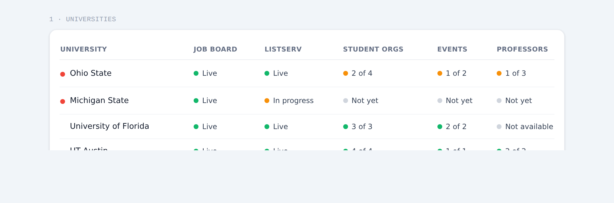

Universities with a red dot sort first. Click any row to open that university.

---

## The university drawer

**Exhibit 2. One university, its five channels, and nothing else.**

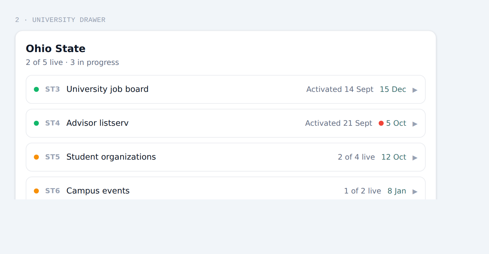

The line under the name is the whole summary. Each channel shows its status, how far along it is, and the
date it is next due.

**There are two things to click on a channel row.** The row itself opens the workflow. The **date** on the
right leaves the drawer and takes you to the task that explains what to do.

---

## Working a channel

Inside a channel you find the same things every time, in the same order.

**Exhibit 3. ST4 expanded. Live win at the top, then contacts, the copy you can send, and history.**

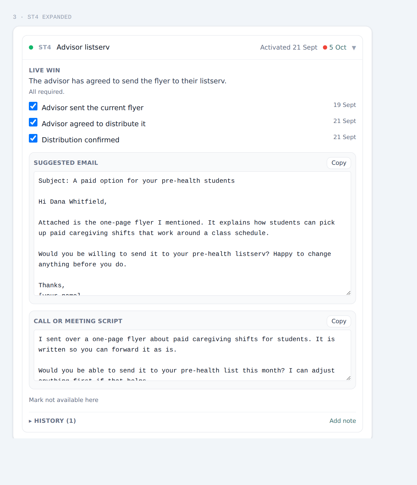

**Live win** is the checklist. Tick what has actually happened. Each tick records the date automatically,
so you never type one.

**Contacts** default to the university advisor. Where the real contact is someone else, a career services
officer for the job board or an events office for a fair, add them.

**Suggested email and call script** appear where the step involves asking someone for something. They are
short on purpose. A partner who has to edit is a partner who does not send. Edit them freely and copy
them out; the workspace does not send mail.

**History** is collapsed until you want it, with the count on the toggle.

**Mark not available here** sits at the bottom and asks for a reason.

---

## The three list channels

**Exhibit 4. ST5. Each organization is its own record with its own live win and its own next check.**

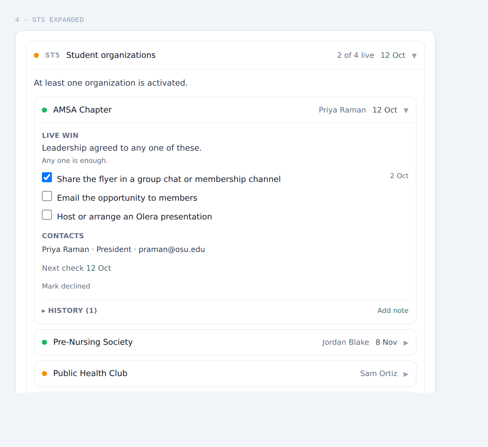

**Student organizations.** An organization is live as soon as its leadership agrees to any one meaningful
way of reaching members: sharing the flyer in a group chat, emailing it out, or arranging a presentation.
One is enough. Each live organization gets its own monthly reconnect.

**Campus events.** Add both kinds, webinars we host and university events we join. An event is live when
five things are true: a leader identified, host approval obtained, a date scheduled, a presenter assigned,
and collateral ready. The same five work for a webinar and for a career fair. This channel also carries a
**semester review**, which arrives on its own so nothing sits unlooked-at for a term.

**Exhibit 5. ST7. The approval block sits above the list, and the list does not exist until it is cleared.**

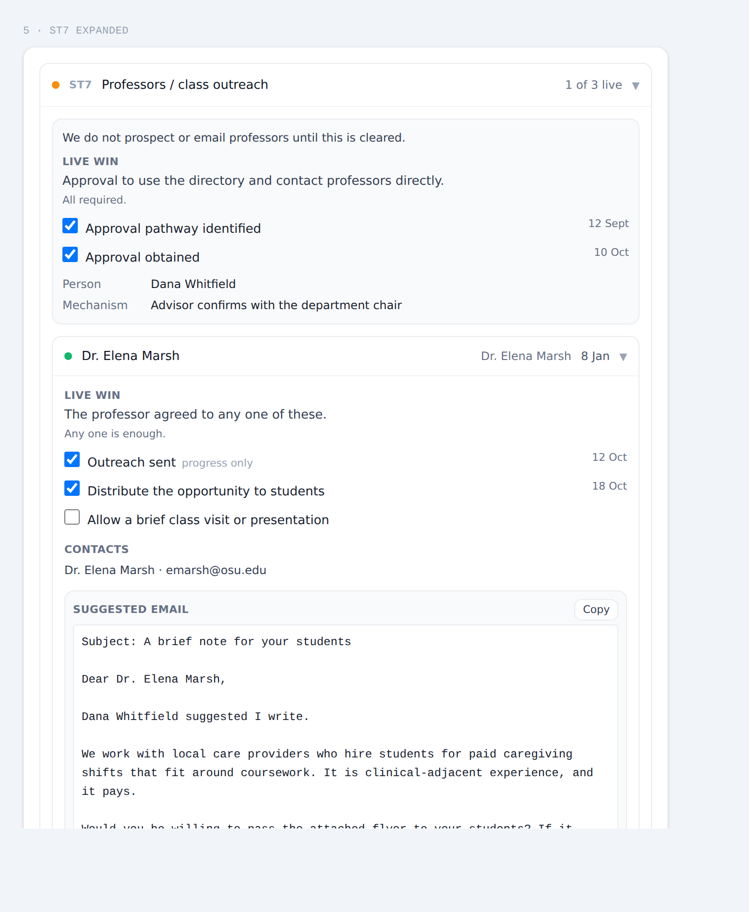

**Professors.** This channel is gated. **You cannot add a professor until approval is recorded**, because
we do not prospect faculty until a university has told us we may. Record who can give that permission,
then record it when it arrives. Once a professor agrees, either to pass the opportunity on or to let us
join a class, they are live and come back to you seasonally.

---

## Tasks

Everything recurring is created for you. You never pick a task type from a menu.

**Exhibit 6. The Tasks tab, grouped by urgency. Every row names its university and channel.**

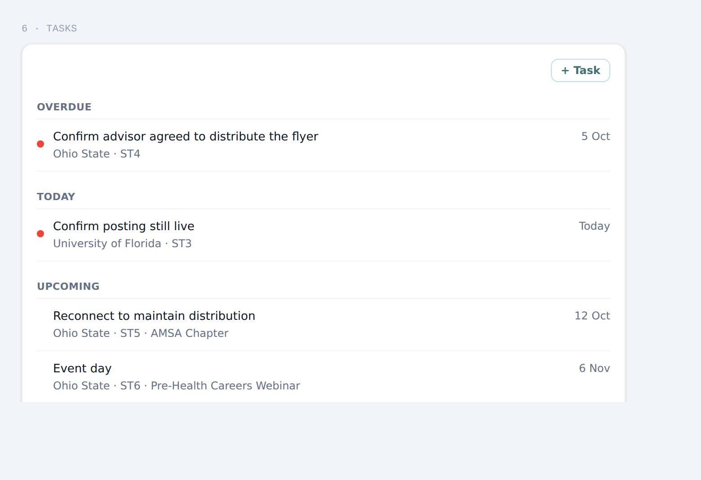

| Task | Appears when | Comes back |
|---|---|---|
| Confirm posting still live | ST3 goes live | Monthly |
| Confirm advisor agreed to distribute the flyer | You record sending the advisor the flyer | Once, after 7 days |
| Remind to send copy to listserv again | ST4 goes live | Monthly |
| Reconnect to maintain distribution | An organization goes live | Monthly, per organization |
| Semester review of event opportunities | ST6 is first opened | Each semester |
| Event day | An event date is scheduled | Once |
| Re-engage professor | A professor goes live | Seasonally, per professor |

**Exhibit 7. A task opened. What it is, why it matters, the steps, the copy, and what done means.**

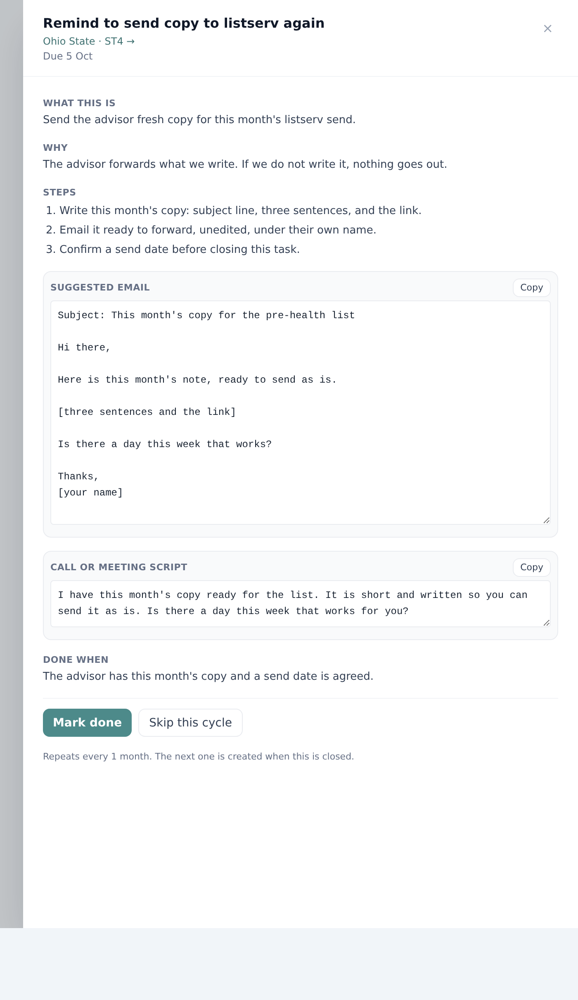

**Mark done** closes a routine check and schedules the next one at the right interval. If you could not do
it this cycle, **Skip this cycle** moves it on without claiming you did.

**Custom tasks** are for work the five channels do not describe. Give it a name, a date, and your own
checklist of what needs doing.

**Exhibit 8. A custom task, with your own checklist items.**

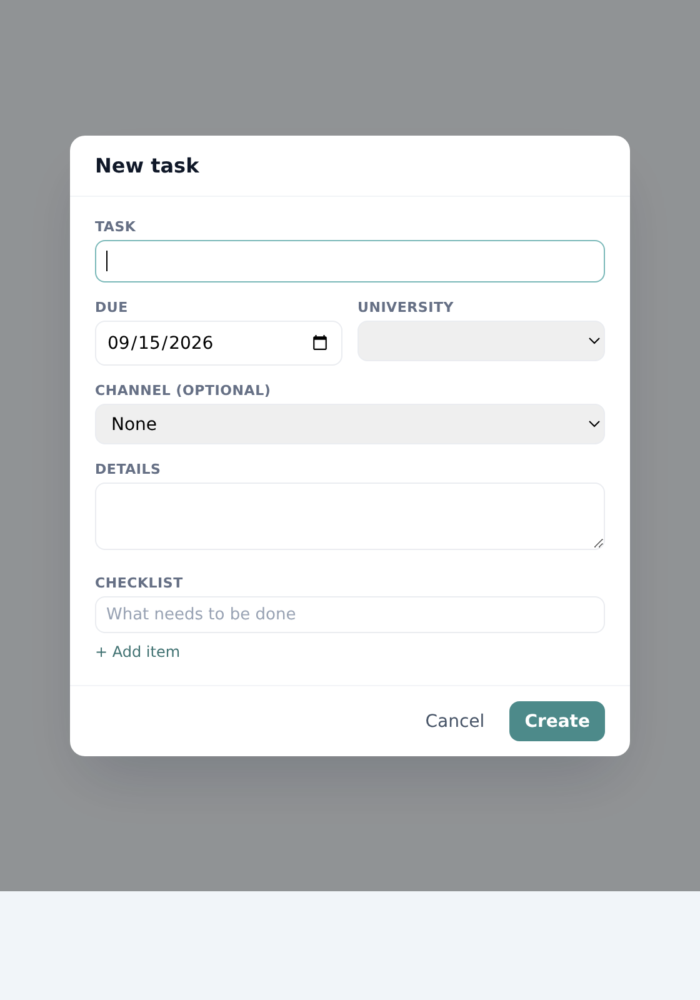

---

## Moving between the two

Every path goes both ways. A next-check date in a university opens that task. A task names its university
and channel as a link back. A red dot anywhere leads to the item that caused it. You can start from either
tab and never reach a dead end.

---

## What this deliberately does not do

It does not send email. It does not assign work to anyone, because one person runs this today. It does not
report on which channel produced a student, because we cannot yet measure that honestly and a plausible
number would be worse than none. It does not detect a channel that has quietly gone stale.

Those are choices, not omissions. Say so if any of them starts costing you real time.

---

# Three worked examples

The three things you will do most often, start to finish.

---

## Example one: turning on the advisor listserv

The most common activation, and the one that shows how the system chases a step for you.

### Step 1. Open the channel

The advisor meeting agreed she would send to the pre-health list. Open Ohio State, then ST4.

**Exhibit 9. Nothing done yet. Three steps, none ticked, so the channel reads Not yet.**

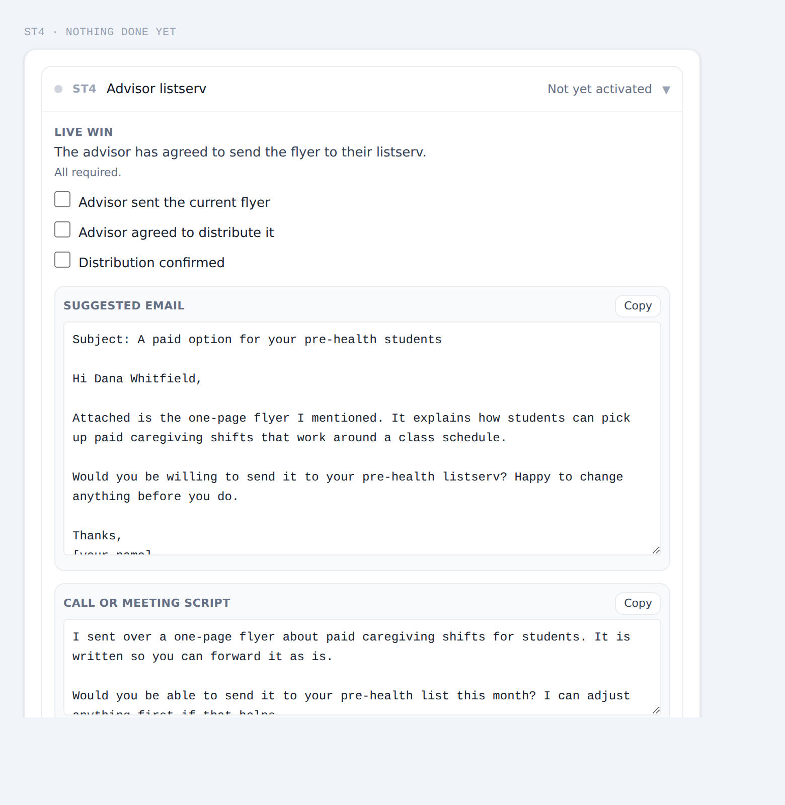

Copy the suggested email, edit it if you want, and send her the flyer.

### Step 2. Record that you sent it

Tick **Advisor sent the current flyer**.

**Exhibit 10. One tick. The channel is now In progress, and a follow-up appeared for 26 September.**

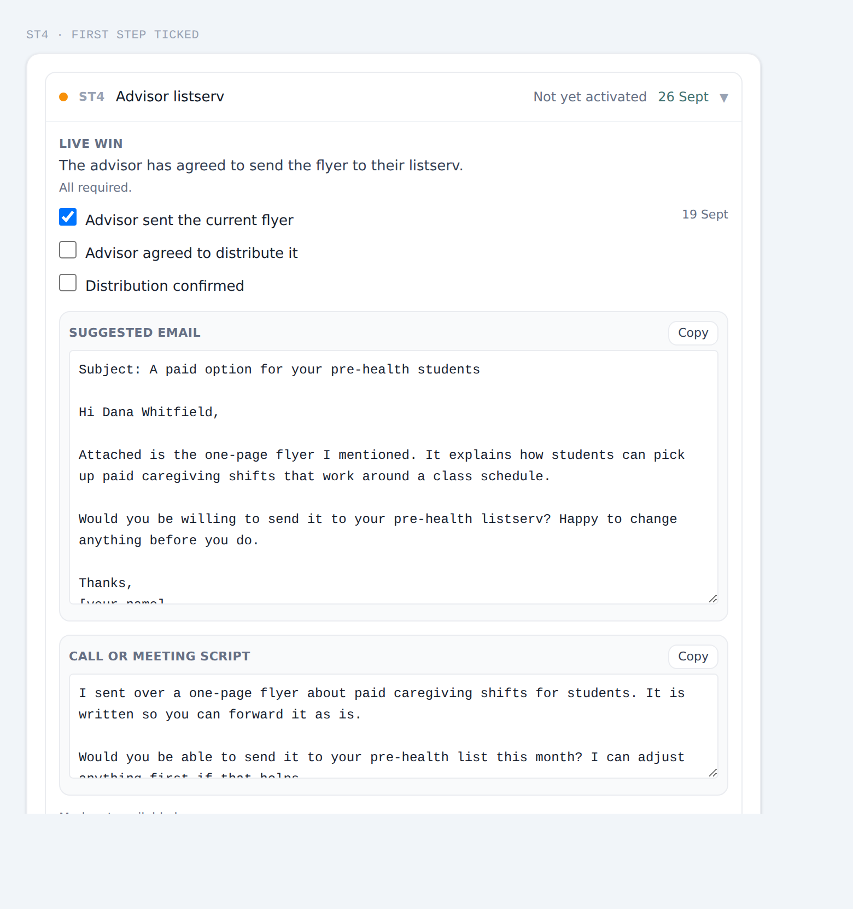

Two things happened without you asking. The status moved to **In progress**, and the system created a
task due in seven days to find out whether she agreed. You do not have to remember to chase this.

### Step 3. Answer the follow-up when it comes due

Seven days later the task is in your Tasks tab.

**Exhibit 11. This task asks a question rather than setting a chore, so it offers an answer instead of Mark done.**

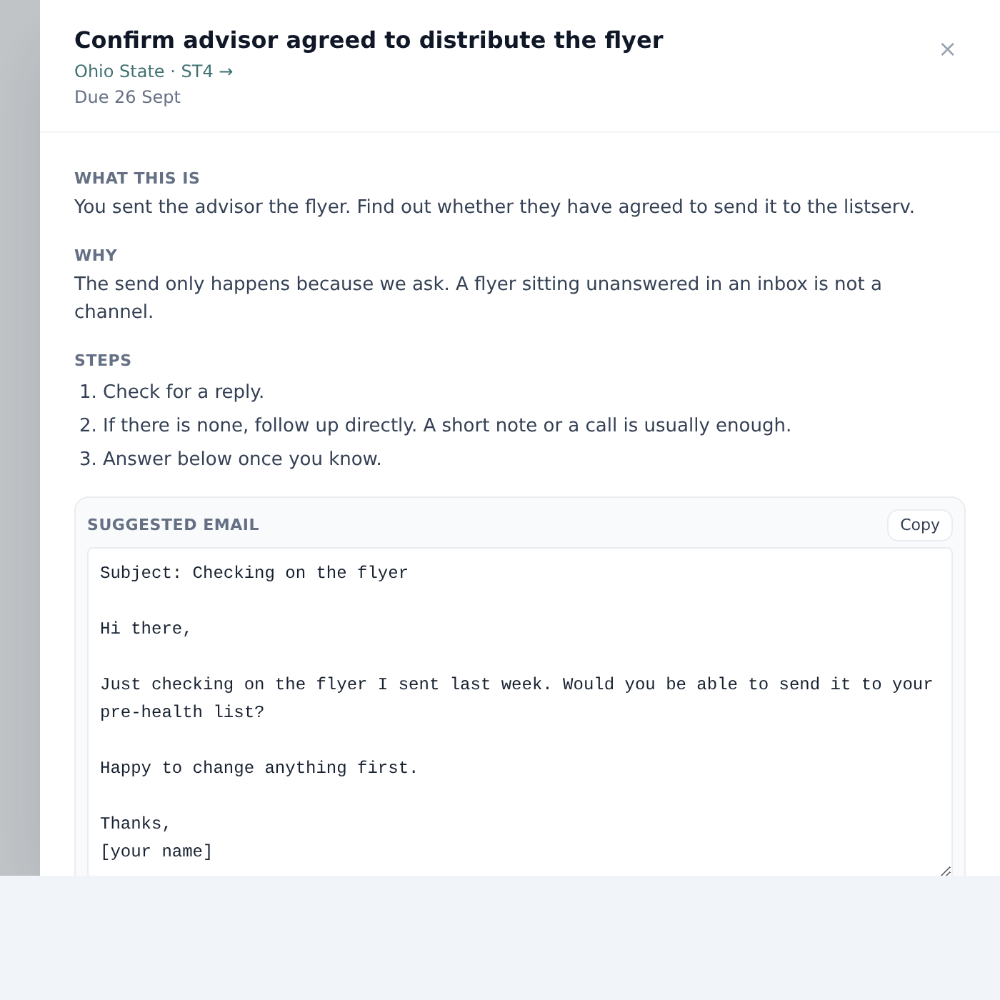

If she agreed, click **Yes, they agreed**. That ticks the second box back in the university record.
The task and the checklist are the same fact, so they cannot end up disagreeing. If she has not replied,
**Not yet, ask again** pushes the task out a week and leaves the box alone.

### Step 4. Confirm the send, and the channel goes live

Tick **Distribution confirmed** once the email has actually gone out.

**Exhibit 12. All three ticked. The channel is Live, dated, and the monthly reminder is already scheduled.**

You will see a brief acknowledgement, and the next check appears on the card. From here the workspace
asks you once a month to send her fresh copy, which is the only reason the listserv keeps going out.

---

## Example two: adding your first student organization

### Step 1. Open ST5

**Exhibit 13. An empty channel. There is one button, and it is the right one.**

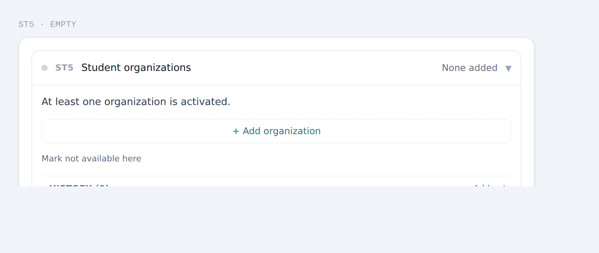

### Step 2. Add the organization by name

Click **Add organization**, type the chapter name, and press Enter.

**Exhibit 14. Added, with its officer recorded. Nothing is agreed yet, so it sits at Not yet.**

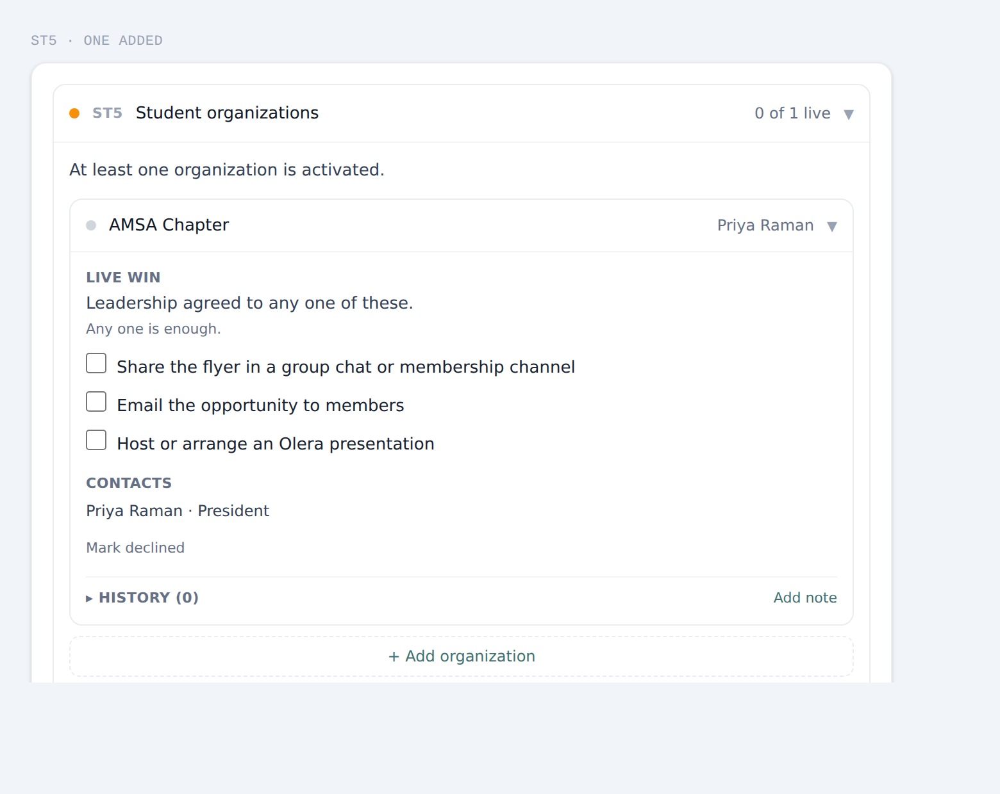

Each organization has its own live win, its own contacts, up to two, and its own history. Reach out to the
officer.

### Step 3. Tick whichever mechanism they agreed to

The chapter president says she will post it in the group chat. Tick that one box.

**Exhibit 15. One tick is enough. The organization is Live, and its monthly reconnect is scheduled.**

**Any one of the three is enough**, because a group-chat post and an all-members email are both real
distribution. You do not need all three, and the system will not ask for them.

Notice the channel now reads **2 of 4 live**. Adding a fifth organization tomorrow will not undo that.
The channel goes live on its first live record and stays there, so adding more work is never punished.

---

## Example three: getting permission, then activating a professor

The one channel with a rule the system enforces rather than trusting you to remember.

### Step 1. Find the channel locked

**Exhibit 16. No professor can be added yet. The list is not hidden, it is closed, with the reason on it.**

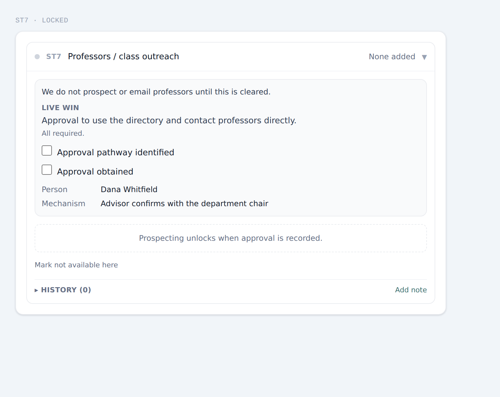

We do not prospect faculty until a university has told us we may. Ask the advisor first: who can tell us
whether we may use the directory and email professors directly?

### Step 2. Record the pathway, then the approval

Tick **Approval pathway identified** once you know who decides, and record their name and how the decision
gets made. Getting an answer often takes a few conversations; use the history to note where you are.

### Step 3. The list unlocks

**Exhibit 17. Approval recorded. The professor list is now open, and the outreach email cites the person who cleared it.**

Add professors one at a time with their department and course. The suggested email names the advisor who
gave permission, because that is what makes a cold email to a professor land.

### Step 4. Send, then record what they agreed to

Tick **Outreach sent** when you write to them. That moves the professor to In progress but does not make
them live, which is correct: contacting someone is not the same as their agreeing.

When a professor agrees, tick either **Distribute the opportunity to students** or **Allow a brief class
visit**. Either one makes them live. If it is a class visit, record whether it is virtual or in person,
when, and which team member is presenting.

Each live professor then comes back to you seasonally, roughly four times a year, which is the rhythm that
matches how terms actually turn over.

---

## What good looks like

A university that is working properly has channels that are live and dates that are in the future. Not
five live channels: a campus with a dead job board and no faculty access, honestly recorded, is in better
shape than one with five blanks.

**The stage does not close.** Every other stage in the funnel ends in an outcome. This one ends in a
standing commitment: postings expire, officers graduate, a fair moves, a listserv only sends when someone
asks. Each channel is two motions, secure it once and then keep it alive, and the second is what decides
whether a university produces students in the spring as well as the autumn.

The workspace exists to make the second motion ordinary daily work rather than something to remember.
