# MedJobs 2.0 — Master Implementation Matrix

One university and the providers around it. Two pipelines built in parallel, each handed from the Admin Team to the Sales Lead at the booked meeting, and from the Sales Lead to the User Success Manager after it. Both feed the Portal, which carries a student from application to a placement we can bill for.

```
┌──────────────────────────────────────────────────────────────┐
│  SITE 1                                                      │
│  ONE UNIVERSITY + ONE SURROUNDING SERVICE AREA OF PROVIDERS  │
└─────────────────────────┬────────────────────────────────────┘
  ┌───────────────────────┴───────────────────────┐
  ▼                                               ▼
PROVIDER SIDE                                   STUDENT / UNIVERSITY SIDE
────────────────────────────────────────────    ────────────────────────────────────────────
PR1  TARGET LIST BUILT                          ST1  TARGET ADVISORS
     Admin Team                                      Admin Team
  │                                               │
  ▼                                               ▼
PR-OUT  OUTBOUND WORK                           ST-OUT  OUTBOUND WORK
        Admin Team                                      Admin Team
  │                                               │
  ╞═══ HANDOFF  Admin Team → Sales Lead           ╞═══ HANDOFF  Admin Team → Sales Lead
  ▼                                               ▼
PR2  MEETING HELD                               ST2  ADVISOR MEETING HELD
     Sales Lead                                      Sales Lead
  │                                               │
  ╞═══ HANDOFF  Sales Lead → User Success         ╞═══ HANDOFF  Sales Lead → User Success
  ▼                                               ▼
PR3  CLIENT SUCCESS                                  UNIVERSITY ACTIVATION
     User Success Manager                         │  User Success Manager
  │  Profile, terms, account setup                ├── ST3  UNIVERSITY JOB BOARD
  │  Through to the first hire                    ├── ST4  STUDENT ORG RELATIONSHIPS
  │                                               ├── ST5  CAMPUS EVENTS
  │                                               ├── ST6  ADVISOR LISTSERVS
  │                                               ├── ST7  PROFESSOR OUTREACH + CLASS VISITS
  │                                               │
  │                                               │   Each is secured once, then maintained.
  │                                               │   All five circulate the opportunity.
  │                                               │
  └───────────────────────┬───────────────────────┘
                          ▼
┌──────────────────────────────────────────────────────────────────────────────────┐
│  PORTAL   carries the flow from student application through fulfillment          │
│                                                                                  │
│   from PROVIDER SIDE                  from STUDENT / UNIVERSITY SIDE             │
│   active client with                  ST8  STUDENT APPLICATION SUBMITTED         │
│   a staffing need                           │                                    │
│            │                                ▼                                    │
│            │                          QUAL  PORTAL VETS THE APPLICATION          │
│            │                                │                                    │
│            │                                ▼                                    │
│            │                          QUALIFIED CANDIDATE                        │
│            └───────────────┬────────────────┘                                    │
│                            ▼                                                     │
│              ┌─────────────────────────────────────┐                             │
│              │  MATCH / FULFILLMENT                │                             │
│              │   MA1  CANDIDATE INTRO              │                             │
│              │    ▼                                │                             │
│              │   MA2  INTERVIEW HELD               │                             │
│              │    ▼                                │                             │
│              │   MA3  HIRE CONFIRMED               │                             │
│              │    ▼                                │                             │
│              │   MA4  6+ SHIFTS WORKED CONFIRMED   │ ◄── real value delivered,   │
│              │    ▼                                │     so Olera charges        │
│              │   MA5  BILL ISSUED AND COLLECTED    │                             │
│              └──────────────────┬──────────────────┘                             │
└─────────────────────────┬────────────────────────────────────────────────────────┘
  ┌───────────────────────┴───────────────────────┐
  ▼                                               ▼
PROVIDER RECEIVES                               STUDENT RECEIVES
────────────────────────────────────────────    ────────────────────────────────────────────
  A successfully placed worker                    Pay
  Value before any fee is charged                 Caregiving experience
  Ongoing value from that worker                  A path to a strong recommendation
```

Each stage below is set out in three layers: what the user does and what the technology does, the procedure behind it, and what the system records and hands on. Anything the document describes that does not exist yet is named as such and carried in the deferred build list at the end.

---

## PR1 — Target list built and pre-flight complete

**Objective** Add a university site so the system loads every matching provider from the Olera directory
into the In Basket, then complete pre-flight research on each one — phone, email, address, decision maker —
confirmed by a pre-flight call.

- **Owner** Admin Team.
- **Users** Admin Team.
- **Completion criteria** Contact details confirmed on the call, and the row launched into outreach — or three unsuccessful call attempts, and the row archived.

> **PR1 is not just the list.** It is the list *built and worked through pre-flight.* A site whose
> providers are loaded but un-researched has not completed PR1.

### ① User journey / technology

**Actor: Admin Team.** Two screens carry the whole stage.

| # | What they do | Where | Exhibit |
|---|---|---|---|
| 1 | Open the Sites tab and review active university territories | [`olera.care/admin/medjobs/sites`](https://olera.care/admin/medjobs/sites) | **A** |
| 2 | Click **+ Add Site** and pick a university. The picker shows how many directory providers fall in that service area — that is how many Provider Prospects the site will generate | Same page, Add Site modal | **B** |
| 3 | Go to the In Basket, Providers tab. The site's providers are waiting there for pre-flight research | [`olera.care/admin/medjobs/in-basket`](https://olera.care/admin/medjobs/in-basket) | **C** |
| 4 | Open a provider row. The drawer holds the research panel — business name, phone, email, address, fax, contact form, decision makers, research notes — with **Fill from Website** and a **source** link | In Basket → provider drawer | **E** |
| 5 | Click **Call to Confirm**, work the suggested script, and log the outcome | Drawer → Log Pre-Flight outcome modal | **D** |
| 6 | Launch outreach once contact details are confirmed | Drawer → **Launch outreach →** | **E** |

**What the system does on its own:** adding a site pulls the matching providers out of the Olera directory
and places them in the In Basket as rows awaiting pre-flight research. Nobody builds the list by hand.

### ② Procedure

<!--FIG preflight-->

**For a given site, work every provider on it.**

1. **Do the desk research first.** Fill in whatever phone, email and address you can find yourself — from
   the provider's website, the source link on the row, or **Fill from Website**. Do not call a row you
   have not looked at.
2. **Call every provider on the site.** The call confirms the research; research alone does not complete
   pre-flight.
3. **Use the suggested script** shown in the log modal: *"Hi, this is \[your name\] from Dr. DuBose's
   office, calling about the Student Caregiver Program for \[University\] students. I'd like to send your
   team an email with the details, and wanted to check first on the best address to send it to."*
4. **Log the outcome, every time.**

   | Outcome | What it means | What happens to the row |
   |---|---|---|
   | **Confirmed contact info** | Reached someone; email and decision maker verified | Pre-flight passes — launch outreach |
   | **No answer** | Nobody picked up | Stays in pre-flight — call again |
   | **Voicemail** | Message left | Stays in pre-flight — call again |
   | **Not interested** | They do not want the information | Row closes; no outreach |

5. **Update the record from the call.** A corrected email address or a named decision maker learned on the
   phone goes onto the row immediately, while you have it.
6. **Three attempts, then archive.** If three calls fail to confirm the contact details, archive the
   provider and move on.

*The modal also carries an **Override & launch outreach** escape hatch for a row you are confident about
without a confirming call. Use it deliberately, not as the default.*

### ③ System / handoff

| Data captured | Status | Events | Next trigger | Handoff |
|---|---|---|---|---|
| Business name · phone · email · address · fax · contact form · decision makers · research notes · call outcome and notes | loaded → in pre-flight → confirmed · archived · closed | site added · providers loaded · contact added or updated · pre-flight call logged (confirmed / no answer / voicemail / not interested) · outreach launched · archived | Contact details confirmed on a call | **Launch outreach → PR-OUT.** Not confirmed → the row stays in pre-flight for another attempt. Three failed attempts → archived |

Every call — including the ones nobody answered — writes to the row's timeline with the caller's name and
the time, so the attempt count is visible rather than remembered.

**Communications** None outbound at this stage. The pre-flight call is the only contact, and it uses the
script in the log modal.

### Exhibits

**Exhibit A — Sites.** Active university territories, each card carrying its research badges
(**Research needed** · Advising ✓ · Orgs ✓ · Dept heads ☐), a stakeholder count, and **Find partners ✦**.
`olera.care/admin/medjobs/sites`

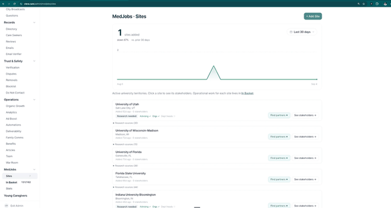

**Exhibit B — Add Site.** The university picker, each option carrying its catchment count — *University of
Houston / Rice — 152 in catchment*. **This is where the size of the prospect list is decided.** Picking a
university with 152 providers commits the Admin Team to pre-flighting 152 rows.
`olera.care/admin/medjobs/sites` → **+ Add Site**

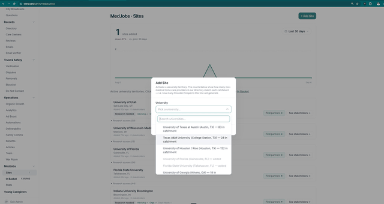

**Exhibit C — In Basket, Providers tab.** The day's workload over three counters — **QUEUED**, **LOGS
COMPLETED TODAY**, and a **STREAK** of consecutive business days hitting fifty logs. Below, one card per
provider, filtered to a single site, under tabs that each carry a worked/total count.
`olera.care/admin/medjobs/in-basket`


**Exhibit D — Log Pre-Flight outcome.** The **SUGGESTED SCRIPT** verbatim, the four outcomes with their
consequences written underneath each, a notes field prompting *"What did they confirm? Anything useful for
outreach copy?"*, and **Override & launch outreach**.
In Basket → provider row → **Call to Confirm**


**Exhibit E — Provider drawer.** **RESEARCH** states the sequence — *"Check the info, call to confirm, then
launch outreach"* — over five contact fields, each with a state marker. The ticks are what pre-flight
complete looks like on a row. Then **DECISION MAKERS**, three actions (**Call to Confirm** · **Launch
outreach →** · **Launch activation →**), research notes, and the timeline. **The timeline is where the
three-strikes count is read from** — one entry per attempt, with the operator's name and how long ago.
In Basket → provider row


---

## PR-OUT — Outbound work

**Objective** Launch the call-and-email campaign on a provider that has cleared pre-flight, then work the
queues it generates until the provider books a meeting or the row runs out.

- **Owner** Admin Team.
- **Users** Admin Team, provider.
- **Completion criteria** A meeting on the Sales Lead's calendar — or a recorded terminal outcome, or a finished cadence that drops the row into Follow-up.

> **The cadence is shorter than the protocol says.** Graize's written protocol calls this the *D0–30
> campaign*. What is shipped is **3 emails and 2 calls over 7 days** — Day 0 · Day 3 · Day 5 · Day 7.
> Either the protocol or the cadence should change; flagged rather than reconciled.

### ① User journey / technology

**Actors: Admin Team and the provider.** Launch happens once; the queues are worked daily.

| # | What happens | Where | Exhibit |
|---|---|---|---|
| 1 | Click **Launch outreach →** on a cleared row. **Confirm outreach plan** opens with the whole campaign laid out — a launch summary, the recipients as checkboxes, and every day expandable to the actual email the provider will receive | In Basket → provider drawer | **E**, **F** |
| 2 | **Start outreach.** Day 0 sends; the rest queue via the send engine | Automatic | — |
| 3 | Work the **Calls** tab — calls grouped by the day they are due, each row with a click-to-dial number | [`olera.care/admin/medjobs/in-basket?tab=calls`](https://olera.care/admin/medjobs/in-basket?tab=calls) | **G** |
| 4 | Open the row. The drawer's **NEXT STEP** panel names the state and offers the actions that fit it | Calls → row | **I** |
| 5 | **Call provider**, work the day's script, log the outcome | Row → **Log call** | **H** |
| 6 | Check replies. **Check for reply** shows the provider's actual message and the ways to respond | Emails → row → **Check for reply** | **J** |
| 7 | When a cadence finishes with no meeting, the row appears in **Follow-up** for triage | In Basket → Follow-up | — |

<!--FIG cadence-->

**The cadence.** Day 0 intro email · Day 3 follow-up email and a check-in call · Day 5 call · Day 7 final
email. Cold email sends from a dedicated outreach domain. Scheduled sends and calls appear in the drawer's
**UPCOMING** list with their dates, so the row's whole future is visible before it happens.

### ② Procedure

1. **Launch only rows that cleared pre-flight.** The override writes itself to the timeline with your
   name on it. Use it deliberately.
2. **Read the plan before starting.** Untick anyone who should not receive it, and expand Day 0 to check
   the merge fields resolved.
3. **Work the Calls tab to zero every day.** Calls are grouped by due date; the count beside the date is
   the day's workload.
4. **Read the NEXT STEP panel before dialling.** It tells you where the row actually is — awaiting reply,
   next call in N days, or they replied and it is your move.
5. **Use the day's script.** A Day 3 call opens with a different line than a Day 5 one.
6. **Answer every reply within one business day** — same day for anything mentioning a time.
7. **Log every outcome, every time**, including the calls nobody answered. A note on its own logs the call.
8. **Do not hand-email a row mid-cadence.** Reply through the row so the cadence stops cleanly.

**Call outcomes and what each does to the row**

| Outcome | What happens |
|---|---|
| **Interested** | They want to move forward — launches the activation sequence |
| **📅 Meeting booked** | Opens the Calendly booking page and marks a meeting scheduled |
| **No answer** | Marks this call done; the next cadence call stays scheduled |
| **Voicemail** | Message left; the next cadence call stays scheduled |
| **Not interested** | Closes the row and cancels remaining outreach |

**Reply handling — what each option does**

| Option | What happens |
|---|---|
| **Launch activation cadence** | Runs the standard activation sequence toward a meeting |
| **✎ Launch custom cadence** | Compose your own emails and calls for a bespoke response |
| **↻ OOO reply — restart last cadence** | Auto-reply, not a real answer. Resumes the cadence and puts the row back to pending |
| **📅 Book a meeting** | Opens the Calendly booking page and marks a meeting scheduled |
| **Not interested** | Sends a polite closing note and stops outreach |

> **A real reply stops the cadence automatically.** The timeline records *"Reply received to \[address\] —
> cadence stopped,"* so the next move is a manual one. The out-of-office option exists precisely because
> an auto-reply should not count as one.

### ③ System / handoff

| Data captured | Status | Events | Next trigger | Handoff |
|---|---|---|---|---|
| Recipients launched · sends, opens, replies · call outcomes and notes · scheduled sends and calls | researched → outreach sent → cold · replied · closed · cadence finished | outreach launched · row moved from Researched to Outreach Sent · outreach email sent (with open state) · called — no answer / voicemail / reached · reply received — cadence stopped · pre-flight overridden | A meeting is booked | **Admin Team → Sales Lead.** The row appears in the Meetings queue with its full timeline. No meeting and the cadence finishes → the row drops to **Follow-up** for re-engage-or-retire triage |

A **state chip** above the timeline reads the row's position without anyone reading its history — *Cold —
1 email sent, never opened · awaiting their callback*, or *Replied — your move*. **UPCOMING** lists what is
still scheduled; **PAST ACTIVITY** what happened, each entry stamped with the operator and how long ago.

Opens, replies and bounces only reach these queues if the send engine's webhook is wired. Without it the
Emails and Follow-up tabs look empty rather than broken.

**Communications** Day 0 intro email · Day 3 follow-up email · Day 3 check-in call · Day 5 call ·
Day 7 final email · the reply the provider sends back.

### Exhibits

**Exhibit F — Confirm outreach plan.** **LAUNCH SUMMARY** (*"3 emails + 2 calls"*), **RECIPIENTS** as
checkboxes with the address and phone each will be reached on, and **CADENCE** with every day expandable.
Day 0 opens to the full email — To, From, subject, the body the provider will see, the variables
substituted, and the program PDF.
In Basket → provider drawer → **Launch outreach →**


**Exhibit G — Calls tab.** Calls grouped by due date with the day's count beside it, each row carrying the
provider, its contact type, its site, and a click-to-dial number.
`olera.care/admin/medjobs/in-basket?tab=calls`

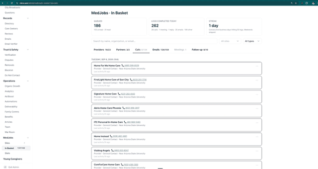

**Exhibit I — The drawer during outreach.** **NEXT STEP** names the state — *"Awaiting reply · Next call
in 4d"* — over the actions that fit it. Below, the state chip, **UPCOMING** (queued emails and scheduled
calls with dates) and **PAST ACTIVITY**.
Calls → row

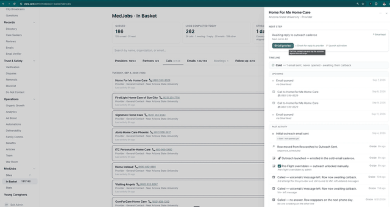

**Exhibit H — Log call.** The day's script at the top — *DAY 3 SCRIPT* — then the five outcomes with their
consequences, and a notes field where a note on its own logs the call.
Calls → row → **Call provider**


**Exhibit J — Check for reply.** The provider's actual reply quoted at the top, then the five ways to
respond. Behind it, the **Emails** tab grouped by state — *THEY REPLIED (9)*.
`olera.care/admin/medjobs/in-basket?tab=replies` → row → **Check for reply**


---

## PR2 — Provider meeting held

**Objective** Hold the meeting, convert the provider, and capture what was promised.

- **Owner** Sales Lead.
- **Users** Sales Lead, provider.
- **Completion criteria** Outcome logged and the relationship handed to the User Success Manager.

### ① User journey / technology

| # | What happens | Where | Exhibit |
|---|---|---|---|
| 1 | **Someone books the 30-minute slot** — usually the Admin Team, live on a call or off a reply that names a time | Calendly — `Student Caregiver Program` | **L** |
| 2 | The booking lands the row in **Meetings**, under **NEEDS LOGGING** once the time has passed — *"log the outcome to move the row forward"* | [`olera.care/admin/medjobs/in-basket?tab=meetings`](https://olera.care/admin/medjobs/in-basket?tab=meetings) | **M** |
| 3 | Open the row. **NEXT STEP** reads *"On the calendar"* with a single action, and the state chip reads *"Replied — they replied · meeting booked"* | Meetings → row | **N** |
| 4 | Hold the meeting, then **Log meeting outcome**. The modal confirms what was booked and who attended, then offers three outcomes | Row → **Log meeting outcome** | **N** |

> **Booking is an Admin Team action first.** The operator putting it in the calendar during the call is
> the design. Sending the link and waiting is the slower fallback.

> **"Finding a time" is a holding state, not a meeting.** The Admin Team sets it while a provider is going
> back and forth by email. Ideally the Meetings tab would hold only booked meetings — see the deferred
> list. Left as-is for now.

### ② Procedure

1. **Read the row before the call.** The timeline shows every email, reply and call that produced this
   meeting — including what they said when they replied.
2. **Run the standard structure** and close with the soft agreement ask: *no rush to sign, we just need it
   before you interview your first student.*
3. **Log the outcome the same day.** A meeting held and unlogged is a row that stops moving.
4. **Write down what was promised** in the notes — a note on its own logs the meeting.
5. **Rebook a no-show once, warmly.** The option opens Calendly for you; people miss meetings.
6. **A no-show that cannot be rebooked goes back into outreach.** It is not a decline. The row should
   re-enter a call-and-email sequence rather than sit in Meetings or close — see the deferred list.

**Meeting outcomes and what each does to the row**

| Outcome | What happens |
|---|---|
| **Interested / went well** | Logs the meeting and launches the activation sequence |
| **No-show / reschedule** | Logs a no-show and opens Calendly to rebook. *Ideally, a no-show that is not immediately rebooked drops the row into a fresh call-and-email sequence — not yet built* |
| **Not interested** | Sends a polite closing note and stops outreach |

### ③ System / handoff

| Data captured | Status | Events | Next trigger | Handoff |
|---|---|---|---|---|
| Booked time · attendee name and address · outcome · notes and commitments | engaged → meeting scheduled → converted · closed | meeting scheduled — row moved to Meetings · meeting held · outcome logged · activation launched | Outcome logged | **Sales Lead → User Success Manager.** *Interested / went well* launches activation and moves the relationship on; the other two close the row |

**Communications** Booking confirmation and reminder from Calendly · the post-meeting details email with
the agreement · a polite closing note when the answer is no.

### Exhibits

**Exhibit L — The booking page.** What the provider sees: **Student Caregiver Program**, 30 minutes, the
Sales Lead's name, and the pitch — *hands-on caregiving hours, recommendation letters, and experience that
strengthens their med, PA, and nursing applications* — over a date and time picker.
`calendly.com/…/home-care-agency-manager-interview`

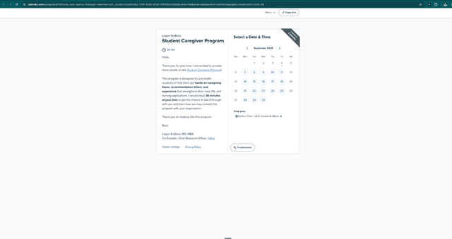

**Exhibit M — Meetings tab.** **NEEDS LOGGING** carries meetings whose time has passed — *"log the outcome
to move the row forward."* **FINDING A TIME** below it holds rows still coordinating by email, a state the
Admin Team sets by hand. The tab count reads worked over total.
`olera.care/admin/medjobs/in-basket?tab=meetings`


**Exhibit N — Log meeting outcome.** A **BOOKED** panel confirming the calendar entry and the attendee,
then the three outcomes with their consequences, and a notes field. Behind it the drawer shows **NEXT
STEP · On the calendar** and the state chip *"Replied — they replied · meeting booked,"* over a timeline
that runs back through every reply and send.
Meetings → row → **Log meeting outcome**

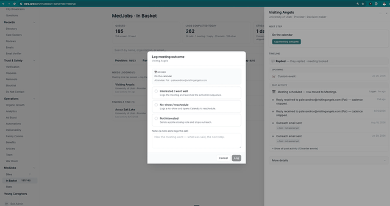

---

## PR3 — Client success

**Objective** Carry the provider from the meeting to a first hire: profile updated, terms understood,
account set up and ready for the first student to arrive.

- **Owner** User Success Manager.
- **Users** User Success Manager, provider.
- **Completion criteria** Profile updated · terms email sent and acknowledged · setup meeting held · the account ready to receive a candidate.

> **Almost none of this is built.** PR3 runs by hand today. The block below describes how it should work;
> every missing piece is on the deferred build list at the end of this document. Nothing here is blocked
> on that — it is blocked on someone doing it consistently.

### What client success is

**The ongoing relationship function, from the moment a provider converts.** It is not onboarding, which
ends, and it is not support, which waits to be asked. It is one person owning the client from the meeting
through the first hire and every hire after — the profile, the terms, the account setup, the interviews,
the placements, the six-shift threshold, the invoice, and the next staffing need.

One role holds it across both sides of MedJobs. Chantel is the User Success Manager today.

### ① User journey / technology

| # | What happens | Where | Built? |
|---|---|---|---|
| 1 | **The Sales Lead names the handoff in the meeting** — *"our user success team will follow up with you on next steps."* The provider leaves expecting the next contact, and expecting it from someone else | In the meeting | Manual |
| 2 | **Logging the meeting outcome alerts the User Success Manager** that a converted provider is waiting on them | — | **Not built — B4** |
| 3 | **They read the whole record before making contact** — the outreach history, what they said in the reply, the meeting notes and anything promised | Provider drawer timeline (Exhibit **N**) | Exists |
| 4 | **They send the terms email** — more detail on how the program works and what it costs | Email, by hand | Manual |
| 5 | **They get the profile updated** — what a good caregiver looks like here, shifts needed, headcount | Provider portal · chased by hand | Partly |
| 6 | **They book the setup meeting** for the next week or two | Calendly, by hand | Manual |
| 7 | **The setup meeting happens** — the account is configured and ready for the first student | In the meeting | Manual |
| 8 | **Everything after this is recorded against the client** — every meeting, touchpoint, interview, hire, six-shift confirmation, invoice | — | **Not built — B5** |

### ② Procedure

1. **The Sales Lead names the handoff in the room.** A warm introduction to a named function beats a cold
   email from a stranger a week later.
2. **Read the record before you write.** The meeting notes tell you what they asked for and what was
   promised. Opening with something they said is the difference between a follow-up and a form letter.
3. **Send the terms email within one business day of the meeting**, while it is still fresh for them.
4. **Land three things, in this order:** profile updated · terms understood · setup meeting booked.
   Chase each until it is done rather than sending one email and waiting.
5. **Book the setup meeting one to two weeks out.** It is the readiness check — the last chance to catch a
   half-finished account before a student is looking at it.
6. **Write down every touchpoint.** Until the client record exists, keep it on the row so the history
   stays in one place.
7. **Do not hand a client to the marketplace until the account is ready.** A provider looking at
   candidates with an incomplete profile gets bad matches and blames the matching.

### ③ System / handoff

| Data captured | Status | Events | Next trigger | Handoff |
|---|---|---|---|---|
| Terms sent and acknowledged · profile answers and demand profile · setup meeting held · every touchpoint after conversion | converted → active client, account ready | handoff received · terms email sent · profile completed · setup meeting held · client note added | The account is ready and a staffing need is recorded | **User Success Manager → the Portal.** The staffing need drives matching; the client stays theirs from here on |

**Communications** The post-meeting terms email · profile reminders · the setup meeting invitation ·
everything after it, from the same person.

### Exhibits

None. There is no client success surface to photograph yet — the work happens in email, in Calendly, and
in the provider row. **B4** and **B5** are what would make this stage visible.

---

## ST1 — Target advisors

**Objective** Produce a verified list of university offices for a site, each with the email outreach
needs, waiting in the In Basket to be confirmed by a call.

- **Owner** Admin Team.
- **Users** Admin Team.
- **Completion criteria** Offices generated as prospects, each verified and tagged, waiting in the Partners tab.

> **The office is the prospect, not the person.** An advising office with an email is what outreach needs.
> Named advisors are optional, and worth adding only when they have their own contact details. The
> opposite of provider prospecting, and deliberate — offices outlast the people in them.

### ① User journey / technology

Three subtypes are worked in turn for each site: **Advising** → **Student orgs** → **Departments**.

| # | What they do | Where | Exhibit |
|---|---|---|---|
| 1 | On the site card, click **Find partners ✦** — *"Find partners with AI for this university"* | [`olera.care/admin/medjobs/sites`](https://olera.care/admin/medjobs/sites) | **O** |
| 2 | **Step 1 · Find offices.** **Suggest links** proposes office pages; **predefined searches** open Google and check themselves off as you go; anything found by hand can be pasted in. Pre-health advising first, then nursing and allied, then career services | Research modal | **P** |
| 3 | **Step 2 · Verify offices.** Each office gets a name, a **tag**, an email, a phone, an optional website, then a **Verified** tick. Advisors can be added underneath, but only with their own email or phone | Research modal | **Q** |
| 4 | **Step 3 · Generate.** The verified offices become prospects in the In Basket, then **Continue to Student orgs →**, and later Departments | Research modal | **R** |
| 5 | The offices appear in the **Partners** tab, each showing its university and its tag | [`olera.care/admin/medjobs/in-basket?tab=partner_book`](https://olera.care/admin/medjobs/in-basket?tab=partner_book) | **S** |

The site card tracks progress across the three subtypes — **Advising ✓ · Orgs ✓ · Dept heads ☐** — with
**Research needed** until the first one is done. The wizard autosaves as you work.

### ② Procedure

1. **Work one site through all three subtypes** — advising, then orgs, then departments — rather than
   half-finishing several sites.
2. **Use Suggest links first, then the predefined searches.** They cover the ground without your keeping a
   list in your head.
3. **Prefer the office with the clearest published email.** Pre-health advising first, then nursing and
   allied health, then career services.
4. **Tag every office.** The tag is what makes the outreach copy correct later.
5. **Add an advisor only when they have their own contact.** A name with no direct email gives outreach
   nothing to use.
6. **Tick verified only when you would send to that address today.** The tick is the gate.
7. **Then confirm by a quick call before launching.** Generating a prospect is not the same as knowing
   the address is live.

### ③ System / handoff

| Data captured | Status | Events | Next trigger | Handoff |
|---|---|---|---|---|
| Office name · tag · email · phone · website · source link · optional advisors · verified flag · the research links kept | researched → prospect | research started · links kept · office verified · prospects generated · stakeholder added to site | Offices generated | Stays with the Admin Team → **ST-OUT**, via the Partners tab |

**Communications** None at this stage. The confirming call and the outreach that follows are ST-OUT.

### Exhibits

**Exhibit O — Find partners.** The entry point on the site card, alongside the research-progress badges
and **See stakeholders →**. `olera.care/admin/medjobs/sites`

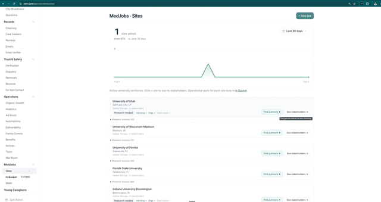

**Exhibit P — Research · step 1, Find offices.** Subtype tabs across the top (**Advising** · Student orgs ·
Departments), the three steps beneath, **Suggest links**, and the predefined searches with **Open all**, an
add-by-hand field, and a kept-links list.

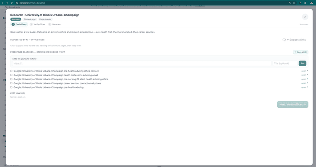

**Exhibit Q — Research · step 2, Verify offices.** *"The advising office is the prospect. Confirm each
one's email and tag — that's all outreach needs."* Each office carries a tag, email, phone and optional
website, an advisors section, and the **Verified** tick. Footer counts *1 of 3 verified*.


**Exhibit R — Research · step 3, Generate.** Confirmation that the offices were created and are waiting in
the In Basket, with the next action named — *confirm each advising office by a quick call, then launch
outreach* — and **Continue to Student orgs →**.

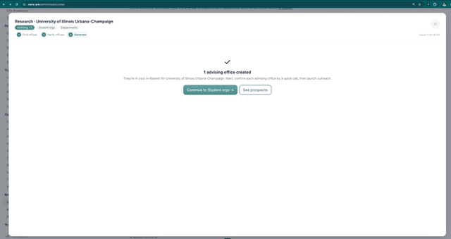

**Exhibit S — Partners tab.** The generated offices as prospects, each with its university and tag, above
the site cards still needing research.
`olera.care/admin/medjobs/in-basket?tab=partner_book`

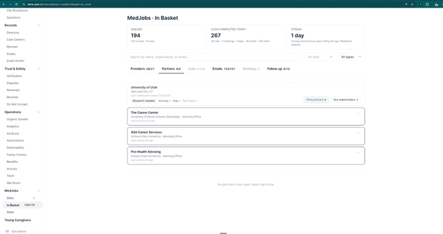

---

## ST-OUT — University outbound

**Objective** Confirm the advising office by phone, launch the call-and-email campaign, then work the
queues it generates until the office books a meeting or the row runs out.

- **Owner** Admin Team.
- **Users** Admin Team, advising office.
- **Completion criteria** A meeting on the Sales Lead's calendar — or a recorded terminal outcome, or a finished cadence that drops the row into Follow-up.

> **Same machinery, different cadence.** ST-OUT runs on the same pre-flight call, the same Calls and
> Emails queues, and the same log modals as the provider side. What differs is the campaign: the partner
> cadence is **5 emails and 1 call**, and every email is meeting-first — the ask is a conversation with
> Dr. DuBose, not a service. Providers get **3 emails and 2 calls**. Nobody should have to remember which;
> the launch modal states it before anything sends.

### ① User journey / technology

**Actors: Admin Team and the advising office.** Confirm, then launch, then work the queues daily.

| # | What happens | Where | Exhibit |
|---|---|---|---|
| 1 | Open the office in the **Partners** tab. The drawer's **RESEARCH** panel states the sequence plainly — *"Check the info, call to confirm, then launch outreach"* — over the office name, general email, general phone, and an **ADVISORS** list | In Basket → Partners → row | **T** |
| 2 | **Call to Confirm.** **Log Pre-Flight outcome** opens with the script and the four outcomes. *Confirmed contact info* unlocks the row for outreach | Drawer → **Call to Confirm** | **U** |
| 3 | **Launch outreach →.** **Confirm outreach plan** lays out the whole campaign — a launch summary, the recipients as checkboxes, and every day expandable to the actual email | Drawer → **Launch outreach →** | **V** |
| 4 | **Start outreach.** Day 0 sends; the rest queue, and **UPCOMING** shows *Outreach queued* with its date | Automatic | **T** |
| 5 | Work the **Calls** and **Emails** tabs daily — the same queues the provider rows sit in | [`olera.care/admin/medjobs/in-basket`](https://olera.care/admin/medjobs/in-basket) | **W** |
| 6 | Check replies. **Check for reply** quotes their message and offers the ways to respond | Emails → row → **Check for reply** | **W** |
| 7 | A cadence that finishes with no meeting drops the row into **Follow-up** | In Basket → Follow-up | — |

**The cadence.** Day 0 is the **intro email (meeting-first)** — it names Dr. DuBose, links the flyer and
the program PDF, and asks for a conversation with the advisors students turn to. Day 3 is a **one-line
bump**. Emails send from `partnerships@findmedjobs.co`, a dedicated outreach domain.

**Recipients.** The general office contact always; any advisor added in ST1 with their own email as a
selectable extra — which is why ST1 accepts only advisors who have one. **Launch activation →** sits
beside Launch outreach as the second cadence, run once a row has engaged.

### ② Procedure

1. **Call before you launch.** The row is a prospect, not a confirmed address. The pre-flight call exists
   to verify the email actually reaches the office and to find the person who decides.
2. **Use the suggested script.** It leads with Dr. DuBose's office, names the program, and asks one thing:
   the best address to send the details to. Nothing is being sold on this call.
3. **Log the outcome, every time**, including the calls nobody answered. The override writes itself to
   the timeline with your name on it.
4. **Read the plan before starting.** Expand Day 0 and check the merge fields resolved. A wrong
   substitution is visible here and nowhere later.
5. **Keep the research notes honest.** The panel says the office was AI-sourced and tells you to confirm
   by phone. Replace that with what the call established.
6. **Answer every reply within one business day** — same day for anything mentioning a time.
7. **Do not hand-email a row mid-cadence.** Reply through the row so the cadence stops cleanly.
8. **Respect permission gating on professors.** Class visits and listserv posts happen because someone
   agreed to them; the ask on this cadence is a meeting, not a distribution.

**The pre-flight outcomes and the reply options are the same four and five as the provider side** (PR1,
PR-OUT). One difference: **Launch activation cadence** drops out of the reply options once a row is
already enrolled — the timeline then reads *"Activation launched,"* and four choices remain.

### ③ System / handoff

| Data captured | Status | Events | Next trigger | Handoff |
|---|---|---|---|---|
| Pre-flight call outcome and notes · recipients launched · sends, opens, replies · call outcomes · scheduled sends and calls | prospect → researched → outreach sent → cold · replied · closed · cadence finished | initial contact added · row moved from Prospect to Researched · reached on the phone · pending tasks superseded — stage advanced · outreach queued · outreach email sent (with open state) · reply received — cadence stopped · activation launched | A meeting is booked | **Admin Team → Sales Lead.** The row appears in the Meetings queue with its full timeline. No meeting and the cadence finishes → the row drops to **Follow-up** |

**Communications** Pre-flight confirming call · Day 0 intro email (meeting-first) with flyer and program
PDF · Day 3 one-line bump · the remaining cadence emails · the cadence call · the reply the office sends
back.

### Exhibits

**Exhibit T — Partner drawer.** **RESEARCH** states the sequence — *"Check the info, call to confirm, then
launch outreach"* — over the office name, general email and general phone, with **ADVISORS (0)** and the
rule beneath it: *"Anyone with an email becomes a selectable recipient at launch, alongside the general
office contact."* Three actions: **Call to Confirm** · **Launch outreach →** · **Launch activation →**.
**Research notes** records where the office came from. **TIMELINE** shows *Outreach queued* under
**UPCOMING**, and the row's history under **PAST ACTIVITY**.
`olera.care/admin/medjobs/in-basket?tab=partner_book` → row


**Exhibit U — Log Pre-Flight outcome.** The **SUGGESTED SCRIPT** — Dr. DuBose's office, the program, and
one ask: the best address to send the details to — then the four outcomes with their consequences stated
on each, a notes field prompting *"What did they confirm? Anything useful for outreach copy?"*, and
**Override & launch outreach** for rows that do not need the call.
Partner drawer → **Call to Confirm**

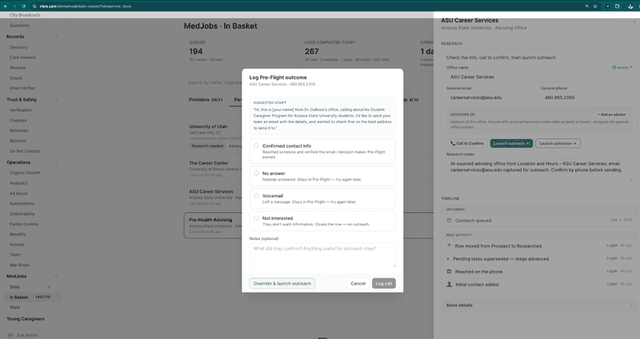

**Exhibit V — Confirm outreach plan.** **LAUNCH SUMMARY** reads *"5 emails + 1 call across the cadence
below."* **RECIPIENTS (1)** lists the general contact with its address and phone. **CADENCE** opens Day 0 —
*intro email (meeting-first)* — to the full email: To, From `partnerships@findmedjobs.co`, the subject,
the body the office will actually read, the variables that were substituted, and the program PDF. Day 3 is
a *one-line bump*. Footer reads *"5 email + 1 call ready"* against **Start outreach**.
Partner drawer → **Launch outreach →**


**Exhibit W — Check for reply, and the Emails tab.** The reply quoted at the top, then the ways to respond
— *Launch custom cadence*, *OOO reply — restart last cadence*, *Book a meeting*, *Not interested*. Behind
it the **Emails** tab grouped by state — *THEY REPLIED (7)* over *PENDING REPLY (96)* — and the drawer's
**NEXT STEP** panel: *They replied · \[address\]* over **Reply now** and **Call**. The timeline shows the
sends, the reply that stopped the cadence, and the activation launch. **This queue is shared:** provider
and partner rows are worked side by side in the same tab with the same modal, which is why the row shown
here is a provider.
`olera.care/admin/medjobs/in-basket?tab=replies` → row → **Check for reply**

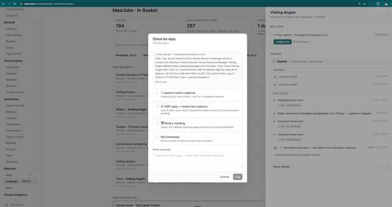

---

## ST2 — Advisor meeting held

**Objective** Hold the meeting, agree which of the five activation channels are open to us, and hand the
User Success Manager a plan they can act on without asking again.

- **Owner** Sales Lead.
- **Users** Sales Lead, advising office.
- **Completion criteria** Outcome logged, the agreed channels and their named contacts written down, and the relationship handed to the User Success Manager.

> **This meeting is not a sale. It is a channel-planning session.** The provider meeting ends in a
> commercial agreement; this one ends in a route to students. The advisor already believes pre-health
> students want caregiving hours. What we do not know is how their campus reaches them — and the output
> is the ST3–ST7 plan.

### ① User journey / technology

| # | What happens | Where | Exhibit |
|---|---|---|---|
| 1 | **Someone books the 30-minute slot.** Usually the Admin Team does it — live on the confirming call, or from a reply that names a time | Calendly — `Student Caregiver Program` | **L** |
| 2 | The booking lands the row in **Meetings**, under **NEEDS LOGGING** once the time has passed | [`olera.care/admin/medjobs/in-basket?tab=meetings`](https://olera.care/admin/medjobs/in-basket?tab=meetings) | **M** |
| 3 | Hold the meeting and work the five channels | Video | — |
| 4 | **Log meeting outcome** — the same modal and the same three outcomes as the provider side | Row → **Log meeting outcome** | **N** |

**Advisors book the same event as providers** — the 30-minute *Student Caregiver Program* slot, one link
for both funnels. The invite copy carries over unchanged, which reads acceptably to an advising office;
the event slug in the URL does not. See the deferred list.

### ② Procedure

1. **Read the row before the call.** Advisors notice when you already know what they told the last person.
2. **Open by naming what students get**, not what we want: hours, a letter, and experience that
   strengthens a med, PA or nursing application. That is the advisor's job, which makes it common ground.
3. **Then work the five channels in order.** This is the body of the meeting.
4. **Ask for their read, not just their permission.** *"Which of these actually reaches pre-health
   students here?"* An advisor telling you the job board is dead and the listserv is everything saves the
   User Success Manager a month.
5. **Get a name for every open channel.** A channel with no named contact is not a channel.
6. **Ask what they need from us to make it easy** — copy, a flyer, a date — then send it within two days.
7. **Log the outcome the same day**, with the channel plan in the notes.

**The five channels — what to ask, and what a usable answer looks like**

| | Channel | Ask | The answer the User Success Manager needs |
|---|---|---|---|
| **ST3** | University job board | Is there a board pre-health students actually check? Who posts, and does it need approval? | The board, the posting route, and who approves |
| **ST4** | Student organisations | Which orgs reach these students — pre-med, pre-nursing, AMSA chapters? Who runs them this term? | Org names and current officers, with a warm introduction where they will make one |
| **ST5** | Campus events | Which fairs or events are worth attending, and what are the deadlines and costs? | Event, date, registration deadline, who books the table |
| **ST6** | Advisor listservs | Do you email these students directly? Would you send something for us? | Which list, who sends it, how often they are willing, and the copy they want |
| **ST7** | Professors and class visits | Which professors teach the courses these students take? Would an introduction be welcome? | Named professors, and explicitly whether we may approach them |

> **Permission is the deliverable on ST6 and ST7.** A listserv send and a class visit both happen on
> someone else's authority. Write down who granted it and what exactly they agreed to, because the User
> Success Manager will be acting on it weeks later without having been in the room.

**Meeting outcomes and what each does to the row**

| Outcome | What happens |
|---|---|
| **Interested / went well** | Logs the meeting and launches the activation sequence |
| **No-show / reschedule** | Logs a no-show and opens Calendly to rebook |
| **Not interested** | Sends a polite closing note and stops outreach |

**When the advisor skips the meeting.** Some advisors will not take a call. They reply to the outreach by
simply telling us what to do — post it here, email this officer, send me copy for the listserv. **Take the
advice and act on it.** A channel the advisor handed us is worth more than the meeting that would have
produced it. Two things still hold:

1. **Capture it exactly as if it came from a meeting** — channel, named contact, permission — so the User
   Success Manager inherits the same plan either way.
2. **Keep pushing for the meeting, gently.** Not to unlock the channels; those are already running. A
   named advisor is what makes the second term easier than the first, and the moment to ask is when you
   report results back: *here is what your listserv produced — can we talk about the spring?*

Today the row has nowhere to sit in that state — channels agreed, no meeting held. See the deferred list.

### ③ System / handoff

| Data captured | Status | Events | Next trigger | Handoff |
|---|---|---|---|---|
| Booked time · attendee · outcome · the channel plan and permissions, as notes · named contacts offered | engaged → meeting scheduled → active partner · closed | meeting scheduled — row moved to Meetings · meeting held · outcome logged · activation launched | Outcome logged | **Sales Lead → User Success Manager.** *Interested / went well* launches activation and hands over the channel plan; the other two close the row |

The channel plan is the handoff. It travels as prose in the meeting notes, which is enough to work from
and not enough to report on — nothing counts how many campuses opened a listserv, or which channel
produced the students who applied. Structured capture is on the deferred list, alongside the attribution
it would make possible.

**Communications** Booking confirmation and reminder from Calendly · the post-meeting note with the
ready-to-send copy and flyer the advisor asked for · the results-back note that carries the next ask.

---

## ST3–ST7 — University activation

**Objective** Turn the channel plan agreed in ST2 into five live channels at that university, then keep
each one alive.

- **Owner** User Success Manager, with the Sales Lead where a physician in the room changes the answer.
- **Users** User Success Manager, advisor, org officers, professors, students.
- **Completion criteria** Every agreed channel is either live and recorded, or explicitly marked as not available at this university — and every live channel has its next maintenance task queued.

> **This stage does not close.** Every stage before it ends in an outcome. Activation ends in a standing
> commitment: postings expire, officers graduate, a career fair moves, a listserv only sends when someone
> remembers. **Each channel is two motions — secure it once, then keep it alive** — and the second decides
> whether a university produces students in the spring as well as the fall.

> **There is no generic version of this stage.** One campus is a dead job board and a listserv that
> reaches everyone; the next is three student orgs and a professor who will give us ten minutes of a
> class. The User Success Manager works the plan per row, not per channel.

### ① User journey / technology

| Channel | Who acts | What the student sees |
|---|---|---|
| **ST3** University job board | USM posts; the advisor or the board's owner approves | A posting on a board they already check |
| **ST4** Student organisations | USM builds the relationship; an officer shares it | A post in their group chat, or a mention at a meeting |
| **ST5** Campus events | USM and Sales Lead attend | A table, a talk, a QR code |
| **ST6** Advisor listservs | USM supplies the copy; the advisor sends it | An email from a sender they already trust |
| **ST7** Professors and class visits | USM and Sales Lead, once permitted | An introduction in a class they are sitting in |

**The advisor follow-up tab** — the surface this stage needs and does not have. On the partner row: the
five channels as a checklist, each **secured**, **not yet**, or **not available here**, with its named
contact and go-live date. A university's whole activation state in one glance, and answerable across
universities — *which campuses have a live listserv?*

A channel checked off **queues its own maintenance task**, into the same daily queues the Admin Team
already works — so keeping a channel alive is ordinary daily work rather than something to remember. None
of this is built; see the deferred list.

### ② Procedure

1. **Work the plan from ST2, not a template.** The row tells you which channels are open at this
   university and who agreed to each. A channel nobody agreed to is not on your list.
2. **Activate every agreed channel within two weeks of the meeting.** The advisor is warmest immediately
   after; a month later you are re-introducing yourself.
3. **Supply ready-to-send copy for anything a partner sends.** The advisor should have to forward, not
   write. This is the single largest determinant of whether ST6 actually happens.
4. **Mark a channel *not available here* out loud.** A dead job board recorded as dead is useful; a dead
   job board left blank looks like work nobody did.
5. **Record the distribution when it happens** — the channel, the date, the asset used, and a rough reach
   estimate — on the partner row.
6. **Report results back to the partner.** *Your listserv produced eleven applications.* It is the reason
   they send the second one, and it is the natural moment to ask for the next thing.
7. **Never let a secured channel go unwatched.** Every live channel carries a next check date; working
   that date is the job.
8. **Re-check the whole row each term.** A row fully activated in September is not necessarily activated
   in January.

**What securing and maintaining each channel actually means**

| | Channel | Secured means | Maintaining means | Rhythm |
|---|---|---|---|---|
| **ST3** | University job board | The listing is live and visible to students | Check the listing is still up and has not expired or been archived; repost or renew it when it has | Every few months |
| **ST4** | Student organisations | An officer has shared it once | Refresh the relationship before it goes cold, and re-establish it with the new officers when leadership turns over | Ongoing, and every term |
| **ST5** | Campus events | We are registered for a specific event on a specific date | Confirm the event is still scheduled and still on our date; rebook when it moves, and get on the next one after it passes | Before each event, then re-book |
| **ST6** | Advisor listservs | The advisor has agreed to send, and has our copy | Remind the advisor to send it, with fresh copy ready each time. The send happens because we asked | Each agreed send |
| **ST7** | Professors and class visits | A professor has agreed to an introduction or a visit | Follow up and email professors — its own kind of work, with its own record of who was contacted, who agreed, and which class was visited | Per professor, then per term |

> **Each of these carries specifics the table cannot hold** — which board, which officer, which fair and
> its registration deadline, which list and when it goes out, which professor and which course. That
> detail belongs on the row against the channel, which is what the follow-up tab is for.

**ST7 is its own workstream.** Professor outreach behaves less like a channel than like a second, smaller
outreach funnel: named professors, a permission state on each, an email to follow up, and a class visit to
schedule once someone says yes. Scoped and named separately when we get to it; noted here so it is not
mistaken for a checkbox.

### ③ System / handoff

| Data captured | Status | Events | Next trigger | Handoff |
|---|---|---|---|---|
| Per channel: secured / not yet / not available · named contact · date live · next check date · distribution date, asset used and reach estimate | partner active → distributing → maintained | channel activated · distribution recorded · maintenance task completed · channel lapsed | A student follows the link | **→ Portal (ST8).** The partner row stays open and keeps producing |

Every other stage hands a row on and lets it go. This one keeps it. The User Success Manager's working
state is the set of partner rows with live channels and the date each is next due — which is why the
follow-up tab and its queued tasks are the difference between five universities and fifty.

**Communications** Ready-to-send copy per channel · the flyer as the shared asset · the listserv reminder
to the advisor · the results-back note · the professor email sequence.

---

## ST8 — Student application submitted

**Objective** Carry a student from the QR code on a flyer to a live application, without anyone in the
middle.

- **Owner** Portal.
- **Users** Student, User Success Manager only when the system cannot finish the job.
- **Completion criteria** The student is live — visible on the board, and the providers in their catchment have been told they are ready to interview.

> **This stage should run itself.** Every other stage is an operator working a queue. This one is a
> student alone with a website at eleven at night. The system screens them, takes the application, chases
> what they left blank, decides when they are ready, and tells the providers. The User Success Manager is
> here for what the system cannot resolve, not as a step in the flow.

> **The assets below are final in form, not in content.** All five work end to end and are shown here as
> the shipped journey. Every one needs another pass, and the journey needs a QA sweep from both entry
> points. See the deferred list.

### ① User journey / technology

| # | What happens | Where | Exhibit |
|---|---|---|---|
| 1 | The student sees the flyer — on a board, in a listserv email, at a table — and scans the **QR code** | Print and PDF, ST3–ST7 | **X** |
| 2 | It lands them on the student page, and the **eligibility check** opens on top of it: *2 quick questions*, starting with *"Where are you headed?"* — Med school · Nursing · PA · PT/OT · Public health · Still exploring | [`olera.care/medjobs/families`](https://olera.care/medjobs/families) | **Y** |
| 3 | They read the **Student Caregiver Program Agreement** — what the program is, who employs them, the one-time $50 fee, the term commitment — and accept it on signing up | Linked from the landing page | **Z** |
| 4 | Signed in, they land on the board: **Recommended for you**, filtered by campus and care type, every card gated behind **Complete profile to apply** | [`olera.care/portal/medjobs/jobs`](https://olera.care/portal/medjobs/jobs) | **AA** |
| 5 | They work the application — availability, commitment, screening questions, experience, documents — against a **Profile completeness** meter that names every remaining section | [`olera.care/portal/medjobs`](https://olera.care/portal/medjobs) | **AB** |
| 6 | The system chases what they left blank on a fixed ladder of nudges | Automatic — daily cron | — |
| 7 | Once the baseline is met, they **Go Live** | Portal → **Go Live** | **AB** |

**The baseline for going live** — the point at which an application is worth a provider's time: **an
intro video · a driver's licence · car insurance · their weekly availability · their answers to the
screening questions.** The first three live in the profile's Verification section, the other two in
sections of their own.

Everything else on the profile makes a student more attractive to a provider. These five are what make
them assessable at all. **The list is a starting position and should be revisited** once we see which
parts providers actually use to decide who to interview.

> **Nothing is required to go live today.** The Go Live review lists unfinished sections under
> *"Recommended but not required,"* and excludes the verification section entirely — which is where the
> video, the licence and the insurance sit. A student can go live at 5%. The baseline above is the intent;
> enforcing it is on the deferred list.

**What going live does.** Two things, and the second one is already built:

1. **The student becomes visible** — active on the board, matchable by providers in their area.
2. **Every provider we are actively working in that student's campus catchment is emailed** that a new
   candidate is ready to interview. This fires on the **first** go-live only, runs in the background so a
   failure can never block the student, and is capped so a single go-live cannot blast an entire
   catchment.

That second one is where this stage runs into QUAL. Going live *is* the qualification event as the system
currently behaves: the broadcast says the candidate is ready, and nobody decided that. Whether that is
right is QUAL's question, not this stage's — see that stage and the deferred list.

### ② Procedure

Deliberately short. If this list grows, the system has failed.

1. **Watch the stall, not the student.** The ladder handles the individual; what needs attention is the
   pattern. A campus where half the applications stop at the same section is a broken question or a broken
   upload, not eight unmotivated students.
2. **Log why students stall**, so the pattern is visible at all.
3. **Intervene by hand only when the system cannot** — a document that will not upload, a student whose
   circumstances do not fit the form.
4. **Check both entry paths after any change to the assets.** The QR code and the email link must each
   carry a student all the way through.

<!--FIG nudges-->

**The nudge ladder — built and running.** A daily job emails every student under 100% completeness, naming
what they are missing, on a fixed schedule: **days 1, 3, 5, 7, then 21, 35, 49, 63** — eight nudges over
roughly six weeks, then it stops. It will not send twice within twenty hours.

> **The ladder measures a different thing than Go Live does.** It treats **100% completeness** as done and
> sends *"Your MedJobs profile is live!"* at that point, while the button that actually makes a student
> live requires nothing at all. So a student can be live on the board at 5% and still be told their
> profile is incomplete — or reach 100%, be told they are live, never press Go Live, and have no provider
> hear about them. Two definitions of *live*, disagreeing. On the deferred list.

### ③ System / handoff

| Data captured | Status | Events | Next trigger | Handoff |
|---|---|---|---|---|
| Eligibility answers · agreement acceptance · availability and commitment · screening answers · experience, certifications, skills, resume · verification documents and expiries · completeness per section | started → in progress → live | student eligibility completed · application started · nudge sent · profile activated · catchment providers notified | Go Live | **→ QUAL.** The student appears on the board and the catchment hears about them |

Nothing here records **how the student found us** — which flyer, which listserv, which class visit. Until
it does, ST3–ST7 cannot be told apart from each other by results, only by effort.

**Communications** Welcome and account-created emails · the profile-incomplete nudge ladder · the
activation email · the candidate-ready broadcast to catchment providers.

### Exhibits

**Exhibit X — The flyer.** The asset every activation channel shares: what the student gets, the four-step
*How to join*, who can join, the one-time $50 fee, and the **QR code** that starts the whole funnel.

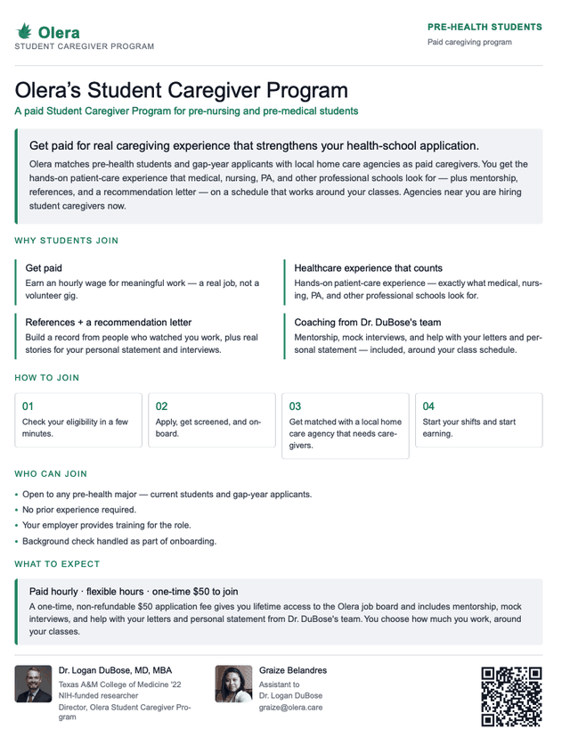

**Exhibit Y — Landing page and eligibility check.** *"Get real healthcare experience — paid caregiving
jobs for college students pursuing careers in medicine and nursing,"* with **Apply Now** and the jobs
board beneath. Over it, **ELIGIBILITY CHECK · 2 QUICK QUESTIONS** — *"Where are you headed?"* — which
routes the student and captures their track before anything else is asked of them.
`olera.care/medjobs/families`

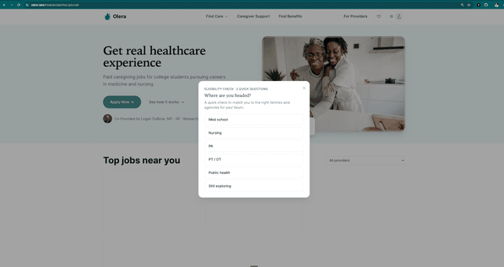

**Exhibit Z — Student Caregiver Program Agreement.** In plain language: what the program is, that **the
agency is their employer and Olera is not**, the $50 fee and what it buys, how matching and offers work,
what they must finish before a first shift, and the one-term commitment. Footed *"Draft for review. Not
legally binding yet."*

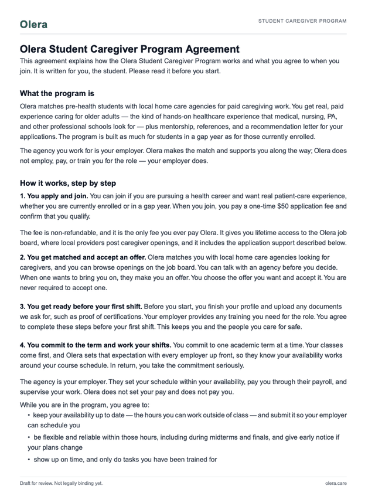

**Exhibit AA — The job board.** **Recommended for you** — *"based on your profile, these are the best
matches near you"* — with campus and care-type filters, a map, and a running job count. Every card and the
banner above them say the same thing: **Complete profile to apply.**
`olera.care/portal/medjobs/jobs`

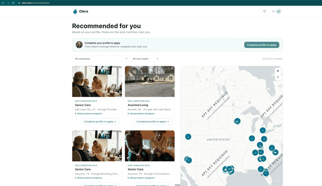

**Exhibit AB — The application portal.** The student's profile, section by section, each with its empty
state and edit control. On the right, **Not live yet** over the **Go Live** button, and **Profile
completeness** — a percentage, a stage label, and every section scored from Profile Overview through
Verification.
`olera.care/portal/medjobs`

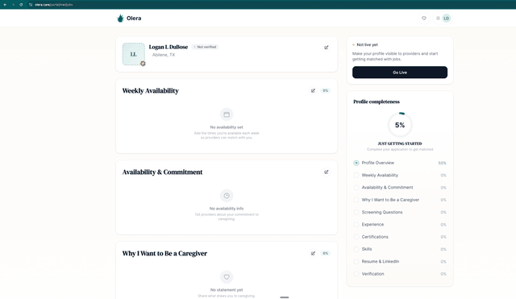

---

## QUAL — Portal vets the application

**Objective** Turn a completed application into a qualified candidate, and put that candidate in front of
the providers who can hire them — from both directions at once.

- **Owner** Portal.
- **Users** Student, providers in the student's catchment, User Success Manager on exceptions.
- **Completion criteria** The student is on the board, every hiring provider in their area has been told they are ready to interview, and the student has been given the list and the phone numbers to call them.

> **Qualification happens at go-live, whether or not anyone decided it.** The moment a student presses Go
> Live, the system tells providers a candidate is *ready to interview*. That is a qualification claim made
> under our name with no criteria behind it. Everything below describes the stage as it should work; the
> criteria are the missing piece the rest of it hangs on.

### ① User journey / technology

| # | What happens | Where | Exhibit |
|---|---|---|---|
| 1 | The student goes live | Portal → **Go Live** | **AB** |
| 2 | **They appear on the board** — matchable, filterable by campus and care type, visible to providers looking for student caregivers | [`olera.care/portal/medjobs/jobs`](https://olera.care/portal/medjobs/jobs) | **AA** |
| 3 | **Every provider we are working in that student's campus catchment is emailed** — *"Ready for interview: a student caregiver candidate near \[campus\]"* — with a link to the profile | Automatic, on first go-live | — |
| 4 | **The student is emailed the providers who are hiring near them, with phone numbers**, and told to call | Not built | — |
| 5 | Providers start hearing from students who have met our bar | Phone | — |

**Both directions matter, and only one of them is built.**

| Direction | What it is | Where it stands |
|---|---|---|
| **Us → providers** | On first go-live, providers being actively worked in the student's campus catchment get *a candidate is ready to interview*, with a link to the profile. Runs in the background so a failure never blocks the student, and is capped so one go-live cannot blast a whole catchment | **Built and running** |
| **Us → student** | A list of every provider hiring near them — name, area, and **the phone number** — and a clear instruction: call them, tell them you are available to interview | **Not built.** This is the important half |

> **The student calling is the point.** A provider who receives an email about a candidate may open it. A
> provider who picks up the phone to a student saying *"I'm in the Student Caregiver Program, I'm cleared
> to interview, are you hiring?"* has met the candidate. The first is a notification; the second is a
> placement starting.

**What exists today is a near-miss.** A student-facing email already fires when a *provider* accepts
terms, telling live students *"a caregiver job near you is open."* Right idea, pointed the wrong way:
triggered by the provider rather than the student qualifying, one provider rather than the list, and a
link to click rather than a number to call.

### ② Procedure

Deliberately short, for the same reason as ST8 — this stage should be a system, not a queue.

1. **Handle exceptions, not cases.** A student the rules would reject who is obviously right, or the
   reverse. Record the reason for every override.
2. **Feed failure reasons back into the application.** A criterion that keeps failing honest applicants is
   a badly written criterion.
3. **Watch what happens after the list goes out** — whether students actually call, and what providers say
   when they do. That is the fastest signal we have about whether our bar means anything.

### ③ System / handoff

| Data captured | Status | Events | Next trigger | Handoff |
|---|---|---|---|---|
| Criteria evaluated · decision and reason · reviewer on an override · which providers were notified · the call list sent to the student | submitted → qualified · not qualified | qualification decision · profile activated · catchment providers notified · call list sent to student | Qualified and both broadcasts sent | **→ MA1.** The candidate is live, the providers know, and the student is calling |

**Communications** The candidate-ready email to catchment providers · **the call list to the student —
hiring providers near them with phone numbers** · the outcome message and what to expect next.

### Exhibits

Both surfaces this stage produces are shown under ST8: **AB** for Go Live, and **AA** for the board the
student appears on.

---

## MA1 — Candidate intro

**Objective** Put a qualified candidate in front of the providers who can hire them, in a form a provider
will actually open, and keep telling the student where the work is until they are hired.

- **Owner** Portal, User Success Manager on exceptions.
- **Users** Provider, student.
- **Completion criteria** The provider has seen the candidate, and the student knows who is hiring and how to reach them.

> **Assume nobody logs in.** A provider will not create an account to look at a candidate, and a student
> will not check a job board every day waiting for work to appear. Everything in this stage has to land in
> an inbox or on a phone and be usable there.

### ① User journey / technology

**To the provider — the candidate, as an attachment.** The intro email carries **the candidate's profile
as a PDF** as well as a link. The PDF is the point: it opens on a phone, forwards to whoever does the
hiring, and needs no login. Our send path already supports attachments — it sends calendar files that way
today — so this is a renderer and a template change, not new infrastructure.

**To the student — three channels, and the board is the least of them.**

| | Channel | What it carries | Why it matters |
|---|---|---|---|
| **1** | **SMS** | A link to the opportunity, or the profile PDF | The one channel a student reads within the hour. The most important of the three |
| **2** | **Email** | The fuller message — who is hiring, where, what the role is | Carries detail SMS cannot, and survives being read later |
| **3** | **The phone** | The student calling providers directly, off the QUAL call list | The most effective of all, and the one we most under-support |
| — | The job board | Everything, browsable | Real and worth having, but a display surface. Most students will not go looking |

An SMS stack already exists — consent handling, quiet hours, a send queue and a flush job — so student SMS
is consent capture and message types on a running pipeline, not a new channel.

### ② Procedure

1. **Send to the provider in the form they will open** — PDF attached, link included, no login asked for.
2. **Do not rely on the board.** If a qualified student has not been introduced anywhere this week, that is
   a push we failed to send, not a student who failed to look.
3. **Watch the students who are qualified and not yet hired.** That list is the whole job at this stage.
4. **Keep the call list current.** A student calling a provider who is no longer hiring wastes the one
   thing we are trying to build.

### ③ System / handoff

| Data captured | Status | Events | Next trigger | Handoff |
|---|---|---|---|---|
| Which providers were sent which candidate · PDF generated and attached · SMS and email sends to the student · opens and replies | qualified → introduced | candidate intro sent · profile PDF generated · student notified by SMS and email | An interview is requested | **→ MA2** |

**Communications** Candidate intro email to the provider, PDF attached · student SMS with the link or PDF
· student email with the detail · the QUAL call list behind the student's own calls.

---

## MA2 — Interview held

<!--FIG interview-->

**Objective** Get a real interview onto two real calendars, then confirm it happened.

- **Owner** Portal.
- **Users** Student, provider, User Success Manager on exceptions.
- **Completion criteria** Both sides firm, a calendar invite on both calendars, and a recorded answer to *did it happen?*.

> **The key endpoint is the calendar invite.** Everything before it is scheduling admin; everything after
> depends on it. When both parties are firm an invite should appear on both calendars, and when its time
> has passed both should be asked whether the meeting happened. That answer is the instrumentation the
> whole match half of the funnel runs on.

### ① User journey / technology

Requests go both ways, and both are built.

| # | What happens | Where | Exhibit |
|---|---|---|---|
| 1 | The student opens a provider's opportunity page and clicks **Request interview** | Provider page · `?ctx=medjobs-student` | **AC** |
| 2 | **Request an interview** — format (**Video · Phone · In person**), a date and time, **Offer another time**, and a note to introduce themselves | Same page | **AC** |
| 3 | Providers can request an interview of a candidate the same way, from the other direction | Provider surfaces | — |
| 4 | The request emails the other party as **proposed**, and lands on the student's **Interviews** calendar as **Pending** | [`olera.care/portal/medjobs/interviews`](https://olera.care/portal/medjobs/interviews) | **AD**, **AE** |
| 5 | On confirmation, both parties are emailed and a calendar file is attached to each | Automatic | — |
| 6 | The interview happens | Video, phone, or on site | — |
| 7 | **Both sides are asked whether it happened.** Not built | — | — |

**What is already there.** The loop runs end to end: interviews carry a state machine — *proposed ·
confirmed · completed · cancelled · no-show · rescheduled* — proposals email the other side, confirmations
email both sides, and a calendar file is attached on confirmation. The student's calendar colour-codes
**Confirmed · Pending · Past**.

**What is missing is narrower than it looks.**

| | What we want | Where it stands |
|---|---|---|
| **1** | A real **Google Calendar event** on both calendars when both are firm — one both sides can see, update and cancel | A calendar file is attached to the confirmation email. Enough for an RSVP, not a shared event |
| **2** | The **did-it-happen loop** — after the scheduled time, email both sides and record the answer | Not built. `completed` and `no_show` exist as states and nothing sets them |

### ② Procedure

1. **Chase the proposal that has sat unanswered.** A pending request nobody confirmed is the single most
   common place a match dies.
2. **Confirm by hand when a provider will not use the system** — and put the invite on the calendar anyway.
3. **Ask the student first** whether the interview happened. They answer faster, and it is their outcome.
4. **Record a no-show as a no-show.** It is a different problem from a hire that did not happen, and only
   one of them is the student's.

### ③ System / handoff

| Data captured | Status | Events | Next trigger | Handoff |
|---|---|---|---|---|
| Format, proposed times, notes · who proposed and who confirmed · the calendar invite · the answer to *did it happen* | proposed → confirmed → completed · cancelled · no-show · rescheduled | interview proposed · interview confirmed · invite sent · interview completed · no-show | Interview confirmed held | **→ MA3** |

**Communications** Proposal email to the other party · confirmation email to both, with the invite ·
reminder before the interview · **the did-it-happen email to both sides afterwards**.

### Exhibits

**Exhibit AC — Request an interview.** From the student's side, on the provider's opportunity page.
**Format** (Video · Phone · In person), a date and time with **Offer another time**, and an optional note.
Behind it the opportunity itself — what you'd do, when, and *"Counts toward your 120 patient-care
hours."*
`olera.care/provider/…?ctx=medjobs-student`

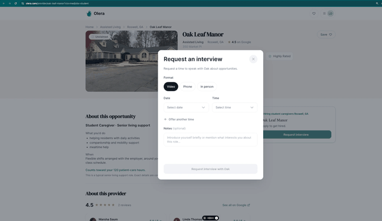

**Exhibit AD — The student's interview calendar, empty.** The month grid and the legend that carries the
whole state model: **Confirmed · Pending · Past**.
`olera.care/portal/medjobs/interviews`

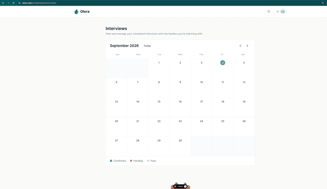

**Exhibit AE — The same calendar after a request.** The requested interview sits on its date — *Oak,
8:30a* — in the amber of **Pending**, waiting on the provider to confirm. This is the state the follow-up
in the SOP above is chasing.

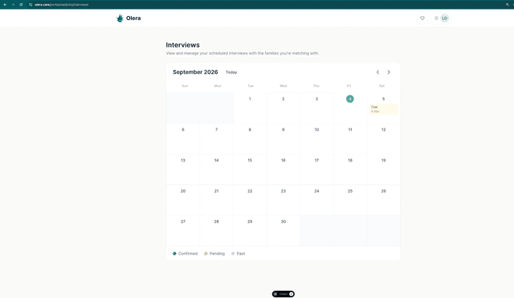

---

## MA3 — Hire confirmed

**Objective** Find out whether the interview produced a job, and if it did not, find out why.

- **Owner** User Success Manager.
- **Users** Student, provider.
- **Completion criteria** A recorded answer either way, with a reason when the answer is no.

> **A hire we did not hear about is a hire we cannot bill for.** This stage exists because nobody tells us
> on their own. The provider hires and moves on; the student starts work and moves on. Every placement we
> know about is one we went and asked for.

### ① User journey / technology

Nothing is built. What should run, after the interview:

| # | What happens | Channel |
|---|---|---|
| 1 | A cadence opens on the **student** — did the interview happen, and did they offer you the job? | SMS first, then email |
| 2 | If the student does not answer, it becomes a **call task** in the daily queue | Phone |
| 3 | The **provider** is emailed the same question, more lightly | Email |
| 4 | The answer is recorded against the placement, with a **reason when it is no** | — |

**Ask the student first, every time.** They reply faster and it is their outcome.

**Instrument the no.** A hire that did not happen is the most useful signal in the funnel — the interview
was a formality, the schedule did not work, the student went quiet, the provider was not really hiring.
Without a reason field, this stage produces a number nobody can act on.

### ② Procedure

1. **Open the cadence the day after the interview**, while both sides still remember it.
2. **Student first, by SMS.** One question, answerable in four words.
3. **Escalate to a call** when two touches go unanswered.
4. **Ask the provider once**, by email, and do not chase them further — the monthly list call picks up what
   they did not answer.
5. **Record the reason for every no.** A blank reason is a lost lesson.

### ③ System / handoff

| Data captured | Status | Events | Next trigger | Handoff |
|---|---|---|---|---|
| Interview outcome · hired or not · start date · the reason when not · which channel got the answer | interviewed → hired · not hired | hire confirmed · hire not confirmed with reason | Hire confirmed | **→ MA4** |

**Communications** Post-interview SMS to the student · follow-up email · the call task when neither lands ·
a single email to the provider.

---

## MA4 — Six or more shifts worked, confirmed

<!--FIG billing-->

**Objective** Establish that the placement actually stuck — six shifts worked — because that is the point
we bill.

- **Owner** User Success Manager.
- **Users** Student, provider on the monthly list call.
- **Completion criteria** Six shifts confirmed and recorded against the placement.

> **Chase the student, not the provider.** The student knows what they worked and answers a text. The
> provider is the customer, and asking them to do our record-keeping every week is how we become annoying
> before we become useful.

### ① User journey / technology

Two ways to get this number, and they are not equally likely to work. **Comms** — SMS and email on a
rhythm until the answer is six — asks the student to reply to a text. **Logging** — a place in the portal
to log shifts as they go — asks them to remember, every time.

**Comms first.** A logging surface is more precise and worth building eventually, but a text a student
answers beats a form they do not fill in. SMS is the channel, on the same stack as MA1 and MA3.

**The provider side is a list, not a cadence.** Monthly or quarterly, the User Success Manager runs the
client's students down on a call: still working, how many shifts, any problems. One conversation confirms
what a dozen emails would not, and it is a touchpoint rather than an interruption. It is the same call
that keeps MA3 honest.

### ② Procedure

1. **Text the student on a rhythm** from their start date until the answer reaches six.
2. **Never ask the provider week to week.** Their confirmation comes on the list call.
3. **Run the list call monthly per client** — every student placed with them, top to bottom.
4. **Record the confirmation and where it came from** — the student, the provider, or both.
5. **Escalate a placement that stalls before six.** A student who stopped after two shifts is a problem
   worth understanding while it is still fixable.

### ③ System / handoff

| Data captured | Status | Events | Next trigger | Handoff |
|---|---|---|---|---|
| Shifts worked and the date each was confirmed · who confirmed it · the list-call record per client | hired → working → threshold met | shift count updated · six shifts confirmed | Six confirmed | **→ MA5** |

Today there is no concept of a shift anywhere in the product. The only trace of the threshold is the
number behind the guarantee.

**Communications** Student SMS on a rhythm · the same question by email · the monthly client list call.

---

## MA5 — Bill issued and collected

**Objective** Turn a confirmed placement into an invoice, and the invoice into money.

- **Owner** User Success Manager.
- **Users** Client.
- **Completion criteria** Invoice issued against a confirmed six-shift placement, and payment recorded.

> **Manual first, deliberately.** At current volume the User Success Manager raising an invoice by hand is
> not a stopgap — it is the right answer, and it is how we learn what the automated version should do.

### ① User journey / technology

| # | What happens | Now | Eventually |
|---|---|---|---|
| 1 | Six shifts are confirmed in MA4 | Recorded by hand | Recorded against the placement |
| 2 | The bill is raised | The User Success Manager raises it | **A button on the client record** — confirm the student hit six, and the invoice issues |
| 3 | The invoice is sent and tracked | By hand | Against the client, with its status |
| 4 | Payment is recorded | By hand | Automatically, against the placement |

**Where the button lives.** On the client record described in PR3 and still unbuilt. That record already
needs to hold every meeting, hire, interview and six-shift confirmation for a client, so the invoice
belongs on it too. Build it, and MA5 becomes one click on a row that already exists — the confirmation is
the trigger, the invoice the consequence, and the team is there only for exceptions.

### ② Procedure

1. **Raise the invoice as soon as six is confirmed**, not on a billing day. The confirmation is the event.
2. **Bill against the placement, not the client** — one invoice per student, so a dispute is about one
   student.
3. **Record payment where the placement lives**, so the client record stays the single account of what
   happened.
4. **Raise a billing question on the monthly list call**, not by email. The call already exists.

### ③ System / handoff

| Data captured | Status | Events | Next trigger | Handoff |
|---|---|---|---|---|
| Placement billed · amount · invoice issued and sent · payment received | threshold met → invoiced → paid | invoice issued · payment recorded | Payment recorded | **Complete.** The client record carries the history |

Two legacy billing paths exist in the product, neither matching this model, and the Stripe path for
placements is stubbed.

**Communications** Invoice · receipt · payment reminder · the billing conversation on the list call.

---

# Deferred build list

Things this document describes as they **should** work, which do not work that way yet. Collected here
rather than softened in the stages above, so the map reads as the operating system we are building toward
and the gap stays visible.

| # | Stage | What we want | Where it stands |
|---|---|---|---|
| **B1** | PR2 | **The Meetings tab holds only booked meetings.** Timing back-and-forth belongs with the email work | *Finding a time* is a hand-set state inside Meetings. Works, but muddies the tab |
| **B2** | PR2 | **A no-show re-enters outreach automatically.** A missed meeting is not a decline | The outcome opens Calendly to rebook. Nothing catches the row if the rebook never happens |
| **B3** | PR-OUT · PR2 | **A custom campaign any operator can launch on a single row** — pick the emails and calls, set the days, start it | *Launch custom cadence* exists in the reply modal, not as a general action from a row |
| **B4** | PR3 | **An alert when a meeting converts**, putting the client in front of the User Success Manager with the meeting notes attached | Not built. Nothing tells them a provider is waiting |
| **B5** | PR3 | **The client record.** One place holding everything after conversion — notes on every touchpoint, plus the interviews, hires, six-shift confirmations and invoices against that client. **The most blocked item here: PR3, MA4 and MA5 all wait on it** | Not built. An MVP — notes and a timeline — would carry the stage |
| **B6** | ST2 | **Structured channel capture at the meeting** — which channels were agreed, the named contact for each, the permission granted, as fields rather than prose | The plan lives in the meeting notes. Workable for one operator, unreportable across campuses |
| **B7** | ST2 | **A state for _channels agreed, no meeting yet_**, carrying an open ask for a relationship meeting | No such state. The row either sits in Meetings without a meeting or looks like one that never engaged |
| **B8** | ST2 | **A partner-facing booking event** | Advisors book the provider's event; the slug `home-care-agency-manager-interview` shows in the URL they click |
| **B9** | ST3–ST7 | **The advisor follow-up tab.** The five channels as a checklist on the partner row — secured, not yet, or not available here — each with its contact and go-live date | Not built. Activation state lives in meeting notes and in the User Success Manager's head |
| **B10** | ST3–ST7 | **Maintenance tasks that queue themselves** — the board re-check, the listserv reminder, the event date, the officer refresh each term | Not built. A channel stays alive only as long as someone remembers it |
| **B11** | ST3–ST7 | **A professor record for ST7** — named professors, a permission state on each, the follow-up and the class visit it produced | Not built, and not yet scoped. Named so it is not mistaken for one more channel |
| **B12** | ST3–ST7 | **Channel attribution.** Which of the five produced a student | Channels are not modelled as distinct entities |
| **B13** | ST8 | **A content pass over every student-facing asset**, with real empty states, and a check that the portal asks for what we want | All five ship and work end to end. None has had a content pass |
| **B14** | ST8 | **Entry-path QA, from the QR code and from email.** Each must carry a student to a submitted application with no dead end, on a phone as well as a laptop | Untested as a journey. The pieces work individually |
| **B15** | ST8 | **A defined and enforced go-live baseline** — video, licence, insurance, availability, screening answers — the list to be revisited once we see what providers use to decide | Nothing is required. The review calls everything *"recommended but not required"* and skips verification, where three of the five sit |
| **B16** | ST8 | **One definition of _live_** | Two, disagreeing. A student can be live at 5% and still be nudged, or reach 100%, be told they are live, and have had no provider told about them |
| **B17** | ST8 | **Application source capture.** Ask a student how they heard about MedJobs | Nothing records it |
| **B18** | QUAL | **The call list to the student.** On qualifying, every provider hiring near them — name, area, phone number — and an instruction to call | Not built. The nearest thing fires when a *provider* accepts terms, names one provider, and offers a link rather than a number |
| **B19** | QUAL | **Written qualification criteria**, then a step that applies them. The catchment broadcast already calls a candidate *ready to interview*, under our name | Today "live" means the student pressed a button. Nothing is required and nothing is checked |
| **B20** | MA1 | **The candidate profile as a PDF on the intro email**, readable on a phone and forwardable without an account. The link stays alongside it | Not built. The send path already supports attachments — it sends calendar files that way today |
| **B21** | MA1 | **Student SMS.** Qualified students who are not yet hired need a push, not a board | Not built for students. The SMS stack exists: consent, quiet hours, a queue and a flush job |
| **B22** | MA2 | **A real calendar event when both sides are firm**, updatable and cancellable by either | A calendar file is attached to the confirmation email. Enough to RSVP, not a shared event |
| **B23** | MA2 | **The did-it-happen loop.** Ask both sides after the scheduled time and record the answer. The instrumentation the whole match half depends on | Not built. `completed` and `no_show` exist as states and nothing ever sets them |
| **B24** | MA3 | **A post-interview cadence to confirm the hire** — student first by SMS, escalating to a call task, one email to the provider | Not built. Nothing asks, so nothing is known |
| **B25** | MA3 | **A reason recorded on every hire that did not happen** | The most useful signal in the funnel, uncollected |
| **B26** | MA4 | **A shift-count rhythm to the student by SMS**, from their start date until the answer reaches six | Not built. Comms before a logging surface: a text they answer beats a form they do not |
| **B27** | MA3 · MA4 | **The monthly client list call.** Every student placed with a client, run top to bottom. Providers confirm here rather than in a cadence | A practice to establish, not code. Needs B5 to run from |
| **B28** | MA4 | **A shift count on the placement, and a view of who is approaching six** | No concept of a shift exists in the product. The only trace of the threshold is the number behind the guarantee |
| **B29** | MA5 | **Billing on the six-shift trigger** — a button on the client record that confirms the threshold, issues the invoice and records payment. Manual until volume justifies it | Two legacy billing paths, neither matching the model, and the placements Stripe path is stubbed. Needs B5 |


**How to use this list.** Nothing here blocks running the operating system by hand today. Each item is a
place where a person is doing something the system should do, or where the system records something less
precisely than the model needs. Scope and prioritise them together, against the whole map, rather than one
at a time as they surface.
