# MedJobs 2.0 — Master Implementation Matrix

## PR1 — Target list built and pre-flight complete

**Objective** Add a university site so the system loads every matching provider from the Olera directory
into the In Basket, then complete pre-flight research on each one — phone, email, address, decision maker —
confirmed by a pre-flight call.
**Owner** Admin Team. **Users** Admin Team.
**Completion criteria** Contact details confirmed on the call, and the row launched into outreach — or
three unsuccessful call attempts, and the row archived.

> **PR1 is not just the list.** It is the list *built and worked through pre-flight.* A site whose
> providers are loaded but un-researched has not completed PR1.

### ① User journey / technology

**Actor: Admin Team.** Two screens carry the whole stage.

| # | What they do | Where | Exhibit |
|---|---|---|---|
| 1 | Open the Sites tab and review active university territories | [`olera.care/admin/medjobs/sites`](https://olera.care/admin/medjobs/sites) | **A** |
| 2 | Click **+ Add Site** and pick a university. The picker shows how many directory providers fall in that service area — that is how many Provider Prospects the site will generate | Same page, Add Site modal | **B** |
| 3 | Go to the In Basket, Providers tab. The site's providers are waiting there for pre-flight research | [`olera.care/admin/medjobs/in-basket`](https://olera.care/admin/medjobs/in-basket) | **C** |
| 4 | Open a provider row. The drawer holds the research panel — business name, phone, email, address, fax, contact form, decision makers, research notes — with **Fill from Website** and a **source** link | In Basket → provider drawer | **E** |
| 5 | Click **Call to Confirm**, work the suggested script, and log the outcome | Drawer → Log Pre-Flight outcome modal | **D** |
| 6 | Launch outreach once contact details are confirmed | Drawer → **Launch outreach →** | **E** |

**What the system does on its own:** adding a site pulls the matching providers out of the Olera directory
and places them in the In Basket as rows awaiting pre-flight research. Nobody builds the list by hand.

### ② Human SOP

**For a given site, work every provider on it.**

1. **Do the desk research first.** Fill in whatever phone, email and address you can find yourself — from
   the provider's website, the source link on the row, or **Fill from Website**. Do not call a row you
   have not looked at.
2. **Call every provider on the site.** The call confirms the research; research alone does not complete
   pre-flight.
3. **Use the suggested script** shown in the log modal: *"Hi, this is \[your name\] from Dr. DuBose's
   office, calling about his Student Caregiver Program for \[University\] students. I'd like to send your
   team an email with the details, and wanted to check first on the best address to send it to."*
4. **Log the outcome, every time.**

   | Outcome | What it means | What happens to the row |
   |---|---|---|
   | **Confirmed contact info** | Reached someone; email and decision maker verified | Pre-flight passes — launch outreach |
   | **No answer** | Nobody picked up | Stays in pre-flight — call again |
   | **Voicemail** | Message left | Stays in pre-flight — call again |
   | **Not interested** | They do not want the information | Row closes; no outreach |

5. **Update the record from the call.** A corrected email address or a named decision maker learned on the
   phone goes onto the row immediately, while you have it.
6. **Three attempts, then archive.** If three calls fail to confirm the contact details, archive the
   provider and move on.

*The modal also carries an **Override & launch outreach** escape hatch for a row you are confident about
without a confirming call. Use it deliberately, not as the default.*

### ③ System / handoff

| Data captured | Status | Events | Next trigger | Handoff |
|---|---|---|---|---|
| Business name · phone · email · address · fax · contact form · decision makers · research notes · call outcome and notes | loaded → in pre-flight → confirmed · archived · closed | site added · providers loaded · contact added or updated · pre-flight call logged (confirmed / no answer / voicemail / not interested) · outreach launched · archived | Contact details confirmed on a call | **Launch outreach → PR-OUT.** Not confirmed → the row stays in pre-flight for another attempt. Three failed attempts → archived |

Every call — including the ones nobody answered — writes to the row's timeline with the caller's name and
the time, so the attempt count is visible rather than remembered.

**Communications** None outbound at this stage. The pre-flight call is the only contact, and it uses the
script in the log modal.

### Exhibits

> Each exhibit is transcribed from the live admin, so the screen can be navigated from this page.
> Captured screenshots drop into [`exhibits/`](exhibits/) and replace the placeholder blocks below.
> Real contact details are redacted here; they are visible in the product.

**Exhibit A — Sites.** `olera.care/admin/medjobs/sites`

Header **MedJobs · Sites** with **+ Add Site** top right. A 30-day counter above the list — *sites added,
with the change against the prior 30 days* — over a sparkline. Then: *"Active university territories. Click a
site to see its stakeholders. Operational work for each site lives in In Basket."*

Each site is a card: university name, city and state, **Added Nd ago · N stakeholders**, a row of research
badges (**Research needed** · Advising ✓ · Orgs ✓ · Dept heads ☐), a **Research sources (N)** expander, and
two buttons — **Find partners ✦** and **See stakeholders →**. Live sites include Utah, Wisconsin-Madison,
Florida, Florida State and Indiana Bloomington. The sidebar carries running **Sites** and **In Basket**
counts.

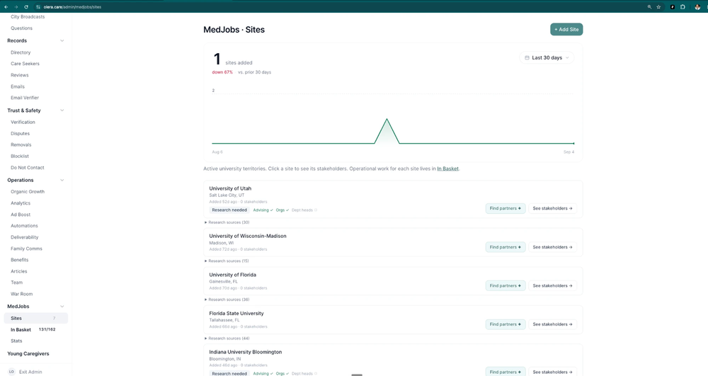

**Exhibit B — Add Site.** `olera.care/admin/medjobs/sites` → **+ Add Site**

Modal titled **Add Site**: *"Activate a university territory. The counts below show how many non-medical
home care providers in our directory match each catchment — i.e. how many Provider Prospects this Site
will generate."*

A **University** field — *Pick a university…* — opens a searchable list, each option carrying its provider
count: *University of Texas at Austin (Austin, TX) — 83 in catchment* · *Texas A&M University (College
Station, TX) — 28* · *University of Houston / Rice (Houston, TX) — 152* · *University of Georgia (Athens,
GA) — 19*. Universities already live are greyed out and marked **— added**.

**This is where the size of the prospect list is decided.** Picking a university with 152 providers in
catchment commits the Admin Team to pre-flighting 152 rows.

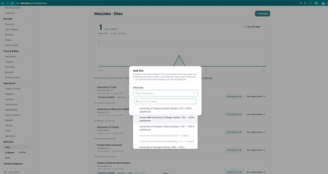

**Exhibit C — In Basket, Providers tab.** `olera.care/admin/medjobs/in-basket`

Header **MedJobs · In Basket** over three cards: **QUEUED** (total, split unread / read), **LOGS COMPLETED
TODAY** (total, broken out by calls · meetings · replies · emails · other), and **STREAK** —
*"Consecutive business days hitting 50 logs. Weekends skipped."*

A search box — *by name, organization, or email* — with **All sites** and **All types** filters. Then the
tab row, each tab carrying a live worked/total count: **Providers** · Partners · Calls · Emails ·
Meetings · Follow-up.

Below, one card per provider: business name, **\[University\] · Provider**, and **Last activity Nm ago**.
The queue is filtered to one site at a time — an Arizona State University run reads Amada Senior Care,
Hart2Heart, Visiting Angels, A Caring Hand for Mom, Simple Living Assisted Home Care, Thrive Home Care
Services, HomeWell Care Services, Freedomcare.

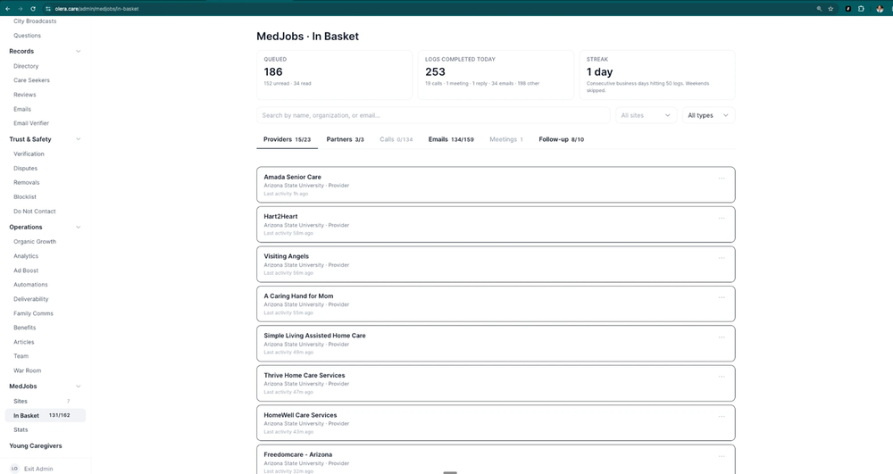

**Exhibit D — Log Pre-Flight outcome.** In Basket → provider row → **Call to Confirm**

Modal titled **Log Pre-Flight outcome**, subtitled with the business name and the number being called.
A **SUGGESTED SCRIPT** panel carries the call opener verbatim. Four outcomes, each with its consequence
written underneath:

- **Confirmed contact info** — *"Reached someone and verified the email / decision maker. Pre-Flight passes."*
- **No answer** — *"Nobody answered. Stays in Pre-Flight — try again later."*
- **Voicemail** — *"Left a message. Stays in Pre-Flight — try again later."*
- **Not interested** — *"They don't want information. Closes the row — no outreach."*

Then **Notes (optional)** — *"What did they confirm? Anything useful for outreach copy?"* — and three
buttons: **Override & launch outreach**, **Cancel**, **Log call**.

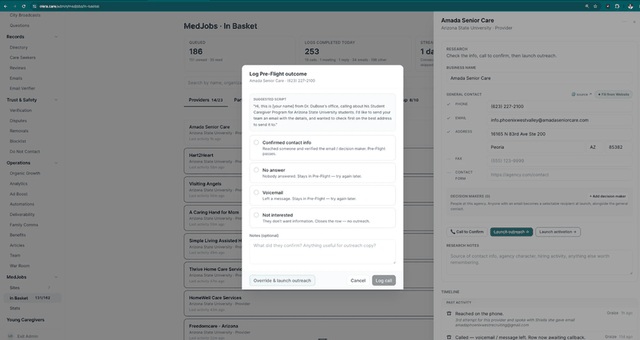

**Exhibit E — Provider drawer.** In Basket → provider row

Right-hand drawer headed with the business name and **\[University\] · Provider**. A **RESEARCH** section
instructs: *"Check the info, call to confirm, then launch outreach."*

**BUSINESS NAME**, then **GENERAL CONTACT** with a **source ↗** link and **+ Fill from Website**. Five
fields, each with a state marker — ✓ **PHONE**, ✓ **EMAIL**, ✓ **ADDRESS** (street, city, state, ZIP),
— **FAX**, — **CONTACT FORM**. The ticks are what "pre-flight complete" looks like on a row.

**DECISION MAKERS (0)** with **+ Add decision maker**: *"People at this agency. Anyone with an email
becomes a selectable recipient at launch, alongside the general contact."*

Three actions: **📞 Call to Confirm** · **Launch outreach →** · **Launch activation →**. Below,
**RESEARCH NOTES** — *"Source of contact info, agency character, hiring activity, anything else worth
remembering."*

Then **TIMELINE · PAST ACTIVITY**, one entry per attempt with the operator's name and how long ago. A
worked row reads like *"Reached on the phone. 3rd attempt for this provider and spoke with \[name\], she
gave email \[address\]"* — Grazy, 1h ago; above *"Called — voicemail / message left. Row now awaiting
callback."* — Grazy, 11d ago.
**This is the attempt count the three-strikes rule is counted from.**

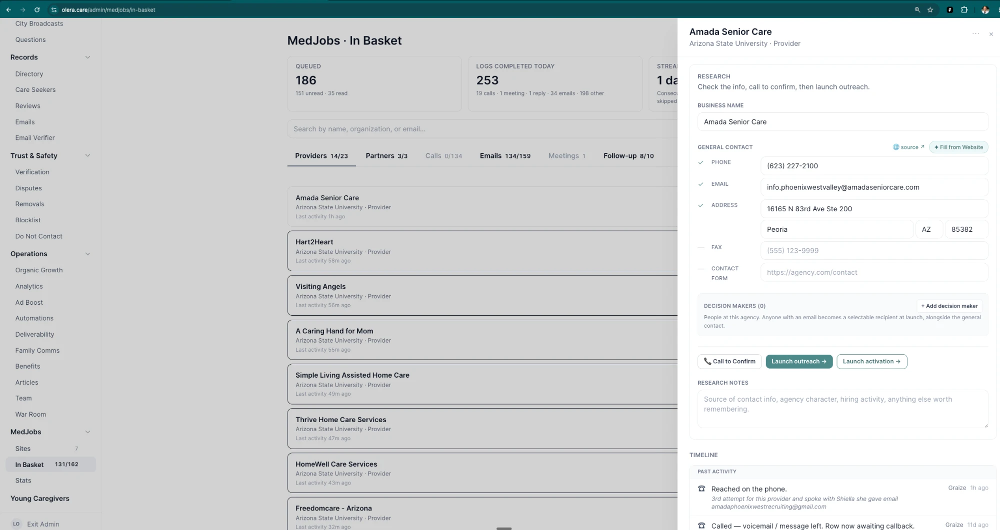

---

## PR-OUT — Outbound work

**Objective** Launch the call-and-email campaign on a provider that has cleared pre-flight, then work the
queues it generates until the provider books a meeting or the row runs out.
**Owner** Admin Team. **Users** Admin Team, provider.
**Completion criteria** A meeting on the Sales Lead's calendar — or a recorded terminal outcome, or a
finished cadence that drops the row into Follow-up.

> **The cadence is shorter than the protocol says.** Graize's written protocol calls this the *D0–30
> campaign*. What is shipped is **3 emails and 2 calls over 7 days** — Day 0 · Day 3 · Day 5 · Day 7.
> Either the protocol or the cadence should change; flagged rather than reconciled.

### ① User journey / technology

**Actors: Admin Team and the provider.** Launch happens once; the queues are worked daily.

| # | What happens | Where | Exhibit |
|---|---|---|---|
| 1 | Click **Launch outreach →** on a cleared row. **Confirm outreach plan** opens with the whole campaign laid out — a launch summary, the recipients as checkboxes, and every day expandable to the actual email the provider will receive | In Basket → provider drawer | **E**, **F** |
| 2 | **Start outreach.** Day 0 sends; the rest queue via the send engine | Automatic | — |
| 3 | Work the **Calls** tab — calls grouped by the day they are due, each row with a click-to-dial number | [`olera.care/admin/medjobs/in-basket?tab=calls`](https://olera.care/admin/medjobs/in-basket?tab=calls) | **G** |
| 4 | Open the row. The drawer's **NEXT STEP** panel names the state and offers the actions that fit it | Calls → row | **I** |
| 5 | **Call provider**, work the day's script, log the outcome | Row → **Log call** | **H** |
| 6 | Check replies. **Check for reply** shows the provider's actual message and the ways to respond | Emails → row → **Check for reply** | **J** |
| 7 | When a cadence finishes with no meeting, the row appears in **Follow-up** for triage | In Basket → Follow-up | — |

**The shipped provider cadence — 3 emails, 2 calls**

| Day | What fires |
|---|---|
| **0** | Intro email |
| **3** | Light follow-up email **and** a check-in call |
| **5** | Call attempt |
| **7** | Final follow-up email |

Cold email sends from a dedicated outreach domain, not the brand domain. Scheduled sends and calls appear
in the drawer's **UPCOMING** list with their dates, so the row's whole future is visible before it happens.

### ② Human SOP

1. **Launch only rows that cleared pre-flight.** The override exists for rows you are confident about
   without a confirming call, and it writes *"Pre-Flight overridden — outreach unlocked manually"* to the
   timeline with your name on it. Use it deliberately.
2. **Read the plan before starting.** Confirm the recipients — untick anyone who should not receive it —
   and expand Day 0 to check the merge fields resolved. The modal shows exactly what the provider will
   see, including the flyer link and the program PDF.
3. **Work the Calls tab to zero every day.** Calls are grouped by due date; the count next to the date is
   the day's workload.
4. **Read the NEXT STEP panel before dialling.** It tells you where the row actually is — awaiting reply,
   next call in N days, or they replied and it is your move.
5. **Use the day's script.** The log modal shows the script for the cadence day you are on, so a Day 3
   call opens with a different line than a Day 5 one.
6. **Answer every reply within one business day** — same day for anything mentioning a time.
7. **Log every outcome, every time**, including the calls nobody answered. A note on its own logs the call.
8. **Do not hand-email a row mid-cadence.** Reply through the row so the cadence stops cleanly.

**Call outcomes and what each does to the row**

| Outcome | What happens |
|---|---|
| **Interested** | They want to move forward — launches the activation sequence |
| **📅 Meeting booked** | Opens the Calendly booking page and marks a meeting scheduled |
| **No answer** | Marks this call done; the next cadence call stays scheduled |
| **Voicemail** | Message left; the next cadence call stays scheduled |
| **Not interested** | Closes the row and cancels remaining outreach |

**Reply handling — what each option does**

| Option | What happens |
|---|---|
| **Launch activation cadence** | Runs the standard activation sequence toward a meeting |
| **✎ Launch custom cadence** | Compose your own emails and calls for a bespoke response |
| **↻ OOO reply — restart last cadence** | Auto-reply, not a real answer. Resumes the cadence and puts the row back to pending |
| **📅 Book a meeting** | Opens the Calendly booking page and marks a meeting scheduled |
| **Not interested** | Sends a polite closing note and stops outreach |

> **A real reply stops the cadence automatically.** The timeline records *"Reply received to \[address\] —
> cadence stopped,"* so the next move is a human one. The out-of-office option exists precisely because
> an auto-reply should not count as one.

### ③ System / handoff

| Data captured | Status | Events | Next trigger | Handoff |
|---|---|---|---|---|
| Recipients launched · sends, opens, replies · call outcomes and notes · scheduled sends and calls | researched → outreach sent → cold · replied · closed · cadence finished | outreach launched · row moved from Researched to Outreach Sent · outreach email sent (with open state) · called — no answer / voicemail / reached · reply received — cadence stopped · pre-flight overridden | A meeting is booked | **Admin Team → Sales Lead.** The row appears in the Meetings queue with its full timeline. No meeting and the cadence finishes → the row drops to **Follow-up** for re-engage-or-retire triage |

The drawer carries a **state chip** above the timeline — *Cold — 1 email sent, never opened · awaiting
their callback*, or *Replied — they replied · your move* — so the row's position is legible without
reading the history. **UPCOMING** lists what is still scheduled; **PAST ACTIVITY** lists what happened,
each entry stamped with the operator and how long ago.

Opens, replies and bounces only reach these queues if the send engine's webhook is wired. Without it the
Emails and Follow-up tabs look empty rather than broken.

**Communications** Day 0 intro email · Day 3 follow-up email · Day 3 check-in call · Day 5 call ·
Day 7 final email · the reply the provider sends back.

### Exhibits

**Exhibit F — Confirm outreach plan.** The launch review: a **LAUNCH SUMMARY** (*"3 emails + 2 calls across
the cadence below"*), **RECIPIENTS** as checkboxes with the address and phone each will be reached on, and
**CADENCE** with every day expandable. Day 0 opens to the full email — To, From, subject, the body the
provider will actually see, the variables that were substituted, and the program PDF. Footer reads
*"3 email + 2 call ready"* against **Start outreach**.
In Basket → provider drawer → **Launch outreach →**

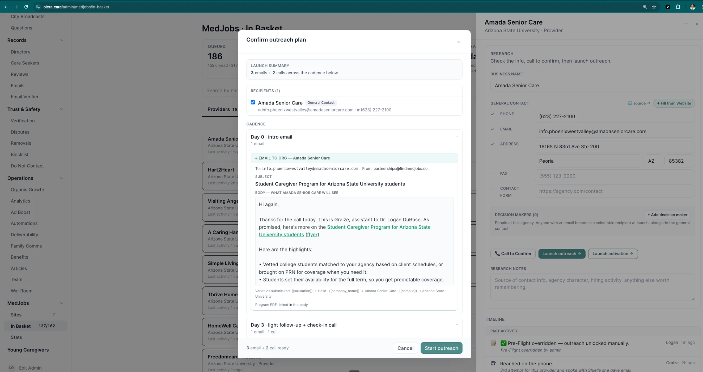

**Exhibit G — Calls tab.** Calls grouped by due date with the day's count beside it, each row carrying the
provider, its contact type, its site, and a click-to-dial number.
`olera.care/admin/medjobs/in-basket?tab=calls`

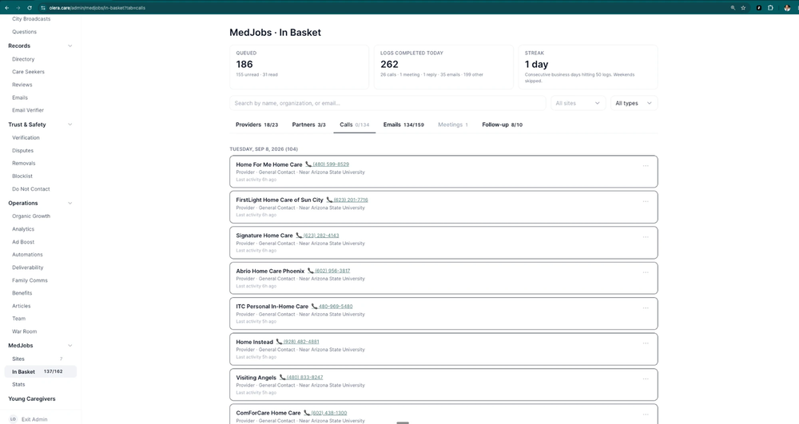

**Exhibit I — The drawer during outreach.** **NEXT STEP** names the state — *"Awaiting reply to outreach
cadence · Next call in 4d"* — over the actions that fit it: **Call provider**, **Check for reply to
provider**, **Launch activation**, and a link out to the send engine. Below, the state chip, then
**UPCOMING** (queued emails and scheduled calls with dates) and **PAST ACTIVITY**.
Calls → row

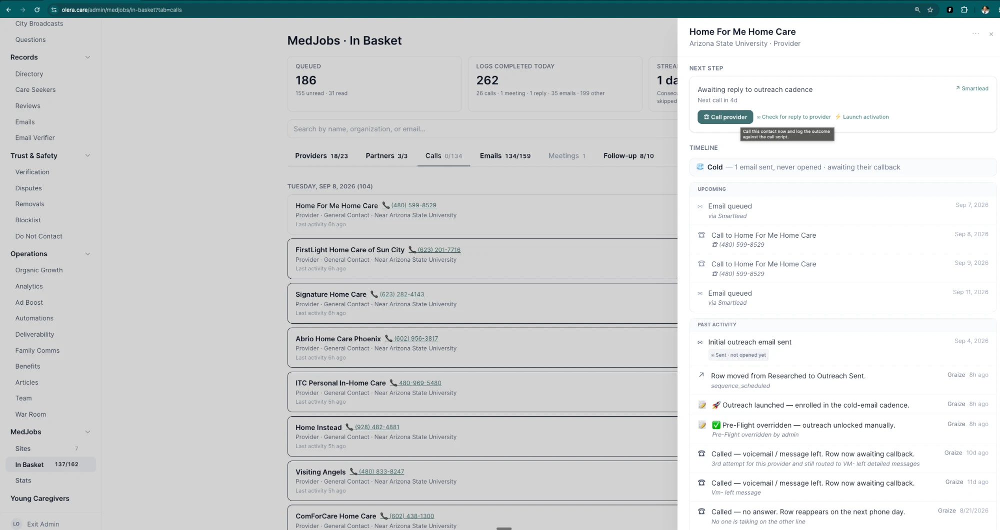

**Exhibit H — Log call.** The day's script at the top — *DAY 3 SCRIPT* — then the five outcomes with their
consequences, and a notes field where a note on its own logs the call.
Calls → row → **Call provider**

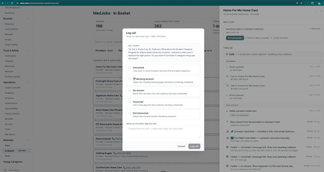

**Exhibit J — Check for reply.** The provider's actual reply quoted at the top, then the five ways to
respond. Behind it, the **Emails** tab grouped by state — *THEY REPLIED (9)*.
`olera.care/admin/medjobs/in-basket?tab=replies` → row → **Check for reply**

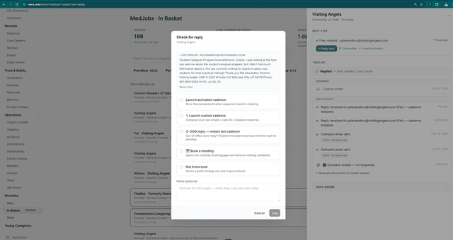

---

## PR2 — Provider meeting held

**Objective** Hold the meeting, convert the provider, and capture what was promised.
**Owner** Sales Lead. **Users** Sales Lead, provider.
**Completion criteria** Outcome logged and the relationship handed to the User Success Manager.

### ① User journey / technology

| # | What happens | Where | Exhibit |
|---|---|---|---|
| 1 | **Someone books the 30-minute slot.** Usually the Admin Team does it — live on a call, or from an email that names a time. The provider can book themselves from the link in the signature, but most bookings are made for them | Calendly — `Student Caregiver Program` | **L** |
| 2 | The booking lands the row in **Meetings**, under **NEEDS LOGGING** once the time has passed — *"log the outcome to move the row forward"* | [`olera.care/admin/medjobs/in-basket?tab=meetings`](https://olera.care/admin/medjobs/in-basket?tab=meetings) | **M** |
| 3 | Open the row. **NEXT STEP** reads *"On the calendar"* with a single action, and the state chip reads *"Replied — they replied · meeting booked"* | Meetings → row | **N** |
| 4 | Hold the meeting, then **Log meeting outcome**. The modal confirms what was booked and who attended, then offers three outcomes | Row → **Log meeting outcome** | **N** |

> **Booking is an Admin Team action first.** The fastest path to a booked meeting is the operator putting
> it in the calendar during the call, or off the back of a reply that offers a time. Sending the link and
> waiting is the slower fallback, not the design.

> **"Finding a time" is a holding state, not a meeting.** The Admin Team sets it when a provider is going
> back and forth by email about when to meet. **Ideally the Meetings tab holds only booked meetings** and
> that coordination lives with the rest of the email work — see the deferred list. Left as-is for now.

### ② Human SOP

1. **Read the row before the call.** The timeline shows every email, reply and call that produced this
   meeting — including what they said when they replied.
2. **Run the standard structure** and close with the soft agreement ask: *no rush to sign, we just need it
   before you interview your first student.*
3. **Log the outcome the same day.** A meeting held and unlogged is a row that stops moving.
4. **Write down what was promised** in the notes — a note on its own logs the meeting.
5. **Rebook a no-show once, warmly.** The option opens Calendly for you; people miss meetings.
6. **A no-show that cannot be rebooked goes back into outreach.** It is not a decline. The row should
   re-enter a call-and-email sequence rather than sit in Meetings or close — see the deferred list.

**Meeting outcomes and what each does to the row**

| Outcome | What happens |
|---|---|
| **Interested / went well** | Logs the meeting and launches the activation sequence |
| **No-show / reschedule** | Logs a no-show and opens Calendly to rebook. *Ideally, a no-show that is not immediately rebooked drops the row into a fresh call-and-email sequence — not yet built* |
| **Not interested** | Sends a polite closing note and stops outreach |

### ③ System / handoff

| Data captured | Status | Events | Next trigger | Handoff |
|---|---|---|---|---|
| Booked time · attendee name and address · outcome · notes and commitments | engaged → meeting scheduled → converted · closed | meeting scheduled — row moved to Meetings · meeting held · outcome logged · activation launched | Outcome logged | **Sales Lead → User Success Manager.** *Interested / went well* launches activation and moves the relationship on; the other two close the row |

**Communications** Booking confirmation and reminder from Calendly · the post-meeting details email with
the agreement · a polite closing note when the answer is no.

### Exhibits

**Exhibit L — The booking page.** What the provider sees: **Student Caregiver Program**, 30 minutes, the
Sales Lead's name, and the pitch — *hands-on caregiving hours, recommendation letters, and experience that
strengthens their med, PA, and nursing applications* — over a date and time picker.
`calendly.com/…/home-care-agency-manager-interview`

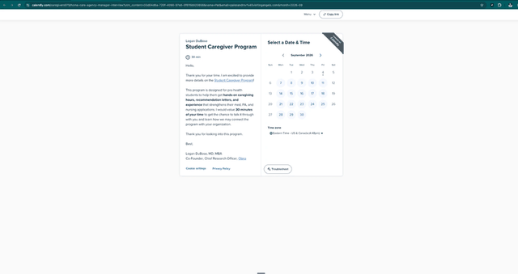

**Exhibit M — Meetings tab.** **NEEDS LOGGING** carries meetings whose time has passed — *"log the outcome
to move the row forward."* **FINDING A TIME** below it holds rows still coordinating by email, a state the
Admin Team sets by hand. The tab count reads worked over total.
`olera.care/admin/medjobs/in-basket?tab=meetings`

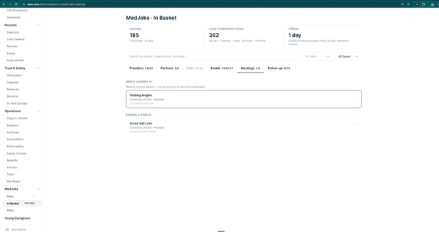

**Exhibit N — Log meeting outcome.** A **BOOKED** panel confirming the calendar entry and the attendee,
then the three outcomes with their consequences, and a notes field. Behind it the drawer shows **NEXT
STEP · On the calendar** and the state chip *"Replied — they replied · meeting booked,"* over a timeline
that runs back through every reply and send.
Meetings → row → **Log meeting outcome**

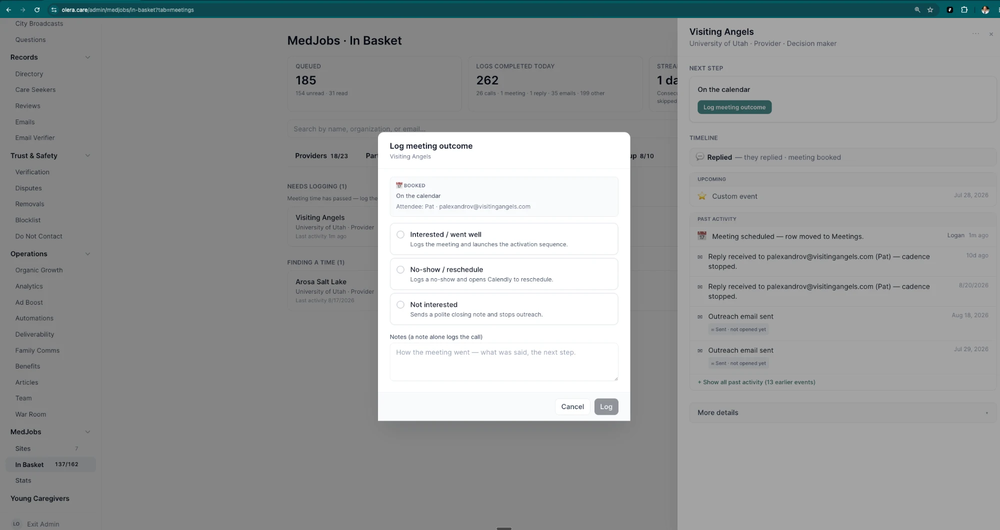

---

## PR3 — Client success

**Objective** Carry the provider from the meeting to an actual first hire. **Owner** User Success Manager.
**Completion criteria** Terms accepted, profile complete, staffing need recorded, candidates visible.

**① User journey / technology**

| Actor | Sees / does | Surface |
|---|---|---|
| Provider | Receives the follow-up; accepts terms; signs in; completes the profile; states the need | Email · magic link · portal · forms |
| User Success Manager | Sends the follow-up; chases answers; drives completion; captures the need | Clients queue · step board · templates |

**② Human SOP** — send the follow-up the same day as the meeting · chase at three and seven days · get the
standard hiring questions answered · verify the provider can actually sign in and see the board · record
the staffing need against the client within a day · never let a converted provider face an empty board.

**③ System / handoff**

| Data captured | Status | Events | Next trigger | Handoff |
|---|---|---|---|---|
| Terms acceptance, profile answers, demand profile, roles and headcount | converted → active client | terms accepted · profile completed · staffing need recorded | Staffing need recorded | **User Success Manager → Portal** — the need drives matching |

**Communications** Post-meeting details email · agreement · reminders · welcome on first authentication.

---

## ST1 — Target advisors

**Objective** Named university stakeholders identified per site. **Owner** Admin Team.
**Completion criteria** Named humans with contact details and a stated reason they are the right person.

**① User journey / technology**

| Actor | Sees / does | Surface |
|---|---|---|
| Admin Team | Builds the stakeholder list by subtype; enriches; records why each is right | Partner prospects · partner sourcing |

**② Human SOP** — work advising pages, org directories, department pages · check org rosters are current ·
capture subtype, since it drives the copy · target 15–25 named humans per site.

**③ System / handoff**

| Data captured | Status | Events | Next trigger | Handoff |
|---|---|---|---|---|
| Name, title, subtype, department, contacts, rationale | prospect | target added · contact added | Contactable | Stays with Admin Team → ST-OUT |

**Communications** None at this stage.

---

## ST-OUT — University outbound

**Objective** Move a stakeholder to a booked meeting. **Owner** Admin Team.
**Completion criteria** Advisor meeting booked, or a recorded terminal outcome.

**① User journey / technology**

| Actor | Sees / does | Surface |
|---|---|---|
| Stakeholder | Receives subtype-appropriate outreach; replies or books | Email · phone · scheduling |
| Admin Team | Launches, calls, triages, books | Partners queue · Calls · Emails · log modals |

**② Human SOP** — use the subtype's tone and ask · keep the ask small and specific · same reply SLA as the
provider side · respect professor permission gating.

**③ System / handoff**

| Data captured | Status | Events | Next trigger | Handoff |
|---|---|---|---|---|
| Sends, engagement, replies, call outcomes | prospect → in outreach → engaged | `email_sent` · `email_replied` · call outcome · `meeting_scheduled` | Meeting booked | **Admin Team → Sales Lead** |

**Communications** Subtype-aware sequences · call script · booking link.

---

## ST2 — Advisor meeting held

**Objective** Secure agreement to reach students. **Owner** Sales Lead.
**Completion criteria** Outcome recorded, agreed channels captured, relationship handed on.

**① User journey / technology**

| Actor | Sees / does | Surface |
|---|---|---|
| Advisor | Books, attends, agrees to specific channels | Scheduling · video |
| Sales Lead | Prepares; runs the meeting; records what was agreed | Meetings queue · drawer · log meeting modal |

**② Human SOP** — ask for specific channels, not general partnership · record which of the five were agreed ·
capture permissions granted, especially for professor access · hand off with the agreed channels attached.

**③ System / handoff**

| Data captured | Status | Events | Next trigger | Handoff |
|---|---|---|---|---|
| Outcome, agreed channels, permissions, contacts offered | engaged → active partner | `meeting_held` · distribution agreed · permission granted | Outcome recorded | **Sales Lead → User Success Manager** — appears in the partners queue |

**Communications** Confirmation · reminder · post-meeting thank-you with the agreed asks.

---

## ST3–ST7 — University activation

**Objective** Circulate the MedJobs opportunity through five parallel channels until students apply.
**Owner** User Success Manager, with the Sales Lead where a physician in the room changes the answer.
**Completion criteria** Each agreed channel is live, and its distribution is recorded.

**① User journey / technology**

| Channel | Who acts | Student sees | Surface |
|---|---|---|---|
| **ST3** University job board | USM posts; advisor approves | A posting on a board they already check | Job postings · opportunity model |
| **ST4** Student org relationships | USM + Sales Lead build; officer shares | A post in their group chat or a mention at a meeting | Partner portal · flyer |
| **ST5** Campus events | USM + Sales Lead run | A table, a talk, a QR code | Partner portal event route |
| **ST6** Advisor listservs | USM supplies copy; advisor sends | An email from a trusted sender | Partner portal message route |
| **ST7** Professor outreach + class visits | USM + Sales Lead, once permitted | An in-class introduction | Professor gating · bulk professors |

**② Human SOP** — activate every agreed channel within two weeks of ST2 · supply ready-to-send copy so the
partner only has to forward · record distribution evidence on the partner row with a rough reach estimate ·
report results back to the partner so they share again · re-check org leadership each term.

**③ System / handoff**

| Data captured | Status | Events | Next trigger | Handoff |
|---|---|---|---|---|
| Channel, date, partner, reach estimate, asset used | partner active → distributing | channel activated · distribution recorded | A student follows the link | **→ Portal (ST8)** |

**Communications** Ready-to-send copy per channel · the flyer as the shared asset · results-back note.

---

## ST8 — Student application submitted

**Objective** Capture an application complete enough to assess. **Owner** Portal, supported by the USM.
**Completion criteria** A submitted application with everything qualification needs.

**① User journey / technology**

| Actor | Sees / does | Surface |
|---|---|---|
| Student | Lands, screens in, applies, uploads documents and video, reads the agreement | Public page · screener · application · uploads |
| User Success Manager | Sees stalled applications and nudges them | Candidates queue |

**② Human SOP** — touch every started-but-unfinished application within 24 hours · nudge with an offer of
help, not a reminder · one further nudge at day three, then leave it · log why students stall.

**③ System / handoff**

| Data captured | Status | Events | Next trigger | Handoff |
|---|---|---|---|---|
| Eligibility answers, availability, documents, video, terms acceptance | started → submitted | student eligibility completed · application started · application submitted | Submission | **→ QUAL** |

**Communications** Confirmation · resume-your-application nudge · submission acknowledgement.

---

## QUAL — Portal vets the application

**Objective** Produce a qualified candidate pool a provider can trust. **Owner** Portal, exceptions to USM.
**Completion criteria** A decision recorded against defined criteria, and the student told the outcome.

**① User journey / technology**

| Actor | Sees / does | Surface |
|---|---|---|
| Student | Learns whether they qualified and what happens next | Portal · email |
| User Success Manager | Reviews outcomes and handles exceptions | Candidates view |

**② Human SOP** — review every borderline case rather than letting it sit · record the reason for any
override · feed recurring failure reasons back into the application.

**③ System / handoff**

| Data captured | Status | Events | Next trigger | Handoff |
|---|---|---|---|---|
| Criteria evaluated, decision, reason, reviewer | submitted → qualified / not qualified | qualification decision · went live | Qualified | **→ MA1** |

> **Note.** The qualification criteria do not exist yet. What the product does today is check that a
> profile is *complete and active*, which is a completeness check, not a qualification decision. The
> criteria have to be written before this stage can be built, delegated, or explained to a provider.

**Communications** Outcome message · you're-live message · what-to-expect-next.

---

## MA1 — Candidate intro

**Objective** Put candidates who fit the staffing need in front of the client. **Owner** Portal, driven by
the USM. **Completion criteria** The client has seen candidates and can act on them.

**① User journey / technology**

| Actor | Sees / does | Surface |
|---|---|---|
| Provider | Browses candidates with a match line explaining the fit | Candidate board · candidate detail |
| Student | Is visible; may be invited | Student portal |
| User Success Manager | Confirms the client is looking; intervenes if not | Client view |

**② Human SOP** — check every active client has candidates to look at · call, do not email, a client who
has not logged in within three days · if nobody fits, that is a supply brief, not a client problem.

**③ System / handoff**

| Data captured | Status | Events | Next trigger | Handoff |
|---|---|---|---|---|
| Candidates surfaced, viewed, match basis | qualified → introduced | candidates viewed | Invite sent | **→ MA2** |

**Communications** New-match notification to the provider · nudge if the board is untouched.

---

## MA2 — Interview held

**Objective** An interview that actually happens, confirmed by both sides. **Owner** Portal, driven by the
USM. **Completion criteria** Both parties confirm it was held.

**① User journey / technology**

| Actor | Sees / does | Surface |
|---|---|---|
| Provider | Invites, proposes times, attends, confirms | Invite flow · calendar |
| Student | Receives the invitation, accepts, attends | Interview flow · calendar |
| User Success Manager | Chases both handshakes; follows up the day after | Interview view |

**② Human SOP** — confirm with both sides 24 hours before · follow up within one day of every interview,
by phone · never let a held interview sit without a next step.

**③ System / handoff**

| Data captured | Status | Events | Next trigger | Handoff |
|---|---|---|---|---|
| Invite, acceptance, scheduled time, held confirmation | introduced → interviewing | interview invited · accepted · held | Held and confirmed | **→ MA3** |

**Communications** Invitation · acceptance · calendar file · reminder · post-interview prompt to both sides.

---

## MA3 — Hire confirmed

**Objective** A recorded placement both parties agree to. **Owner** Portal, driven by the USM.
**Completion criteria** Placement recorded as confirmed, with the agreement signed.

**① User journey / technology**

| Actor | Sees / does | Surface |
|---|---|---|
| Provider | Makes the offer and signs the agreement | Offer flow · agreement modal |
| Student | Sees the offer and accepts | Offer view |
| User Success Manager | Walks a first-time client through it; confirms both sides see the same state | Client and candidate views |

**② Human SOP** — walk the first offer personally · confirm the student understood what they accepted ·
record the start date, because it is the clock MA4 runs on.

**③ System / handoff**

| Data captured | Status | Events | Next trigger | Handoff |
|---|---|---|---|---|
| Offer, agreement signature, acceptance, start date | interviewing → hired | offer made · accepted · hire confirmed | Confirmed | **→ MA4** |

**Communications** Offer notification · acceptance confirmation to both sides · start-of-work note.

---

## MA4 — Six or more shifts worked, confirmed

**Objective** Verify the placement produced real work. **Owner** User Success Manager.
**Completion criteria** Six shifts confirmed by an agreed method, with a recorded result and timestamp.

> **This is the commercial threshold of the entire model and it has no implementation.** No shift or
> hours-worked concept exists anywhere in MedJobs. The only related value is a 120-hour threshold on the
> placement record, which backs the service guarantee rather than the bill. Everything below is a design
> to decide, not a workflow to audit.

**① User journey / technology** — undecided. The three plausible shapes:

| Option | Who confirms | Effort | Trust |
|---|---|---|---|
| Provider attestation | Provider clicks to confirm six shifts | Lowest | Depends on the provider |
| Student log | Student records shifts as worked | Moderate | Cross-checkable against the provider |
| Manual confirmation | USM asks both sides and records the answer | Highest | Highest, and does not scale |

**② Human SOP** — undefined until the mechanism is chosen. Whatever the mechanism, the USM must be able to
see which placements are approaching the threshold, and chase the confirmation.

**③ System / handoff**

| Data captured | Status | Events | Next trigger | Handoff |
|---|---|---|---|---|
| Shift count, confirmation source, confirmed-at, confirmer | hired → threshold met | six shifts confirmed | Threshold met | **→ MA5** |

**Communications** Confirmation request · confirmation acknowledgement to both sides.

---

## MA5 — Bill issued and collected

**Objective** Invoice against the confirmed threshold and collect. **Owner** User Success Manager.
**Completion criteria** Payment received and reconcilable.

**① User journey / technology**

| Actor | Sees / does | Surface |
|---|---|---|
| Provider | Sees what they owe and why, and pays | **Undefined** |
| User Success Manager | Issues the invoice, tracks it, chases it | **Undefined** |

**② Human SOP** — manual invoicing is acceptable for the first placements · reference the signed agreement
and the confirmed shift count · track invoiced against collected weekly · chase at fourteen days.

**③ System / handoff**

| Data captured | Status | Events | Next trigger | Handoff |
|---|---|---|---|---|
| Amount, basis, invoice date, payment date, method | threshold met → billed → collected | bill issued · payment collected | Payment received | **→ ongoing support** |

> **Note.** The billing technology that exists today — a subscription checkout, a billing portal, and
> stubbed per-placement fee fields — implements a different model. None of it bills after six shifts.

**Communications** Invoice · receipt · reminder.

---

# Deferred build list

Things this document describes as they **should** work, which do not work that way yet. Written down here
rather than softened in the stages above, so the document reads as the operating system we are building
toward and the gap stays visible.

| # | Stage | What we want | Where it stands |
|---|---|---|---|
| **B1** | PR2 | **The Meetings tab holds only booked meetings.** Email back-and-forth about timing belongs with the rest of the email work, not in a tab that otherwise means *a meeting exists* | *Finding a time* is a hand-set state inside Meetings. Works, but muddies the tab |
| **B2** | PR2 | **A no-show re-enters outreach automatically.** A missed meeting is not a decline — the row should drop into a fresh call-and-email sequence, effectively a custom re-engagement campaign, rather than closing or sitting still | The outcome logs a no-show and opens Calendly to rebook. Nothing catches the row if the rebook does not happen |
| **B3** | PR-OUT · PR2 | **A custom campaign any operator can launch on a single row** — pick the emails and calls, set the days, start it. Needed for no-show recovery and for any bespoke follow-up | *Launch custom cadence* exists in the reply modal; not available as a general action from a row |
| **B4** | ST3–ST7 | **Channel attribution.** Know which of the five university channels produced a student | Channels are not modelled as distinct entities |
| **B5** | ST8 | **Application source capture.** Ask a student how they heard about MedJobs | Nothing records it |
| **B6** | QUAL | **Written qualification criteria**, then a vetting step that applies them | Today "live" means profile complete and active — a completeness check, not a qualification decision |
| **B7** | MA4 | **Shift verification.** Some reliable way to confirm six shifts were worked, and a view of which placements are approaching the threshold | No shift or hours-worked concept exists anywhere |
| **B8** | MA5 | **Billing on the six-shift trigger** — invoice raised against a confirmed threshold, payment recorded | Two legacy billing paths, neither matching the model |

**How to use this list.** Nothing here blocks running the operating system by hand today. Each item is a
place where a human is currently doing something the system should do, or where the system records
something less precisely than the model needs. They get scoped and prioritised after the map is complete —
not one at a time as they surface.
