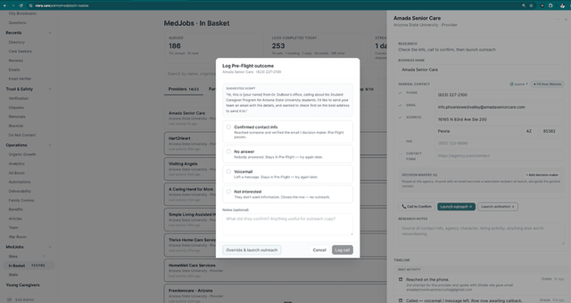
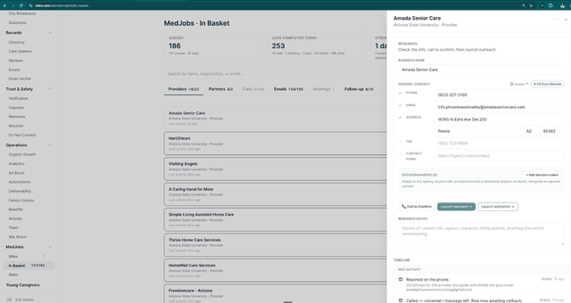
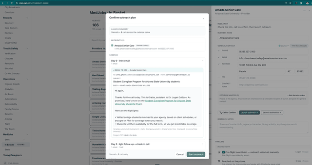
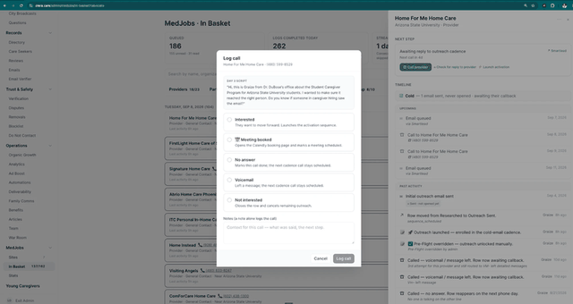
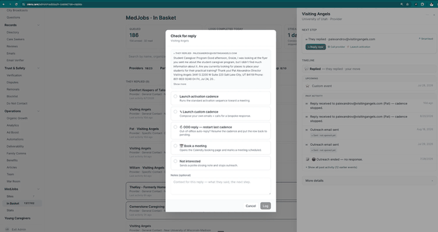
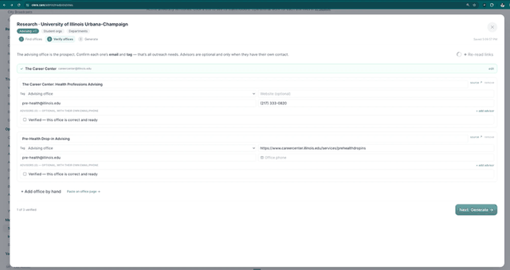
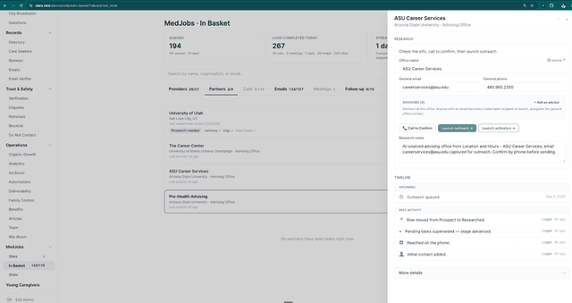
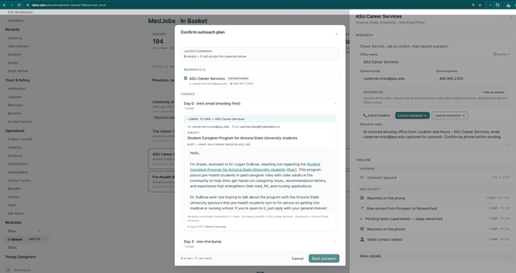
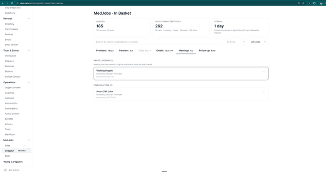
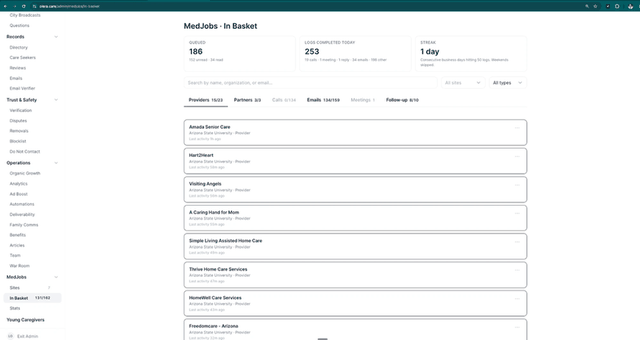

# MedJobs Admin Team Operations

A role view of the MedJobs 2.0 Master Implementation Matrix. Every instruction here
comes from that document, which stays the source of truth. Nothing has been added to
the operating model; where the master leaves a question open, it is marked
**GAP / DECISION NEEDED** rather than answered here.

**ROLE PURPOSE** Build both target lists for a site and work them until a meeting is
on the Sales Lead's calendar. The Admin Team runs the front half of both pipelines:
provider prospecting and outreach, university office prospecting and outreach, and
the booking that ends both.

**WHAT YOU OWN** PR1 target list built and pre-flight complete. PR-OUT outbound work.
ST1 target advisors. ST-OUT university outbound. Booking the 30-minute slot on both
sides. The daily Calls, Emails and Follow-up queues.

**WHAT YOU DO NOT OWN** The meeting itself, which is the Sales Lead's (PR2, ST2).
Client success and university activation, which are the User Success Manager's (PR3,
ST3 to ST7). Everything the Portal carries from ST8 onward.

**WHO HANDS WORK TO YOU** Nobody. Both pipelines start with you: a site added in PR1
generates the provider list, and **Find partners** in ST1 generates the office list.

**WHO YOU HAND WORK TO** The Sales Lead, at the booked meeting, on both sides.

[Provider outreach](#pr1) [University outreach](#st1) [Booking and handoff](#booking) [Daily queues](#queues) [Exceptions](#exceptions) [Gaps](#gaps) [Traceability](#trace)
{: .navbar }

## PR1 Target list built and pre-flight complete {: #pr1 .nobreak }

**Objective** Add a university site so the system loads every matching provider from
the Olera directory into the In Basket, then complete pre-flight research on each one,
being phone, email, address and decision maker, confirmed by a pre-flight call.

PR1 is not just the list. It is the list *built and worked through pre-flight.* A site
whose providers are loaded but un-researched has not completed PR1.

| | |
|---|---|
| **Trigger** | You add a site. The system pulls the matching providers out of the Olera directory and places them in the In Basket as rows awaiting pre-flight research. Nobody builds the list by hand |
| **Tools** | Sites tab `olera.care/admin/medjobs/sites` &#183; **+ Add Site** modal &#183; In Basket Providers tab `olera.care/admin/medjobs/in-basket` &#183; the provider drawer &#183; **Log Pre-Flight outcome** modal |
| **Communications** | None outbound. The pre-flight call is the only contact, and it uses the script in the log modal |
| **Completion criteria** | Contact details confirmed on the call, and the row launched into outreach. Or three unsuccessful call attempts, and the row archived |
| **Handoff** | **Launch outreach**, to PR-OUT. The row stays with you |

<!--FIG preflight-->

### Required actions

For a given site, work every provider on it.

1. **Do the desk research first.** Fill in whatever phone, email and address you can
   find yourself, from the provider's website, the source link on the row, or **Fill
   from Website**. Do not call a row you have not looked at.
2. **Call every provider on the site.** The call confirms the research; research alone
   does not complete pre-flight.
3. **Use the suggested script** shown in the log modal: *"Hi, this is \[your name\]
   from Dr. DuBose's office, calling about the Student Caregiver Program for
   \[University\] students. I'd like to send your team an email with the details, and
   wanted to check first on the best address to send it to."*
4. **Log the outcome, every time.**
5. **Update the record from the call.** A corrected email address or a named decision
   maker learned on the phone goes onto the row immediately, while you have it.
6. **Three attempts, then archive.** If three calls fail to confirm the contact
   details, archive the provider and move on.

| Outcome | What it means | What happens to the row |
|---|---|---|
| **Confirmed contact info** | Reached someone; email and decision maker verified | Pre-flight passes, launch outreach |
| **No answer** | Nobody picked up | Stays in pre-flight, call again |
| **Voicemail** | Message left | Stays in pre-flight, call again |
| **Not interested** | They do not want the information | Row closes; no outreach |

**Exhibit D. Log Pre-Flight outcome.** The suggested script, the four outcomes with their consequences stated on each, the notes field, and **Override and launch outreach**. In Basket, provider row, **Call to Confirm**.

**Exhibit E. Provider drawer.** **RESEARCH** states the sequence over five contact fields, each with a state marker. The ticks are what pre-flight complete looks like on a row. **The timeline is where the three-strikes count is read from**, one entry per attempt, with the operator and how long ago.

### What must be recorded

Business name, phone, email, address, fax, contact form, decision makers, research
notes, call outcome and notes. Every call, including the ones nobody answered, writes
to the row's timeline with the caller's name and the time, so the attempt count is
visible rather than remembered. The timeline is where the three-strikes count is read
from.

[Back to top](#top)
{: .totop }

## PR-OUT Outbound work {: #pr-out }

**Objective** Launch the call-and-email campaign on a provider that has cleared
pre-flight, then work the queues it generates until the provider books a meeting or
the row runs out.

| | |
|---|---|
| **Trigger** | A row's contact details are confirmed on the pre-flight call |
| **Tools** | Provider drawer &#183; **Confirm outreach plan** modal &#183; Calls tab `olera.care/admin/medjobs/in-basket?tab=calls` &#183; **Log call** modal &#183; Emails tab and **Check for reply** &#183; Follow-up tab |
| **Communications** | Day 0 intro email &#183; Day 3 follow-up email &#183; Day 3 check-in call &#183; Day 5 call &#183; Day 7 final email &#183; the reply the provider sends back |
| **Completion criteria** | A meeting on the Sales Lead's calendar. Or a recorded terminal outcome, or a finished cadence that drops the row into Follow-up |
| **Handoff** | **Admin Team to Sales Lead** when a meeting is booked. The row appears in the Meetings queue with its full timeline. No meeting and the cadence finishes, and the row drops to **Follow-up** for re-engage-or-retire triage |

<!--FIG cadence-->

**The cadence.** Three emails and two calls over seven days: Day 0 intro email, Day 3
follow-up email and a check-in call, Day 5 call, Day 7 final email. Cold email sends
from a dedicated outreach domain. Scheduled sends and calls appear in the drawer's
**UPCOMING** list with their dates, so the row's whole future is visible before it
happens.

**Exhibit F. Confirm outreach plan.** **LAUNCH SUMMARY**, the recipients as checkboxes with the address and phone each will be reached on, and every cadence day expandable to the actual email. This is where you check the merge fields resolved.

### Required actions

1. **Launch only rows that cleared pre-flight.** The override writes itself to the
   timeline with your name on it. Use it deliberately.
2. **Read the plan before starting.** Untick anyone who should not receive it, and
   expand Day 0 to check the merge fields resolved.
3. **Work the Calls tab to zero every day.** Calls are grouped by due date; the count
   beside the date is the day's workload.
4. **Read the NEXT STEP panel before dialling.** It tells you where the row actually
   is: awaiting reply, next call in N days, or they replied and it is your move.
5. **Use the day's script.** A Day 3 call opens with a different line than a Day 5 one.
6. **Answer every reply within one business day**, same day for anything mentioning a
   time.
7. **Log every outcome, every time**, including the calls nobody answered. A note on
   its own logs the call.
8. **Do not hand-email a row mid-cadence.** Reply through the row so the cadence stops
   cleanly.

| Call outcome | What happens |
|---|---|
| **Interested** | They want to move forward, launches the activation sequence |
| **Meeting booked** | Opens the Calendly booking page and marks a meeting scheduled |
| **No answer** | Marks this call done; the next cadence call stays scheduled |
| **Voicemail** | Message left; the next cadence call stays scheduled |
| **Not interested** | Closes the row and cancels remaining outreach |

**Exhibit H. Log call.** The day's script at the top, then the five outcomes with their consequences, and a notes field where a note on its own logs the call. Calls, row, **Call provider**.

| Reply option | What happens |
|---|---|
| **Launch activation cadence** | Runs the standard activation sequence toward a meeting |
| **Launch custom cadence** | Compose your own emails and calls for a bespoke response |
| **OOO reply, restart last cadence** | Auto-reply, not a real answer. Resumes the cadence and puts the row back to pending |
| **Book a meeting** | Opens the Calendly booking page and marks a meeting scheduled |
| **Not interested** | Sends a polite closing note and stops outreach |

**Exhibit J. Check for reply.** The provider's actual reply quoted at the top, then the five ways to respond. Behind it the **Emails** tab grouped by state. Emails, row, **Check for reply**.

A real reply stops the cadence automatically. The timeline records *"Reply received to
\[address\], cadence stopped,"* so the next move is a manual one. The out-of-office
option exists precisely because an auto-reply should not count as one.

### What must be recorded

Recipients launched, sends and opens and replies, call outcomes and notes, scheduled
sends and calls. A **state chip** above the timeline reads the row's position without
anyone reading its history. **UPCOMING** lists what is still scheduled; **PAST
ACTIVITY** what happened, each entry stamped with the operator and how long ago.

[Back to top](#top)
{: .totop }

## ST1 Target advisors {: #st1 }

**Objective** Produce a verified list of university offices for a site, each with the
email outreach needs, waiting in the In Basket to be confirmed by a call.

The office is the prospect, not the person. An advising office with an email is what
outreach needs. Named advisors are optional, and worth adding only when they have
their own contact details. The opposite of provider prospecting, and deliberate:
offices outlast the people in them.

| | |
|---|---|
| **Trigger** | A site exists and its partner research has not been done. The site card reads **Research needed** |
| **Tools** | Site card **Find partners** &#183; the Research modal, steps 1 to 3 &#183; Partners tab `olera.care/admin/medjobs/in-basket?tab=partner_book` |
| **Communications** | None at this stage. The confirming call and the outreach that follows are ST-OUT |
| **Completion criteria** | Offices generated as prospects, each verified and tagged, waiting in the Partners tab |
| **Handoff** | Stays with the Admin Team, to ST-OUT, via the Partners tab |

Three subtypes are worked in turn for each site: **Advising**, then **Student orgs**,
then **Departments**. The site card tracks progress across the three, and the wizard
autosaves as you work.

### Required actions

1. **Work one site through all three subtypes**, advising, then orgs, then
   departments, rather than half-finishing several sites.
2. **Use Suggest links first, then the predefined searches.** They cover the ground
   without your keeping a list in your head.
3. **Prefer the office with the clearest published email.** Pre-health advising first,
   then nursing and allied health, then career services.
4. **Tag every office.** The tag is what makes the outreach copy correct later.
5. **Add an advisor only when they have their own contact.** A name with no direct
   email gives outreach nothing to use.
6. **Tick verified only when you would send to that address today.** The tick is the
   gate.
7. **Then confirm by a quick call before launching.** Generating a prospect is not the
   same as knowing the address is live.

**Exhibit Q. Research, step 2, verify offices.** *"The advising office is the prospect. Confirm each one's email and tag, that's all outreach needs."* Each office carries a tag, email, phone and optional website, an advisors section, and the **Verified** tick.

### What must be recorded

Office name, tag, email, phone, website, source link, optional advisors, the verified
flag, and the research links kept.

[Back to top](#top)
{: .totop }

## ST-OUT University outbound {: #st-out }

**Objective** Confirm the advising office by phone, launch the call-and-email
campaign, then work the queues it generates until the office books a meeting or the
row runs out.

Same machinery, different cadence. ST-OUT runs on the same pre-flight call, the same
Calls and Emails queues, and the same log modals as the provider side. What differs is
the campaign: the partner cadence is **five emails and one call**, and every email is
meeting-first. The ask is a conversation with Dr. DuBose, not a service. Providers get
**three emails and two calls**. Nobody should have to remember which; the launch modal
states it before anything sends.

| | |
|---|---|
| **Trigger** | An office is generated as a prospect and sitting in the Partners tab |
| **Tools** | Partners tab, the partner drawer &#183; **Call to Confirm** and **Log Pre-Flight outcome** &#183; **Launch outreach** and **Confirm outreach plan** &#183; the shared Calls and Emails queues &#183; Follow-up |
| **Communications** | Pre-flight confirming call &#183; Day 0 intro email (meeting-first) with flyer and program PDF &#183; Day 3 one-line bump &#183; the remaining cadence emails &#183; the cadence call &#183; the reply the office sends back. Emails send from `partnerships@findmedjobs.co` |
| **Completion criteria** | A meeting on the Sales Lead's calendar. Or a recorded terminal outcome, or a finished cadence that drops the row into Follow-up |
| **Handoff** | **Admin Team to Sales Lead** when a meeting is booked. No meeting and the cadence finishes, and the row drops to **Follow-up** |

**Recipients.** The general office contact always; any advisor added in ST1 with their
own email as a selectable extra, which is why ST1 accepts only advisors who have one.
**Launch activation** sits beside Launch outreach as the second cadence, run once a
row has engaged.

**Exhibit T. Partner drawer.** **RESEARCH** states the sequence over the office name, general email and general phone, with **ADVISORS** and the rule beneath it. Three actions: **Call to Confirm**, **Launch outreach**, **Launch activation**.

### Required actions

1. **Call before you launch.** The row is a prospect, not a confirmed address. The
   pre-flight call exists to verify the email actually reaches the office and to find
   the person who decides.
2. **Use the suggested script.** It leads with Dr. DuBose's office, names the program,
   and asks one thing: the best address to send the details to. Nothing is being sold
   on this call.
3. **Log the outcome, every time**, including the calls nobody answered. The override
   writes itself to the timeline with your name on it.
4. **Read the plan before starting.** Expand Day 0 and check the merge fields
   resolved. A wrong substitution is visible here and nowhere later.
5. **Keep the research notes honest.** The panel says the office was AI-sourced and
   tells you to confirm by phone. Replace that with what the call established.
6. **Answer every reply within one business day**, same day for anything mentioning a
   time.
7. **Do not hand-email a row mid-cadence.** Reply through the row so the cadence stops
   cleanly.
8. **Respect permission gating on professors.** Class visits and listserv posts happen
   because someone agreed to them; the ask on this cadence is a meeting, not a
   distribution.

**Exhibit V. Confirm outreach plan, partner side.** **LAUNCH SUMMARY** reads *"5 emails + 1 call across the cadence below."* Day 0 opens to the full meeting-first intro email, sending from `partnerships@findmedjobs.co`. This is the modal that tells you which cadence you are launching.

The pre-flight outcomes and the reply options are the same four and five as the
provider side. One difference: **Launch activation cadence** drops out of the reply
options once a row is already enrolled. The timeline then reads *"Activation
launched,"* and four choices remain.

### What must be recorded

Pre-flight call outcome and notes, recipients launched, sends and opens and replies,
call outcomes, scheduled sends and calls.

[Back to top](#top)
{: .totop }

## Booking and the handoff to the Sales Lead {: #booking }

Booking is where both pipelines leave you. It is the same 30-minute *Student Caregiver
Program* slot for providers and for advising offices.

**Booking is an Admin Team action first.** The operator putting it in the calendar
during the call is the design. Sending the link and waiting is the slower fallback.

| | |
|---|---|
| **Trigger** | A provider or an advising office agrees to a meeting, live on a call or in a reply that names a time |
| **Tool** | Calendly, the `Student Caregiver Program` event |
| **What happens next** | The booking lands the row in **Meetings** `olera.care/admin/medjobs/in-basket?tab=meetings`, under **NEEDS LOGGING** once the time has passed |
| **What must be recorded** | The booked time and the attendee. The row carries its full timeline into the Meetings queue |
| **Handoff** | **Admin Team to Sales Lead.** From the booked meeting on, the row is the Sales Lead's until they log the outcome |

**Exhibit M. Meetings tab.** **NEEDS LOGGING** carries meetings whose time has passed. **FINDING A TIME** below it holds rows still coordinating by email, the state you set by hand.

**Finding a time** is a holding state, not a meeting. You set it by hand while a
provider is going back and forth by email. It sits below **NEEDS LOGGING** in the
Meetings tab.

[Back to top](#top)
{: .totop }

## Daily queues, logging and follow-up {: #queues }

This is the standing shape of the work, on both sides at once. Provider and partner
rows are worked side by side in the same tabs with the same modals.

| Queue | What it holds | The rule |
|---|---|---|
| **Providers** | The site's providers awaiting pre-flight research, filtered to a single site | Work every provider on a site before moving on |
| **Calls** | Calls grouped by the day they are due, each with a click-to-dial number | Work it to zero every day. The count beside the date is the day's workload |
| **Emails** | Rows grouped by state, *THEY REPLIED* over *PENDING REPLY* | Answer every reply within one business day, same day for anything mentioning a time |
| **Meetings** | **NEEDS LOGGING** over **FINDING A TIME** | Booked meetings pass to the Sales Lead. *Finding a time* is yours to maintain |
| **Partners** | Generated offices as prospects, each with its university and tag | Confirm by call, then launch |
| **Follow-up** | Rows whose cadence finished with no meeting | Re-engage-or-retire triage |

The In Basket header carries the day's workload over three counters: **QUEUED**,
**LOGS COMPLETED TODAY**, and a **STREAK** of consecutive business days hitting fifty
logs.

**Exhibit C. In Basket, Providers tab.** The day's workload over three counters: **QUEUED**, **LOGS COMPLETED TODAY**, and a **STREAK** of consecutive business days hitting fifty logs.

**Logging discipline, in one line.** Log every outcome every time, including the calls
nobody answered, because the timeline is the only record of how many attempts a row
has had and who made them.

[Back to top](#top)
{: .totop }

## Exceptions and escalation {: #exceptions }

Only the exceptions the master document defines are listed here.

| Situation | What the master says to do |
|---|---|
| **A row you are confident about without a confirming call** | **Override and launch outreach** exists in the Log Pre-Flight modal. Use it deliberately, not as the default. It writes itself to the timeline with your name on it |
| **Three failed pre-flight calls** | Archive the provider and move on |
| **An out-of-office auto-reply** | **OOO reply, restart last cadence.** It is not a real answer; the cadence resumes and the row goes back to pending |
| **A reply that names a time** | Answer the same day, not within one business day |
| **A reply mid-cadence** | Reply through the row, never by hand-email, so the cadence stops cleanly |
| **A cadence that finishes with no meeting** | The row drops to Follow-up for re-engage-or-retire triage |
| **A professor named on the university side** | Permission gating applies. The ask on the ST-OUT cadence is a meeting, not a distribution |

[Back to top](#top)
{: .totop }

## Gaps and decisions needed {: #gaps }

Each of these is a place the master document leaves open or names as unbuilt. None is
resolved here.

**GAP / DECISION NEEDED &#183; The provider cadence does not match the written
protocol.** The master records that Graize's written protocol calls this the *D0 to
30 campaign*, while what is shipped is three emails and two calls over seven days.
The master states plainly: *"Either the protocol or the cadence should change; flagged
rather than reconciled."* Until it is reconciled, work the shipped cadence, which is
what the launch modal states.

**GAP &#183; Opens, replies and bounces depend on a webhook.** The master notes these
only reach the Emails and Follow-up queues if the send engine's webhook is wired, and
that without it *"the Emails and Follow-up tabs look empty rather than broken."* If
those tabs look empty, check the webhook before concluding there is no work.

**B1 &#183; The Meetings tab holds only booked meetings.** *Finding a time* is a
hand-set state inside Meetings. It works, but it muddies the tab. Timing back-and-forth
belongs with the email work.

**B3 &#183; A custom campaign any operator can launch on a single row.** Pick the
emails and calls, set the days, start it. Today *Launch custom cadence* exists in the
reply modal only, not as a general action from a row.

**B8 &#183; A partner-facing booking event.** Advisors book the provider's event. The
slug `home-care-agency-manager-interview` shows in the URL they click.

[Back to top](#top)
{: .totop }

## Traceability {: #trace }

Every section of this manual against its source in the master document. Ownership,
sequence, handoffs and completion criteria are carried over unchanged.

| This manual | Master document |
|---|---|
| PR1, all of it | PR1, objective, procedure steps 1 to 6, outcomes table, system and handoff row, communications |
| PR-OUT, all of it | PR-OUT, objective, the cadence, procedure steps 1 to 8, both outcome tables, system and handoff row |
| ST1, all of it | ST1, objective, the office-is-the-prospect note, procedure steps 1 to 7, system and handoff row |
| ST-OUT, all of it | ST-OUT, objective, the same-machinery note, recipients, procedure steps 1 to 8, system and handoff row |
| Booking and the handoff | PR2 journey step 1 and the booking note; ST2 journey step 1; PR2 exhibit M for *Finding a time* |
| Daily queues | PR1 exhibit C (the three counters), PR-OUT journey steps 3 to 7, ST-OUT journey steps 5 to 7, ST-OUT exhibit W (the shared queue) |
| Exceptions | PR1 override note and step 6; PR-OUT reply table and steps 6 to 8; ST-OUT steps 3 and 8 |
| Gaps | PR-OUT cadence note; PR-OUT webhook note; deferred build list B1, B3, B8 |

**Nothing was added.** No stage, status, outcome, cadence, script, threshold or tool
appears here that is not in the master. **Nothing owned by the Admin Team was
omitted:** PR1, PR-OUT, ST1 and ST-OUT are carried in full, along with the booking
action the master assigns to the Admin Team inside PR2 and ST2.

[Back to top](#top)
{: .totop }
